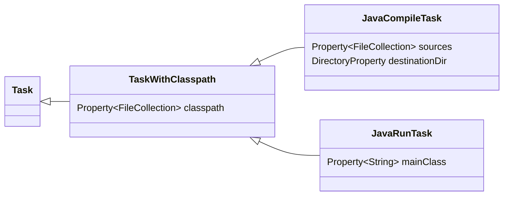
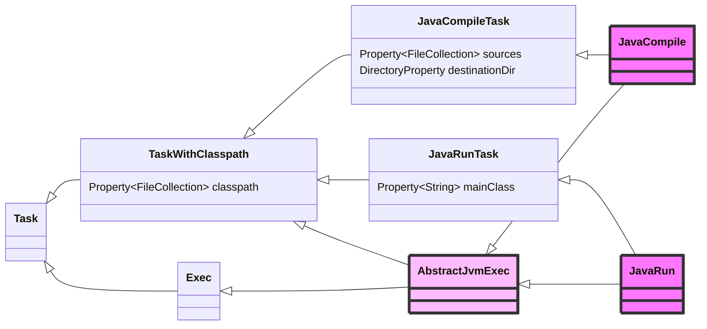

+++

title = "Build Automation"
description = "The art of letting machines do the job for you, with Gradle as example"
outputs = ["Reveal"]

[reveal_hugo]
transition = "slide"
transition_speed = "fast"
custom_theme = "custom-theme.scss"
custom_theme_compile = true

[reveal_hugo.custom_theme_options]
targetPath = "css/custom-theme.css"
enableSourceMap = true

+++

# Build Automation

{}

---

# Overview

* Build automation:
  * The software lifecycle
  * Automation styles
* Gradle as paradigmatic build automator
    * Core concepts and basics
    * Dependency management and configurations
    * The build system as a dependency
    * Hierarchial organization
    * Isolation of imperativity
    * Declarativity via DSLs
    * Reuse via plug-ins
    * Testing plug-ins
    * Existing plugins

---

<!-- write-here "shared-slides/build-systems/build-systems-intro.md" -->

<!-- end-write -->

---

<!-- write-here "shared-slides/build-systems/dependencies.md" -->

<!-- end-write -->

---

## Imperative build tool example: CMake

[CMake](https://cmake.org/) is a widely used *imperative* build automation tool, especially in C and C++ projects.

* **Imperative configuration**: Build instructions are specified in `CMakeLists.txt` using CMake's own scripting language.
* **Cross-platform**: Generates native build files for various platforms (Makefiles, Visual Studio projects, etc.).
* **Dependency management**: Supports finding and linking against external libraries.
* **Build targets**: Allows defining multiple build targets (executables, libraries) within a single project.
* **Custom commands**: Supports custom build commands and scripts for specialized tasks.

---

[CMake build file example](https://github.com/krux02/minimal_cmake_example/blob/master/CMakeLists.txt)

CMake version and project name, declarative:
```cmake
cmake_minimum_required(VERSION 3.0) # setting this is required
project(example_project)            # this sets the project name
```

File globbing: search of what to build is manual/imperative:

```cmake
# These instructions search the directory tree when cmake is
# invoked and put all files that match the pattern in the variables 
# `sources` and `data`.
file(GLOB_RECURSE sources      src/main/*.cpp src/main/*.h)
file(GLOB_RECURSE sources_test src/test/*.cpp)
file(GLOB_RECURSE data resources/*)
# You can use set(sources src/main.cpp) etc if you don't want to
# use globbing to find files automatically.
```

Target definitions, imperative:

```cmake
# The data is just added to the executable, because in some IDEs (QtCreator) 
# files are invisible when they are not explicitly part of the project.
add_executable(example ${sources} ${data})

# Just for example add some compiler flags.
target_compile_options(example PUBLIC -std=c++1y -Wall -Wfloat-conversion)

# This allows to include files relative to the root of the src directory with a <> pair
target_include_directories(example PUBLIC src/main)

# This copies all resource files in the build directory.
# We need this, because we want to work with paths relative to the executable.
file(COPY ${data} DESTINATION resources)
```

---

Depedency management, imperative:

```cmake
# This defines the variables Boost_LIBRARIES that containts all library names
# that we need to link into the program.
find_package(Boost 1.36.0 COMPONENTS filesystem system REQUIRED)

target_link_libraries(example PUBLIC
  ${Boost_LIBRARIES}
  # here you can add any library dependencies
)
```

Testing with googletest, imperative:

```cmake
find_package(GTest)
if(GTEST_FOUND)
  add_executable(unit_tests ${sources_test} ${sources})

  # This define is added to prevent collision with the main.
  # It might be better solved by not adding the source with the main to the
  # testing target.
  target_compile_definitions(unit_tests PUBLIC UNIT_TESTS)

  # This allows us to use the executable as a link library, and inherit all 
  # linker options and library dependencies from it, by simply adding it as dependency.
  set_target_properties(example PROPERTIES ENABLE_EXPORTS on)

  target_link_libraries(unit_tests PUBLIC ${GTEST_BOTH_LIBRARIES} example)

  target_include_directories(unit_tests PUBLIC ${GTEST_INCLUDE_DIRS})
endif()
```

---

Packaging with CPack, mostly imperative with some declarative parts:

```cmake
# All install commands get the same destination. this allows us to use paths
# relative to the executable.
install(TARGETS example DESTINATION example_destination)

# This is basically a repeat of the file copy instruction that copies the
# resources in the build directory, but here we tell cmake that we want it
# in the package.
install(DIRECTORY resources DESTINATION example_destination)

# Now comes everything we need, to create a package
# there are a lot more variables you can set, and some
# you need to set for some package types, but we want to
# be minimal here.
set(CPACK_PACKAGE_NAME "MyExample")
set(CPACK_PACKAGE_VERSION "1.0.0")

# We don't want to split our program up into several incomplete pieces.
set(CPACK_MONOLITHIC_INSTALL 1)

# This must be last
include(CPack)
```

---

## Declarative build tool example: Python Poetry


[Poetry](https://python-poetry.org/) is a modern, *declarative* build and dependency management tool for Python.

* **Declarative configuration**: All project metadata, dependencies, and build instructions are specified in `pyproject.toml`.
    * Declarative build tools tend to favor markup files over scripts:
        * XML (Maven)
        * TOML (Poetry, Rust's Cargo)
        * JSON (Node.js's npm)
        * YAML (JetBrains' Amper)
* **Scripted tasks**: Allows definition of custom scripts for automation.
* **Dependency resolution**: Handles dependency resolution and locking via `poetry.lock`.
* **Virtual environments**: Automatically manages isolated Python environments per project.
* **Build and publish**: Supports building and publishing packages to PyPI or other repositories.
---

## Python's conflicting standards


Since there were no standard management systems originally,
multiple tools *proliferated*

* The Python Packaging Authority (PyPA) is inconsistent in its suggestions:
    * Recommends [`venv`](https://docs.python.org/3/library/venv.html)
    * Also recommends [Pipenv](https://pipenv.pypa.io/en/latest/) , which uses [`virtualenv`](https://virtualenv.pypa.io/en/latest/)
    * Also endorses [Poetry](https://python-poetry.org/)

* Many Python developers also rely on [PyEnv](https://github.com/pyenv/pyenv)

* Many data scientists use [Anaconda](https://www.anaconda.com/)

---

## Python ecosystem

1. By default, Python is installed _system-wide_
    + i.e. there should be _one_ (and __only__ one) Python interpreter on the system
    + **Problem 1**: two different projects cannot use different versions of Python!

2. All Python installations come with `pip`, the _package installer_ for Python
    * Python packages are supposed to be installed _system-wide_ with `pip install PACKAGE_NAME`
    * **Problem 2**: Two different projects cannot use different versions of the same package!

* `PyEnv` is a tool to manage _multiple_ Python __installations__ _on the same system_
    + *tackles Problem 1*
    + **Poetry** checks that the right Python version is used, but does not manage Python installations

* `virtualenv` and `venv` create _virtual_ Python installations _on the same system_
    + `virtualenv` is a _third-party_ tool, `venv` is _built-in_ in Python 3.3 and later
    + *tackles Problem 2*
    + **Poetry** automatically creates and manages virtual environments for each project

---

## Poetry's canonical project structure

```bash
root-directory/
├── main_package/
│   ├── __init__.py
│   ├── sub_module.py
│   └── sub_package/ 
│       ├── __init__.py 
│       └── sub_sub_module.py 
├── test/
│   ├── test_something.py
│   └── test_something_else.py/ 
├── pyproject.toml # File where project configuration (metadata, dependencies, etc.) is stored
├── poetry.toml # File where Poetry configuration is stored
├── poetry.lock # File where Poetry locks the dependencies
└── README.md
```

If you already use Python, notice:
- no `requirements.txt` nor `requirements-dev.txt`
- `pyproject.toml`, `poetry.toml`, and `poetry.lock` are **Poetry-specific**
- `poetry.lock` is generated _automatically_ by Poetry, and should not be edited manually

---

## A Python [`calculator`](https://github.com/unibo-dtm-se/calculator)

(courtesy of Giovanni Ciatto)

```toml
[tool.poetry]

# publication metadata
name = "unibo-dtm-se-calculator"
packages = [ # files to be included for publication
    { include = "calculator" },
]
version = "0.1.1"
description = "A simple calculator toolkit written in Python, with several UIs."
authors = ["Giovanni Ciatto <giovanni.ciatto@unibo.it>"]
license = "Apache 2.0"
readme = "README.md"

# dependencies (notice that Python is considered a dependency)
[tool.poetry.dependencies] 
python = "^3.10.0"
Kivy = "^2.3.0"

# development dependencies
[tool.poetry.group.dev.dependencies]
poetry = "^1.7.0"
pytest = "^8.1.0"
coverage = "^7.4.0"
mypy = "^1.9.0"

# executable commands that will be created then installing this package
[tool.poetry.scripts]
calculator-gui = "calculator.ui.gui:start_app"
calculator = "calculator.ui.cli:start_app"

# where to download the dependencies from
[[tool.poetry.source]]
name = "PyPI"
priority = "primary"

# packaging dependencies
[build-system]
requires = ["poetry-core"]
build-backend = "poetry.core.masonry.api"

# the project-specific environment will be created in the local .venv folder
[virtualenvs]
in-project = true 
```

Pure TOML: completely declarative

---

## Poetry: build lifecycle

Poetry is used via the `poetry` command line tool:
* `poetry install` -- resolves and installs dependencies
* `poetry run <command>` -- runs a command within the virtual environment

### Actual behavior of `poetry install`

1. *Validate* the project is correct and all necessary information is available
2. *Verify* the version of Python is correct
3. *Resolve* the dependencies, or use the ones in `poetry.lock` if already available
4. *Retrieve* the dependencies from the specified sources
5. *Create* a virtual environment if not already available
6. *Install* the dependencies in the virtual environment

Subsequent lifecycle phases are managed by the `poetry run` command, and are thus custom.

❗ Except for `install`, Poetry does not provide a predefined lifecycle

---

## A structured build lifecycle: Apache Maven

A build lifecycle typical of *declarative automators*, composed by *phases*.

⚠️ Selecting a phase implies executing all previous phases.

1. `validate` -- validate the project is correct and all necessary information is available
2. `compile` -- compile the source code of the project
3. `test` -- test the compiled source code using a suitable unit testing framework. These tests should not require the code be packaged or deployed
4. `package` -- take the compiled code and package it in its distributable format, such as a JAR.
5. `verify` -- run any checks on results of integration tests to ensure quality criteria are met
6. `install` -- install the package into the local repository, for use as a dependency in other projects locally
7. `deploy` -- done in the build environment, copies the final package to the remote repository for sharing with other developers and projects.

* Phases are made of *plugin goals*
* **Execution** requires the name of a *phase* or *goal* (dependent goals will get executed)
* **Convention over configuration**: *sensible defaults*

What if there is no plugin for something peculiar of the project?

---

## A meta-build lifecycle: a lifecycle for build lifecycles

1. **Initialization**: understand what is part of a build
2. **Configuration**: create the necessary phases / goals and configure them
    * Define the *goals* (or *tasks*)
    * Configure the *options*
    * Define *dependencies* among tasks
        * Forming a *directed acyclic graph*
3. **Execution**: run the tasks necessary to achieve the build goal

Rather than declaratively fit the build into a predefined lifecycle, declaratively define a build lifecycle

$\Rightarrow$ Typical of *hybrid automators*

---

## Gradle

A paradigmatic example of a hybrid automator:
* Written mostly in Java
* with an outer Groovy layer and DSL
* ...and, more recently, a Kotlin layer and DSL

### Our approach to Gradle

* We are **not** going to learn "how to *use* Gradle"
* We are going to *explore how to drive Gradle from scratch*
    * Gradle is flexible enough to allow an exploration of its core concepts
    * It will work as an exemplary case for most hybrid automators
    * Other automation systems can be driven similarly once the basics are understood

---

## Gradle: main concepts

* **Project** -- A collection of files composing the software
    * The *root* project can contain *subprojects*
* **Build file** -- A special file, with the build information
    * situated in the root directory of a project
    * instructs Gradle on the organization of the project
* **Dependency** -- A resource required by some operation.
    * May have dependencies itself
    * Dependencies of dependencies are called *transitive* dependencies
* **Configuration** -- A group of dependencies with *three roles*:
    1. *Declare* dependencies
    2. *Resolve* dependency declarations to actual artifacts/resources
    2. *Present* the dependencies to consumers in a suitable format
* **Task** -- An atomic operation on the project, which can
  * have input and output files
  * depend on other tasks (can be executed only if those are completed)
  * Tasks *bridge the declarative and imperative worlds*


---

## Gradle from scratch: empty project

Let's start as empty as possible, just point your terminal to an empty folder and:
```bash
touch build.gradle.kts
gradle tasks
```

Stuff happens: if nothing is specified,
<br>
*Gradle considers the folder where it is invoked as a project*
<br>
*The project name matches the folder name*

Let's understand what:
<br>

```bash
Welcome to Gradle <version>!

Here are the highlights of this release:
 - Blah blah blah

Starting a Gradle Daemon (subsequent builds will be faster)
```

Up to there, it's just performance stuff:
Gradle uses a background service to speed up cacheable operations

---

## Gradle from scratch: empty project

```bash
> Task :tasks

------------------------------------------------------------
Tasks runnable from root project
------------------------------------------------------------

Build Setup tasks
-----------------
init - Initializes a new Gradle build.
wrapper - Generates Gradle wrapper files.
```

Some tasks exist already!
They are built-in.
Let's ignore them for now.


---

## Gradle from scratch: empty project

```bash
Help tasks
----------
buildEnvironment - Displays all buildscript dependencies declared in root project '00-empty'.
components - Displays the components produced by root project '00-empty'. [incubating]
dependencies - Displays all dependencies declared in root project '00-empty'.
dependencyInsight - Displays the insight into a specific dependency in root project '00-empty'.
dependentComponents - Displays the dependent components of components in root project '00-empty'. [incubating]
help - Displays a help message.
model - Displays the configuration model of root project '00-empty'. [incubating]
outgoingVariants - Displays the outgoing variants of root project '00-empty'.
projects - Displays the sub-projects of root project '00-empty'.
properties - Displays the properties of root project '00-empty'.
tasks - Displays the tasks runnable from root project '00-empty'.
```

Informational tasks. Among them, the `tasks` task we just invoked

---

## Gradle: configuration vs execution

It is time to create our first *task*
<br>
Create a `build.gradle.kts` file as follows:


```gradle
{}
```

Now launch gradle with `gradle brokenTask`:
```bash
gradle broken
this is executed at CONFIGURATION time!

BUILD SUCCESSFUL in 378ms
```
Looks ok, but it's **utterly broken**

---

## Gradle: configuration vs execution

Try launching `gradle tasks`
* We do not expect our task to run, we are launching something else

```bash
❯ gradle tasks

> Task :tasks

------------------------------------------------------------
Tasks runnable from root project
------------------------------------------------------------

this is executed at CONFIGURATION time!
Build Setup tasks
```

**Ouch!**

**Reason**: the build script executes when Gradle is invoked, and *configures* tasks and dependencies.
<br>
Only later, when a task is invoked, the block gets *actually executed*

---

## Gradle: configuration vs execution

Let's write a *correct* task
```gradle
{}
```

Execution with `gradle helloWorld`
```bash
gradle helloWorld

> Task :helloWorld
Hello, World!
```

---

## Gradle: configuration vs execution

* The *build configuration* happens **first**
    * Tasks and their dependencies are a **result of the configuration**
* The *task execution* happens **later**
    * As per the "meta-lifecycle" discussed before

Delaying the execution allows for *more flexible configuration*

This will be especially useful when *modifying existing behavior*

```gradle
{}
```

output of `gradle helloWorld`:
```text
Configuring task: helloWorld

> Task :helloWorld
About to say hello...
Hello, World!

BUILD SUCCESSFUL in 231ms
1 actionable task: 1 executed
```

---

## Gradle: configuration avoidance

While task execution happens only for those tasks that are invoked (or their dependencies),
task configuration happens for *all* tasks declared in the build script.
* This can lead to *performance issues* in large builds

In Gradle, tasks are registered lazily, and can be configured lazily as well, using the `configure` and `configureEach` methods.

{}
{}
```gradle
{}
```
{}
{}
`gradle helloWorld` output:
```text
Configuring task: helloWorld

> Task :helloWorld
Starting task: helloWorld
About to say hello...
Hello, World!
Finished task: helloWorld

BUILD SUCCESSFUL in 395ms
1 actionable task: 1 executed
```

`gradle tasks` output:
```text
Configuring task: tasks

> Task :tasks
Starting task: tasks
Configuring task: help        # Configuration happens only when a task is needed!
Configuring task: projects
... list of tasks ...
Configuring task: helloWorld

------------------------------------------------------------
Tasks runnable from root project 'configuration-avoidance'
------------------------------------------------------------
... list of tasks ...
BUILD SUCCESSFUL in 239ms
1 actionable task: 1 executed
```
{}
{}


---

## Gradle: task types

Gradle offers some facilities to make writing new tasks easier
<br>
An example is the [`org.gradle.api.Exec`](https://docs.gradle.org/current/javadoc/org/gradle/api/tasks/Exec.html) task type, representing a command to be executed on the underlying command line

The task type can be specified at task registration time.
<br>
Any `open class` implementing [`org.gradle.api.Task`](https://docs.gradle.org/current/javadoc/org/gradle/api/Task.html) can be instanced.

Tasks of unspecified type are plain `DefaultTask`s

```gradle
{}
```

```bash
> Task :printJavaVersion
Ready to invoke /usr/lib/jvm/java-11-openjdk/bin/java
openjdk version "11.0.8" 2020-07-14
OpenJDK Runtime Environment (build 11.0.8+10)
OpenJDK 64-Bit Server VM (build 11.0.8+10, mixed mode)
/usr/lib/jvm/java-11-openjdk/bin/java invocation complete
```

---

## Gradle: compiling from scratch

Let's compile a simple `src/HelloWorld.java`:
```java
class HelloWorld {
    public static void main(String... args) {
        System.out.println("Hello, World!");
    }
}
```

Build logic:
1. Find the Java compiler executable
2. Find the sources to be compiled
3. Invoke `javac -d destination <files>`

Which step should be in configuration, and which in execution?

**General rule**: move as much as possible to execution
* The less is done at configuration time, the faster the build when the task is not executed
* Delaying to execution allows for more flexible configuration

---

## Lazy configuration, inputs, outputs

```java
tasks.register<Exec>("compileJava") {
    // Computed at configuration time
    val sources = TODO("assume this is expensive")
    // configuration that needs "sources"
    doFirst { // We need to compute the sources and classpath as late as possible!
        sources.forEach { ... }
    }
}
```

* Problem: we need to run the *expensive* operation even if the task is *not executed*!
    * We must **delay** the execution as much as possible
* Problem: other tasks may *generate sources*, and should thus run before
    * We must understand that the output of some tasks is the input of other tasks

---

## Task inputs and outputs

How can Gradle determine which tasks some task depends on?
* Explicit dependencies (later)
* Implicit dependencies, via *inputs* and *outputs*
    * If a task *input* is the *output* of another task, then the first task depends on the second

Inputs and outputs can be configured via the `inputs` and `outputs` properties of a task.

Inputs and outputs are also used by Gradle to determine if a task is `UP-TO-DATE`,
namely, if it can be skipped because its inputs have not changed since the last execution.
* This is called *incremental build*.
* Large builds can be sped up significantly.

---

## Lazy configuration in Gradle

Gradle supports the construction of *lazy* properties and providers:

1. Wire together Gradle components without worrying about values, just knowing their *provider*.
    * Configuration happens *before* execution, some values are unknown
    * yet their provider is known at configuration time

#### In the gradle API

`Provider` -- a value that can only be queried and cannot be changed
* Transformable through a `map` method
* Easily built via `project.provider { ... }` (`project` can be omitted in build scripts)

`Property` -- a value that can be queried and also changed
* Subtype of Provider
* Can be `set` by passing a value or a `Provider`
* A new property can be created via `project.objects.property<Type>()` (`project` can be omitted in build scripts)

---

```gradle
{}
```

Execution:
```bash
gradle compileJava

BUILD SUCCESSFUL in 693ms
```
Compiled files are in `build/bin`!

---

## Gradle: dependency management

Dependency management in Gradle is rooted in two fundamental concepts:
* **Dependency**, a resource of some kind, possibly having other (*transitive*) dependencies
* **Configuration**, a *resolvable* (mappable to actual resources) set of dependencies
    * $\Rightarrow$ Not to be confused with the configuration **phase**!

Let's see a use case: compiling a Java source with a dependency
* In `javac` terms, we need to feed some jars to the `-cp` flag of the compiler
* In Gradle (automation) terms, we need:
    * a *configuration* representing the compile classpath
    * one *dependency* for each library we need to compile

---

## Gradle: dependency management

Conceptually, we want something like:
```kotlin
// Gradle way to create a configuration
val compileClasspath ... // Delegation!
dependencies {
    compileClasspath.add(dir("libs").files.filter { it.extension == "jar" })
}
```
To be consumed by our improved compile task:
```kotlin
tasks.register<Exec>("compileJava") {
    ...
    else -> args(
        "-d", outputDir,
        // classpath from the configuration
        "-cp", "${File.pathSeparator}${compileClasspath.asPath}",
        *sources.toTypedArray(),
    )
}
```

---

## Gradle: using custom configurations

A minimal DSL to simplify file access:

```gradle
{}
```

Dependency declaration (configuration time):
```gradle
{}
```

Dependency use (execution time):
```gradle
{}
```

---

## Gradle: using custom configurations

Full example:

```gradle
{}
```

---

## Gradle: task dependencies

Next step: we can compile, why not executing the program as well?

1. Let's define a `runtimeClasspath` configuration
    * "inherits" from `compileClasspath`
    * includes the output folder
    * In general we may need stuff at runtime that we don't need at compile time
        * E.g. stuff loaded via reflection

```gradle
{}
```

2. Let's write the task

```gradle
{}
```

---

{}
{}
```gradle
{}
```
{}
{}
```gradle
{}
```
{}
{}

---

## Gradle: task dependencies

Let us temporarily comment:
```gradle
{}
```
and run:

```bash
> Task :runJava FAILED

[Incubating] Problems report is available at: file:///home/danysk/LocalProjects/spe-slides/examples/run-java-deps/build/reports/problems/problems-report.html

FAILURE: Build failed with an exception.

* What went wrong:
A problem was found with the configuration of task ':runJava' (type 'Exec').
  - Type 'org.gradle.api.tasks.Exec' property '$1' specifies directory '/home/danysk/LocalProjects/spe-slides/examples/run-java-deps/build/bin' which doesn't exist.
    
    Reason: An input file was expected to be present but it doesn't exist.
    
    Possible solutions:
      1. Make sure the directory exists before the task is called.
      2. Make sure that the task which produces the directory is declared as an input. # <<<< OUR PROBLEM!!
    
    For more information, please refer to https://docs.gradle.org/8.14/userguide/validation_problems.html#input_file_does_not_exist in the Gradle documentation.

* Try:
> Make sure the directory exists before the task is called
> Make sure that the task which produces the directory is declared as an input
> Run with --scan to get full insights.

BUILD FAILED in 752ms
1 actionable task: 1 executed
```

$\Rightarrow$ The code was not compiled!
* We need `runJava` to run after `compileJava`
* One task depends on another!

---

## Gradle: task dependencies

Run with the dependency correctly set:

```bash
 ./gradlew runJava                                                                                                                                                                                1 ✘  3.4.7  

> Task :compileJava
[/home/danysk/LocalProjects/spe-slides/examples/run-java-deps/src/HelloMath.java]

> Task :runJava
avg=3.0, std.dev=1.5811388300841898
regression: y = 2.0300000000000002 * x + -0.030000000000001137
R²=0.998957626296907

BUILD SUCCESSFUL in 581ms
2 actionable tasks: 2 executed
```

---

## Build automation: dependencies everywhere

Dependencies permeate the world of build automation.
* At the *"task"* level
    * Compile dependencies
    * Runtime dependencies
* At the *"build"* level
    * Phases of the lifecycle (*configurations* in Gradle) depend on other phases
    * *Tasks* depend on other tasks

$\Rightarrow$ *at the **global** level as well!*

*no guarantee*  that automation written with some tool at version `X`, will work at version `Y`!

---

## The Gradle wrapper

* A global dependency on the build tool is **hard to capture**
* Often, it becomes a *prerequisite expressed in natural language*
    * e.g., "you need Maven 3.6.1 to build this software"
* *Critical* issues when different pieces of the same system depend on different build tool versions

Gradle proposes a (partial) solution with the so-called *Gradle wrapper*

* *A minimal program* that simply downloads the version of gradle written in a configuration file
* *Generable* with the built-in task `wrapper`
    * `gradle wrapper --gradle-version=<VERSION>`
* Prepares scripts for bash and cmd to run Gradle at the specified version
    * `gradlew`
    * `gradlew.bat`

The Gradle wrapper is ***the** correct way* to use gradle, and we'll be using it from now on.

---

## Mixed imperativity and declarativity

At the moment, we have part of the project that's declarative, and part that's imperative:

* **Declarative**
    * configurations and their relationships
    * dependencies
    * task dependencies
* **Imperative**
    * Operations on the file system
    * some of the actual task logics
    * resolution of configurations

The *declarative* part is the one *for which we had a built-in API for*!

---

## Unavoidability of imperativity
### (and its isolation)

The base mechanism at work here is *hiding imperativity under a clean, declarative API*.

Also *"purely declarative"* build systems, such as Maven, which are driven with markup files, *hide* their imperativity behind a curtain (in the case of Maven, plugins that are configured in the `pom.xml`, but implemented elsewhere).

*Usability*, *understandability*, and, ultimately, *maintability*, get increased when:
* *Imperativity* gets *hidden* under the hood
* Most (if not all) the operations can be *configured* rather than *written*
* Configuration can be *minimal for common tasks*
    * **Convention over configuration**, we'll get back to this
* Users can *resort to imperativity* in case of need

---

## Isolation of imperativity
### Task type definition

Let's begin our operation of isolation of imperativity by refactoring our hierarchy of operations.

* We have a number of "Java-related" tasks.
* All of them have a classpath
* All of them have an executable that depend on the operation they perform
* One has an output directory and input sources
* One has a "main class" input

{}
{}

{}
{}
```gradle
{}
```

{}
{}

---

## Isolation of imperativity
### Task design

Next step: let's inherit the behavior of our tasks from `Exec`:



---

## Creating a new Task type in Gradle

Gradle supports the definition of new task types:
* New tasks *must implement* the `Task` interface
    * They *usually inherit* from `DefaultTask`
* They must be `abstract`
    * Gradle creates subclasses on the fly under the hood and injects methods
* A public method can be marked as `@TaskAction`, and will get invoked to execute the task

---

### Input, output, caching, and continuous build mode

In recent Gradle versions, it is mandatory
to _annotate every public property's **getter**_ of a task with a marker annotation 
for gradle to mark it as an *input* or an *output*.
* `@Input`, `@InputFile`, `@InputFiles`, `@InputDirectory`, `@InputDirectories`, `@Classpath`
* `@OutputFile`, `@OutputFiles`, `@OutputDirectory`, `@OutputDirectories`
    * `@Internal` marks *internal* output properties (not reified on the file system)
    * `@Internal` marks *internal* output properties (not reified on the file system)
* In practice, these appear in Kotlin code as `@get:Input`, etc.
    * Otherwise, Kotlin would generate the annotation on the *field*, not on the *getter*, and Gradle would ignore it

#### Why?

1. **Performance**
    * Gradle caches intermediate build results, using input and output markers to undersand whether or not some task is *up to date*
    * This allows for *much* faster builds while working on large projects
        * Time to build completion can decrease a dozen minutes to seconds!
2. **Continuous build**
    * Re-run tasks upon changes with the `-t` option
    * (In/Out)put markers are used to understand *what* to re-run

---

## Custom Task types in Gradle


{}
{}
```gradle
{}
```
{}
{}
```gradle
{}
```
{}
{} 

---

## Isolation of imperativity
### Problem

In our main `build.gradle.kts`, we have:

{}
{}
a *declarative* part

```gradle
{}
```
{}
{}
an *imperative* part

```gradle
{}
```

(continues a lot further)
{}
{}

### Idea

**Hide** the *imperative* part *under the hood*,
and **expose** a purely *declarative API* to the *user*.

---

## Isolation of imperativity
### Project-wise API extension

Gradle provides a way to define project-wise build APIs using a special `buildSrc` folder
* Requires a Gradle configuration file
    * What it actually does will be clearer in future

{}
{}
Directory structure:

```text
project-folder
├── build.gradle.kts
├── buildSrc
│   ├── build.gradle.kts
│   └── src
│       └── main
│           └── kotlin
│               ├── ImperativeAPI.kts
│               └── MoreImperativeAPIs.kt
└── settings.gradle.kts
```
{}
{}
`buildSrc/build.gradle.kts`' contents (clearer in future):

```gradle
{}
```
{}
{}

---

## Isolation of imperativity
### Project-wise API extension

{}
{}
Directory structure for our Java infrastructure:
```text
examples/buildsrc
├── build.gradle.kts
├── buildSrc
│   ├── build.gradle.kts
│   └── src
│       └── main
│           └── kotlin
│               ├── AllFiles.kt
│               ├── JavaCompile.kt
│               ├── JavaRun.kt
│               └── JavaTasksAPI.kt
├── gradlew
├── gradlew.bat
├── libs
│   └── commons-math3-3.6.1.jar
└── src
    └── HelloMath.java
```
{}
{}
our new `build.gradle.kts`:
```gradle
{}
```

{}
{}

we can use all types defined in `buildSrc/src/main/kotlin/` in the main project's `build.gradle.kts`!

---

## Isolation of imperativity
### Project-wise conventions

{}
{}
What our `build.gradle.kts` defines is now a *convention* for Java projects:
```gradle
{}
```

{}
{}
* There exist two configurations:
    * `compileClasspath`
    * `runtimeClasspath`, which extends from `compileClasspath`
* All jars in `libs` are added to both configurations
* There is a `compileJava` task that compiles all Java sources in `src`
* There is a `runJava` task that runs a specified main class

These could be valid for *any Java project*!
{}
{}

---

## Isolation of imperativity
### Project-wise conventions

* Conventional build logic can be defined in `buildSrc/src/main/kotlin/convention-name.gradle.kts`,
* and imported in the main `build.gradle.kts` via:
```gradle
plugins {
    id("convention-name")
}
```

{}
{}
`buildSrc/src/main/kotlin/java-convention.gradle.kts`:
```gradle
{}
```
{}
{}
`build.gradle.kts`:
```gradle
{}
```
{}
{}

---

## Build hierarchies

Sometimes projects are *modular*
<br>
Where a module is a sub-project with a clear identity, possibly reusable elsewhere

Examples:
* A smartphone application with:
    * A common library
    * A software that uses such library for the actual app
* Bluetooth control software comprising:
    * Platform-specific drivers
    * A platform-agnostic bluetooth API and service
    * A CLI interface to the library
    * A Graphical interface

Modular software *simplifies maintenance* and *improves understandability*
<br>
Modules may **depend** on other modules
<br>
Some build tasks of some module may require build tasks *of other modules* to be complete before execution

---

## Hierarchial project

Let us split our project into two components:
* A base library
* A stand-alone application using the library

We need to reorganize the build logic to something similar to

```text
hierarchial-project
|__:library
\__:app
```

Desiderata:
* We can compile any of the two projects from the root
* We can run the app from the root
* Calling a run of the app implies a compilation of the library
* We can clean both projects

---

## Authoring subprojects in Gradle

Gradle (as many other build automators)
offers built-in support for *hierarchial projects*.
<br>
Gradle is limited to *two levels*, other products such as Maven have no limitation

Subprojects are listed in a `settings.gradle.kts` file
<br>
Incidentally, it's the same place where the project name can be specified

Subprojects *must have their own* `build.gradle.kts`
<br>
They can also have their own `settings.gradle.kts`, e.g. for selecting a name different than their folder

---

## Authoring subprojects in Gradle

1. Create a settings.gradle.kts and declare your modules:

```gradle
rootProject.name = "project-with-hierarchy"

include(":library") // There must be a folder named "library"
include(":app") // There must be a folder named "app"
```

2. In the root project, configure the part common to **all** projects (included the root project) in a `allprojects` block
```gradle
allprojects {
    // Executed for every project, included the root one
    // here, `project` refers to the current project
}
```

3. Put the part shared by *solely the sub-projects* into a `subprojects` block
```gradle
subprojects {
    // Executed for all subprojects
    // here, `project` refers to the current project
}
```

4. In each subproject's `build.gradle.kts`, add further customization as necessary
5. Connect configurations to each other using dependencies
```gradle
dependencies {
    compileClasspath(project(":library")) { // My compileClasspath configuration depends on project library
        targetConfiguration = "runtimeClasspath" // Specifically, from its runtime
    }
}
```
6. Declare inter-subproject task dependencies
    * Tasks may fail if ran out of order! Compiling `app` requires `library` to be compiled.
```gradle
tasks.compileJava { dependsOn(project(":library").tasks.compileJava) }
```

---

## Reusability across multiple projects

We now have a rudimental infrastructure for building and running Java projects
<br>
What if we want to reuse it?

Of course, copy/pasting the same file across projects is to be avoided whenever possible

## The concept of plugin

Gradle (as many other build systems) allow extensibility via *plugins*
<br>
A *plugin* is a software component that *extends the API* of the base system
<br>
It usually includes:
* A set of `Task`s
* An `Extension` -- An object incapsulating the global configuration options
    * leveraging an appropriate *DSL*
* A `Plugin` object, implementing an `apply(Project)` function
    * Application must create the extension, the tasks, and the rest of the imperative stuff
* A **manifest** file declaring which of the classes implementing `Plugin` is the entry point of the declared plugin
    * located in `META-INF/gradle-plugins/<plugin-name>.properties`

---

## Divide, conquer, encapsulate, adorn

General approach to a *new* build automation problem:

**Divide**: Identify the *base steps*, they could become your tasks

* Or any concept your build system exposes to model atomic operations

**Conquer**: Clearly express the *dependencies* among them

* Build a *pipeline*
* Implement them Providing a *clean API*

**Encapsulate**: confine imperative logic, make it an *implementation detail*

**Adorn**: provide a DSL that makes the library *easy and intuitive*

*Not very different than what's usually done in (good) software development*


---

## Using a plugin

* Plugins are loaded from the *build environment*
    * the *classpath* used for such tasks can be explored with the built-in task `buildEnvironment`
    * if a plugin is not found, then if a version for it is available it's *fetched from remote repositories*
        * by default the [Gradle plugin portal](https://plugins.gradle.org/)
* Plugins need to be **applied**
    * Which actually translates to calling the `apply(Project)` function
    * Application for *hierarchial* projects is *not automatic*
        * You might want your plugin to be applied only in some subprojects!

**Example code**
```kotlin
plugins {
    pluginName // Loads a plugin from the "buildEnvironment" classpath
    `plugin-name` // Syntax for non Kotlin-compliant plugin names
    id("plugin2-name") // Alternative to the former
    id("some-custom-plugin") version "1.2.3" // if not found locally, gets fetched from the Gradle plugin portal
}
// In case of non-hierarchial projects, plugins are also "applied"
// Otherwise, they need to get applied manually, e.g.:
allprojects {
    apply(plugin = "pluginName")
}
```

---

## Built-in Gradle plugins

The default Gradle distribution includes a large number of plugins, e.g.:
* `java` plugin, for Java written applications
    * a full fledged version of the custom local plugin we created!
* `java-library` plugin, for Java libraries (with no main class)
* `scala` plugin
* `cpp` plugin, for C++
* `kotlin` plugin, supporting Kotlin with multiple targets (JVM, Javascript, native)

We are going to use the Kotlin JVM plugin to build our first standalone plugin!
<br>
(yes we already did write our first one: code in `buildSrc` is *project-local plugin code*)

---

## A Greeting plugin

A very simple plugin that greets the user

**Desiderata**
* adds a `greet` task that prints a greeting
* the default output should be configurable with something like:

```gradle
{}
```

---

## Setting up a Kotlin build

First step: we need to set up a Kotlin build, we'll write our plugin in Kotlin

```gradle
plugins {
    // No magic: calls a method running behind the scenes, equivalent to id("org.jetbrains.kotlin-$jvm")
    kotlin("jvm") version "2.2.20" // version is necessary
}
```

The Kotlin *plugin* introduces tasks and configurations to compile and package Kotlin code

Second step: we need to declare where to find dependencies
* Maven repositories are a de-facto standard for shipping JVM libraries

```gradle
// Configuration of software sources
repositories {
    mavenCentral() // points to Maven Central
}

dependencies {
     // "implementation" is a configuration created by by the Kotlin JVM plugin
    implementation(...) // we can load libraries here
}
```

Third step, we need the Gradle API 

```groovy
dependencies {
    implementation(gradleApi()) // Built-in method, returns a `Dependency` to the current Gradle version
    api(gradleKotlinDsl()) // Built-in method, returns a `Dependency` to the Gradle Kotlin DSL library
}
```

---

## Plugin name and entry point

Gradle expects the plugin entry point (the class implementing the `Plugin` interface) to be specified in a **manifest file**
* in a *property file*
* located in `META-INF/gradle-plugins`
* whose file name is `<plugin-name>.properties`

The name is usually a "reverse url", similarly to Java packages.
<br>
e.g., `it.unibo.spe.greetings`

The file content is just a pointer to the class implementing `Plugin`, for instance:
```properties
implementation-class=it.unibo.spe.firstplugin.GreetingPlugin
```

---

## Plugin implementation

Usually, composed of:
* A *clean API*, if the controlled system is not trivial
* A set of *tasks* incapuslating the imperative logic
* An *extension* containing the DSL for configuring the plugin
* A *plugin*
    * Creates the extension
    * Creates the tasks
    * Links tasks and extension

---

## A Gradle plugin implementation

inside `src/main/kotlin/<package-path>/`:

{}
{}

`HelloTask` implementation:

```gradle
{}
```

{}
{}

`HelloExtension`, the DSL entrypoint:

```gradle
{}
```

`HelloGradle`, the plugin entrypoint:
* whose `apply` method is called upon application

```gradle
{}
```

{}
{}

---

## Notes on plugins

* The `Plugin` configures the project as needed for the tasks and the extension to work
* Plugins can forcibly *apply* other plugins
    * e.g., the Kotlin plugin applies the `java-library` plugin behind the scenes
    * although it is generally preferred to *react* to the application of other plugins
* Plugins can *react* to the application of other plugins
    * e.g., enable additional features or provide compatibility
    * doing so is possible by the `plugins` property of `Project`, e.g.:
```kotlin
project.plugins.withType(JavaPlugin::class.java) {
    // Stuff you want to do only if someone enables the Java plugin for the current project
}
```

---

## Testing a plugin

1. Push the gradle plugin into the *build classpath*
2. Prepare a Gradle *workspace*
3. *Launch the tasks* of interest
4. *Verify* the task success (or failure, if expected), or the program output

Gradle provides a **test kit**, to launch Gradle programmatically and inspect the execution results

---

## Importing Gradle test kit and Kotest

It's just matter of pulling the right dependencies

```gradle
dependencies {
    implementation(gradleApi())
    implementation(gradleKotlinDsl())
    testImplementation(gradleTestKit()) // Test implementation: available for testing compile and runtime
}
```

### Plugin Classpath injection

By default, the Gradle test kit just runs Gradle.
We want to inject our plugin into the distribution:
1. Create the list of files composing our *runtime classpath*
3. Make sure that the list is always up to date and ready before test execution
2. Use such list as our classpath for running Gradle

This operation is now build-in the test kit:

```kotlin
// Configure a Gradle runner
val runner = GradleRunner.create()
    .withProjectDir()
    .withPluginClasspath(classpath) // we need Gradle **and** our plugin
    .withArguments(":tasks", ":you", ":need", ":to", ":run:", "--and", "--cli", "--options")
    .build() // This actually runs Gradle
// Inspect results
runner.task(":someExistingTask")?.outcome shouldBe TaskOutcome.SUCCESS
runner.output shouldContain "Hello from Gradle"
```

---

## DRY with dependencies declaration

Look at the following code:

```kotlin
dependencies {
    testImplementation("io.kotest:kotest-runner-junit5:4.2.5")
    testImplementation("io.kotest:kotest-assertions-core:4.2.5")
    testImplementation("io.kotest:kotest-assertions-core-jvm:4.2.5")
}
```
It is *repetitive* and *fragile* (what if you change the version of a single kotest module?)

---

## DRY with dependencies declaration

Let's patch all this fragility:

```kotlin
dependencies {
    val kotestVersion = "4.2.5"
    testImplementation("io.kotest:kotest-runner-junit5:$kotestVersion")
    testImplementation("io.kotest:kotest-assertions-core:$kotestVersion")
    testImplementation("io.kotest:kotest-assertions-core-jvm:$kotestVersion")
}
```
Still, quite repetitive...

---

## DRY with dependencies declaration

```groovy
dependencies {
    val kotestVersion = "4.2.5"
    fun kotest(module: String) = "io.kotest:kotest-$module:$kotestVersion"
    testImplementation(kotest("runner-junit5")
    testImplementation(kotest("assertions-core")
    testImplementation(kotest("assertions-core-jvm")
}
```

Uhmm...
* it's still repetitive (can be furter factorized by bundling the kotest modules)
* the function and version could be included in `buildSrc`
* custom solutions can be nice, but:
    1. they can be hard to understand, as they are not standard
    2. may make further automation harder (e.g., bots that run automatic updates may not be aware of your custom solution)

---

## Declaring dependencies in a *catalog*

Gradle 7 introduced the *catalogs*, a standardized way to collect and bundle dependencies.

Catalogs can be declared in:
* the `build.gradle.kts` file (they are API, of course)
* a [TOML](https://github.com/toml-lang/toml) configuration file (default: `gradle/libs.versions.toml`)

{}
{}
```gradle
{}
```
{}
{}
Gradle generates *type-safe accessors* for the definitions:

```gradle
{}
```

Also for the plugins:
```gradle
{}
```
{}
{}

---

## Build vs. Compile vs. Test toolchains

We now have three different runtimes at play:
1. One or more **compilation targets**
    * In case of JVM projects, the target bytecode version
    * In case of .NET projects, the target .NET
    * In case of native projects, the target OS / architecture
2. One or more **runtime targets**
    * In case of JVM or .NET projects the virtual machines we want to support
3. A **built-time runtime**
    * In case of Gradle, the JVM running the build system

These toolchains *should be controlled indipendently*!

You may want to use Java 17 to run Gradle, but compile in a Java 8-compatible bytecode, and then test on Java 11.

---

## Gradle and the toolchains

Default behaviour: Gradle uses *the same JVM it is running in* as:
* build runtime (you don't say)
* compile target
* test runtime

Supporting multiple toolchains may not be easy!
* Cross-compilers?
* Automatic retrieval of runtime environments?
* Emulators for native devices?

Targeting a portable runtime (such as the JVM) *helps a lot*.

---

## Introducing the Gradle toolchains

Define the reference toolchain version (*compilation target*):

```gradle
java {
    toolchain {
        languageVersion.set(JavaLanguageVersion.of(11))
        vendor.set(JvmVendorSpec.ADOPTOPENJDK) // Optionally, specify a vendor
        implementation.set(JvmImplementation.J9) // Optionally, select an implementation
    }
}
```

Create tasks for running tests on specific environments:

```gradle
tasks.withType<Test>().toList().takeIf { it.size == 1 }?.let{ it.first }.run {
    // If there exist a "test" task, run it with some specific JVM version
    javaLauncher.set(javaToolchains.launcherFor { languageVersion.set(JavaLanguageVersion.of(8)) })
}
// Register another test task, with a different JVM
val testWithJVM17 by tasks.registering<Test> { // Also works with JavaExec
    javaLauncher.set(javaToolchains.launcherFor { languageVersion.set(JavaLanguageVersion.of(17)) })
} // You can pick JVM's not yet supported by Gradle!
tasks.findByName("check")?.configure { it.dependsOn(testWithJVM17) } // make it part of the QA suite
```


---

## Making the plugin available

We now know how to build a plugin, we know how to test it,
<br>
*we don't know how to make it available to other projects!*

We want something like:
```gradle
plugins {
    id("our.plugin.id") version "our.plugin.version"
}
```
To do so, we need to ship our plugin to the [Gradle plugin portal](https://plugins.gradle.org/)
<br>
Gradle provides [a plugin publishing plugin](https://plugins.gradle.org/docs/publish-plugin) to simplify delivery

...but before, we need to learn how to

1. click $\Rightarrow{}$ [**pick a version number**](../05-version-selection) $\Leftarrow{}$ click

2. click $\Rightarrow{}$ [**select a software license**](../06-licenses)! $\Leftarrow{}$ click

---

# Setting a version

The project version can be specified in Gradle by simply setting the `version` property of the project:

```kotlin
version = "0.1.0"
```

* Drawback: *manual management*!

It would be better to *rely on the underlying DVCS*
<br>
to compute a Semantic Versioning compatible version!

---

## DVCS-based Automatic semantic versioning

There are a number of plugins that do so
<br>
including [one I've developed](https://github.com/DanySK/git-sensitive-semantic-versioning-gradle-plugin)

Minimal configuration:
```kotlin
plugins {
    id ("org.danilopianini.git-sensitive-semantic-versioning") version "<latest version>"
}
```

```plain
 ./gradlew printGitSemVer
> Task :printGitSemVer
Version computed by GitSemVer: 0.1.0-archeo+cf5b4c0
```

Another possibility is *writing a plugin yourself*
<br>
But at the moment we are stuck: we don't know yet how to expose plugins to other builds


---

# Selecting a license

There's not really much I want to protect in this example, so I'm going to pick one of the most open licenses: MIT (BSD would have been a good alternative)

1. Create a LICENSE file
2. Copy the text from the MIT license
3. If needed, edit details

```plain
Copyright 2020 Danilo Pianini

Permission is hereby granted, free of charge, to any person obtaining a copy of this software and associated
documentation files (the "Software"), to deal in the Software without restriction, including without limitation
the rights to use, copy, modify, merge, publish, distribute, sublicense, and/or sell copies of the Software, and to
permit persons to whom the Software is furnished to do so, subject to the following conditions:

The above copyright notice and this permission notice shall be included in all copies or substantial portions of the
Software.

THE SOFTWARE IS PROVIDED "AS IS", WITHOUT WARRANTY OF ANY KIND, EXPRESS OR IMPLIED, INCLUDING BUT NOT LIMITED TO THE
WARRANTIES OF MERCHANTABILITY, FITNESS FOR A PARTICULAR PURPOSE AND NONINFRINGEMENT. IN NO EVENT SHALL THE AUTHORS
OR COPYRIGHT HOLDERS BE LIABLE FOR ANY CLAIM, DAMAGES OR OTHER LIABILITY, WHETHER IN AN ACTION OF CONTRACT, TORT OR
OTHERWISE, ARISING FROM, OUT OF OR IN CONNECTION WITH THE SOFTWARE OR THE USE OR OTHER DEALINGS IN THE SOFTWARE.
```

---

# Maven style packaging

JVM artifacts are normally shipped in form of jar archives
<br>
the de-facto convention is *inherited from Maven*:
* Each distribution has a **groupId**, an **artifactId**, and a **version**
    * e.g. `com.google.guava:guava:29.0-jre`
        * groupId: `com.google.guava`
        * artifactId: `guava`
        * version: `29.0-jre`
* Further **metadata** is stored in a `pom.xml` file
* Multiple artifacts in the same distributions are identified by a **classifier**
    * e.g., a project having executables, sources, and javadoc, may have:
        * `guava-29.0-jre.jar`
        * `guava-29.0-jre-javadoc.jar`
        * `guava-29.0-jre-sources.jar`

---

# Setting the details

In order to create Maven-compatible artifacts, we need first to set the **groupId**:
```kotlin
group = "it.unibo.firstplugin"
```
Many repositories require to register the group and associate developer identities to it

The project name set in `settings.gradle.kts` is usually used as **artifactId**

---

## Preparing the plugin publication

Gradle provides two plugins to simplify the assembly and upload of plugins

```kotlin
plugins {
  `java-gradle-plugin`
  id("com.gradle.plugin-publish") version "0.12.0"
}
```
```kotlin
pluginBundle { // These settings are set for the whole plugin bundle
    website = "https://unibo-spe.github.io/"
    vcsUrl = "https://github.com/unibo-spe/"
    tags = listOf("example", "greetings", "spe", "unibo")
}
```
```kotlin
gradlePlugin {
    plugins {
        create("") { // One entry per plugin
            id = "${project.group}.${project.name}"
            displayName = "SPE Greeting plugin"
            description = "Example plugin for the SPE course"
            implementationClass = "it.unibo.spe.firstplugin.GreetingPlugin"
        }
    }
}
```
They add the `publishPlugins` task

---

## Credentials

In order to publish on the Gradle Plugin Portal (but it is true for any repository) users need to be *authenticated*
<br>
This is most frequently done via authentication tokens, and more rarely by username and password.

It is first required to [register](https://plugins.gradle.org/user/register),
once done, an **API Key** will be available from the web interface, along with a **secret**.

These data is required to be able to publish, and can be fed to Gradle in two ways:

1. By editing the `~/.gradle/gradle.properties` file, adding:
```plain
gradle.publish.key=YOUR_KEY
gradle.publish.secret=YOUR_SECRET
```
2. Via command line, using `-P` flags:
```plain
./gradlew -Pgradle.publish.key=<key> -Pgradle.publish.secret=<secret> publishPlugins
```

---

# Actual publication

```plain
❯ ./gradlew publishPlugins
> Task :publishPlugins
Publishing plugin it.unibo.spe.greetings-plugin version 0.1.0-archeo+ea6b9d7
Publishing artifact build/libs/greetings-plugin-0.1.0-archeo+ea6b9d7.jar
Publishing artifact build/libs/greetings-plugin-0.1.0-archeo+ea6b9d7-sources.jar
Publishing artifact build/libs/greetings-plugin-0.1.0-archeo+ea6b9d7-javadoc.jar
Publishing artifact build/publish-generated-resources/pom.xml
Activating plugin it.unibo.spe.greetings-plugin version 0.1.0-archeo+ea6b9d7
```

[The result is a published plugin](https://plugins.gradle.org/plugin/it.unibo.spe.greetings-plugin)

---

# Quality control

It is a good practice to set up some tools to validate the quality of the source code and testing.

In the case of Kotlin, there are three useful tools:
1. Setting the **compiler** into a "*warnings as errors*" mode
2. Enabling a *coverage* tool such as **Jacoco**
2. Configuring **Ktlint**, a Pinterest-made tool similar to Checkstyle
3. Configuring **Detekt**, a *static code analysis* tool similar to PMD

* All quality control tasks are dependencies of the `check` task

Moreover, we need a way to *inspect the results* of executing these controls, besides of course failing if too many things go wrong.

(note: under Kotlin and Scala, I do not recommend to use Spotbugs: even though it works, it generates *way* too many false positives)


---

## Build reports in Gradle

Tasks with a report module usually publish their results under `$buildDir/reports/$reportName`

* For instance, *test results* are published in `$buildDir/reports/tests`
* Other tools follow the same convention
* If you want to write a reporting task, extend from `AbstractReportTask`

---

## Using Jacoco with Kotest

Jacoco works with Kotest out of the box
```kotlin
plugins {
    // Some plugins
    jacoco
    // Some plugins
}
```

The plugin introduces two tasks:
* `jacocoTestCoverageVerification`
* `jacocoTestReport`

The latter must be configured to produce readable reports:

```kotlin
tasks.jacocoTestReport {
    reports {
        // xml.isEnabled = true // Useful for processing results automatically
        html.isEnabled = true // Useful for human inspection
    }
}
```

Note: Jacoco does not work with the Gradle test kit, but [there are plugins](https://github.com/koral--/jacoco-gradle-testkit-plugin) to work this around.

---

## Aggressive compiler settings

Can be configured for every `KotlinCompile` task

```groovy
tasks.withType<org.jetbrains.kotlin.gradle.tasks.KotlinCompile> {
    kotlinOptions {
        allWarningsAsErrors = true
    }
}
```

---

# Ktlint

* Linter with *minimal configuration* options
* Configuration happens in a `.editorconfig` file
* Also *checks build files*

```kotlin
plugins {
    id("org.jlleitschuh.gradle.ktlint") version "9.4.1"
}
```

Adds the following tasks:
* `ktlintApplyToIdea`, `ktlintApplyToIdeaGlobally` -- Change the IntelliJ Idea configuration to adhere to the rules
* `ktlintCheck`, `ktlintKotlinScriptCheck`, `ktlint<SourceSetName>SourceSetCheck`, -- Apply rules and report errors
* `ktlintFormat`, `ktlintKotlinScriptFormat`, `ktlint<SourceSetName>SourceSetFormat` -- Lint code automatically

---

# Detekt

* Configurable static source code analyzer

```kotlin
plugins {
    id("io.gitlab.arturbosch.detekt") version "1.14.1"
}

repositories {
    mavenCentral()
}

dependencies {
    // Adds a configuration "detektPlugins"
    detektPlugins("io.gitlab.arturbosch.detekt:detekt-formatting:1.14.1")
}
detekt {
    failFast = true // fail build on any finding
    buildUponDefaultConfig = true // preconfigure defaults
    config = files("$projectDir/config/detekt.yml") // Custom additional rules
}
```

Adds the `detekt` task, failing in case of violation

---

# DRY!

You know how to build and publish Gradle plugins: **factorize the common part!**

### Example: Preconfigured Kotlin QA

```groovy
plugins {
    // Just applies and pre-configures jacoco, detekt, and ktlint
    id("org.danilopianini.gradle-kotlin-qa") version "0.2.1"
    // Just applies and pre-configures jacoco, Spotbugs, PMD, and checkstyle
    id("org.danilopianini.gradle-java-qa") version "0.2.1"
}
```

---

# Code documentation

It is a good practice to automate the generation of the API documentation.
* The `java[-library]` plugin adds a `javadoc` task for the Javadoc
* The `scala` plugin includes a task of type `ScalaDoc`
* Documentation for Kotlin is generated by using the **Dokka** tool
    * Jetbrains provides a plugin!

```kotlin
plugins { id("org.jetbrains.dokka") version "1.4.10" }
```
Adds four tasks:
* `dokkaGfm`, `dokkaHtml`, `dokkaJavadoc`, `dokkaJekyll`
* They differ by kind of documentation they generate

---

# Creating artifacts

The `java-library` and `java` plugins (applied behind the scenes by the `kotlin-jvm` plugin as well) automatically create an `assemble` task which generates a task of type `Jar` creating a non-executable jar with the project contents.

* Further tasks of the same type can be defined for other archives
    * e.g., containing sources or documentation

```kotlin
val javadocJar by tasks.registering(Jar::class) {
    archiveClassifier.set("javadoc")
    from(tasks.dokkaJavadoc.get().outputDirectory) // Automatically makes it depend on dokkaJavadoc
}
val sourceJar by tasks.registering(Jar::class) {
    archiveClassifier.set("source")
    from(tasks.compileKotlin.get().outputDirectory)
    from(tasks.processResources.get().outputDirectory)
}
```

generates a jar file with classifier `javadoc` inside the `build/libs` folder

---

## Signing artifacts

Many repositories require artifacts to be **signed** in order for them to be delivered/deployed
* e.g. Bintray, Maven Central

If you do not have a signature yet, [time to create one](https://central.sonatype.org/pages/working-with-pgp-signatures.html)
* Creation: `gpg --gen-key`
* List: `gpg --list-keys`
* Distribution: `gpg --keyserver keyserver.ubuntu.com --send-keys <KEY-ID>`

Once you have a key, you can use the `signing` plugin to have Gradle generate signatures

To set a default signatory, add to your `~/.gradle/gradle.properties`:

```properties
signing.keyId = <your key id>
signing.password = <redacted>
signing.secretKeyRingFile = <your user home>/.gnupg/secring.gpg
```

---

## Maven Central and other software repositories

[Maven Central](https://search.maven.org/) is one of the de-facto standard repositories for JVM (artifacts)
* It actually hosts any artifact compatible with the Maven conventional format
* **No-retract policy**
    * **Errors** [stay there forever](https://search.maven.org/artifact/commons-io/commons-io)
* *Requires* both *sources* and *Javadoc* artifacts to get shipped
* Artifacts on Central should only depend from other artifacts on Central
* "Old" deployment management, requires some machinery

Other notable repositories:
* ~~*Bintray JCenter*: superset of Maven Central~~ (**dismissed**)
* *Jitpack*: code hosting with (semi-)automatic packaging
* *NPM*: for Javascript code
* *PyPI*: for Python code
* *RubyGems.org*: for Ruby code

---

## Publishing artifacts on Maven Central

**Requirements**
* A valid public signature
* A registered **groupId**
    * Registration is handled manually, [open an issue](https://issues.sonatype.org/secure/CreateIssue.jspa?issuetype=21&pid=10134)
    * You could register `io.github.yourghusername` as group id
* Complete project metadata in a `pom.xml` file
    * Including developers, urls, project description, etc.

**Procedure**
* *Sign* artifacts with your registered signature
* *Upload* them to `oss.sonatype.org`
* *Close* the repository
    * Automatically checks contents, structure, and signatures
* Double check and then *Release*
    * There is *no turning back* after a mistake!

---

## The Gradle publish plugin

Gradle provides a `maven-publish` *plugin for automated delivery* to Maven repositories

Requires some manual configuration:
* Explicit creation of a publication task
* Generation and attachment of sources and javadoc jars
* Configuration of the repository credentials
* Configuration of the `pom.xml` metadata
* Configuration of the signature

If a publication `pubName` is created for a repository `RepoName`, then these tasks get created:
* `publish<PubName>PublicationTo<RepoName>Repository`
* `publish<PubName>PublicationToMavenLocal`


---

## The Gradle publish plugin: Maven Central example

```kotlin
plugins { `maven-publish` }
val javadocJar by ...
val sourceJar by ...
publishing {
    maven {
        url = uri("https://s01.oss.sonatype.org/service/local/staging/deploy/maven2/")
        val mavenCentralPwd: String? by project // Pass the pwd via -PmavenCentralPwd='yourPassword'
        credentials {
            username = "danysk"
            password = mavenCentralPwd
        }
    }
    publications {
        val publicationName by creating(MavenPublication::class) {
            from(components["java"]) // add the jar produced by the java plugin
            // Warning: the gradle plugin-publish plugin already adds them to the java SoftwareComponent
            artifact(javadocJar) // add the javadoc jar to this publication
            artifact(sourceJar) // add the source jar to this publication
            pom {
                name.set("My Library")
                description.set("A concise description of my library")
                url.set("http://www.example.com/library")
                licenses { license { name.set("...") } }
                developers { developer { name.set("...") } }
                scm {
                    url.set("...")
                    url.set("...")
                }
            }
        }
        signing { sign(publicationName) }
    }
}
```

---

## Preconfigured Central publication

I produced a plugin that pre-configures `maven-publish` to point to Maven Central

* Reacts to the application of `java`, `maven-publish`, and `signing` plugins
* Defines task types `SourcesJar` and `JavadocJar`
    * Supports both Javadoc and Dokka
* Creates tasks to create the archives before delivery
* Requires credentials to be set as environment variables
    * `MAVEN_CENTRAL_USERNAME`
    * `MAVEN_CENTRAL_PASSWORD`

---

## Preconfigured Central publication




---

# Inspecting dependencies

In rich projects, most of the build-related issues are due to pesky stuff going on with *dependencies*
* Transitive conflicts
    * dependency A requires B at version 1, dependency C requires B at version 2
* Multiple names for the same artifact
* Unexpected differences between configurations

Gradle allows for **inspection** of the dependencies:
* `./gradlew dependencies` prints the dependency trees for each configuration

Inspecting multiple large trees can be difficult
* A single dependency inspection is available
* `./gradlew dependencyInsight --dependency <DepName> `
    * Optionally, fiterable by configuration: `--configuration <ConfName>`

---

# Inspecting dependencies *among tasks*

When developing plugins or rich builds, the issue of dependencies also affect **tasks**

Gradle *does not* provide tools to ispect the task graph graphically, but a plugin exists.



Generates a `taskTree` task printing the task tree of the tasks listed along with `taskTree`.

---

# Build reporting

* As any software, complex builds need rich inspection tools
    * Performance issues may arise
    * Some tests may run anomalously slow
    * Dependency trees may get hard to analyze in a terminal
    * Plugin behaviour could be different than expected

Gradle supports a reporting system called *Gradle build scans*
* Executable by appending `--scan` to the build
* Requires terminal interaction (or use of the [enterprise plugin](https://docs.gradle.com/enterprise/gradle-plugin/))

Example scans:
* [https://scans.gradle.com/s/5i6ai7gz6qzmc](https://scans.gradle.com/s/5i6ai7gz6qzmc)
* [https://scans.gradle.com/s/5jmd7avh2gnvi](https://scans.gradle.com/s/5jmd7avh2gnvi)

---

## Automated scans without `--scan`

In `settings.gradle.kts`:

```gradle
{}
```

---

