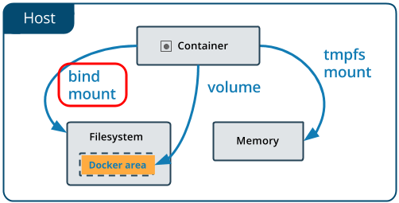
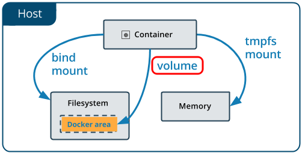
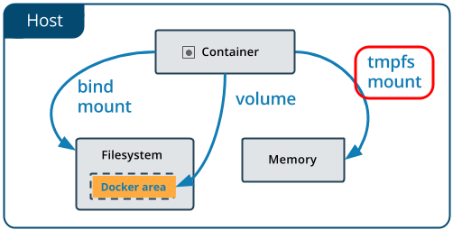
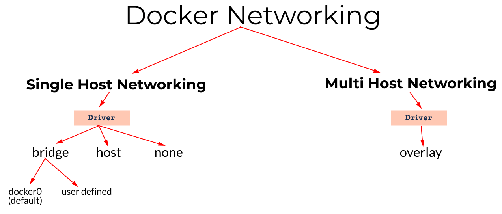
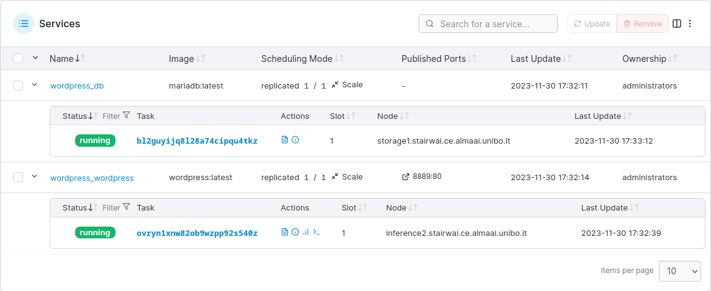
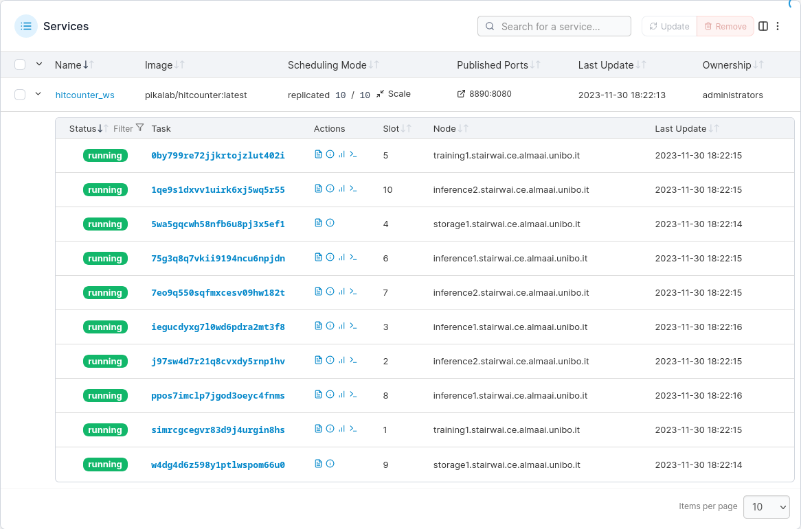
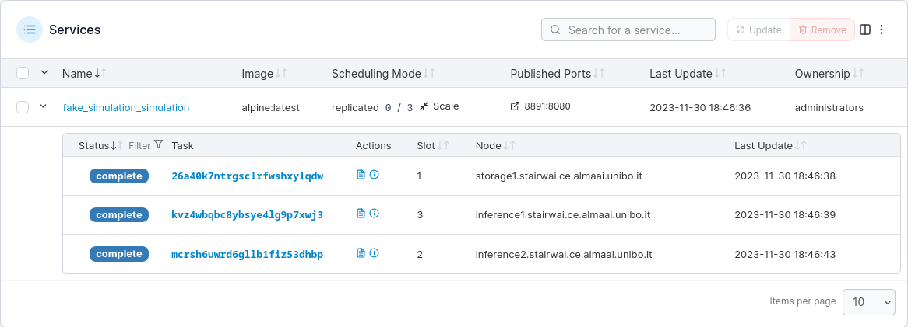
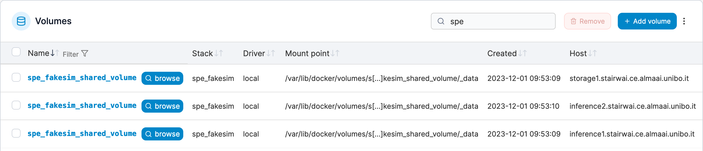

+++

title = "Containerisation and Orchestration"
description = "Practical introduction to Containerisation and Orchestration with Docker"
outputs = ["Reveal"]

[reveal_hugo.custom_theme_options]
targetPath = "css/custom-theme.css"
enableSourceMap = true

+++

<style>
.reveal blockquote {
    font-family: 'Georgia';
}
.reveal blockquote::before{
    content: "";
}
.reveal blockquote::after{
    content: "";
}
</style>

# Containerisation and Orchestration

{}

---

## Preliminaries

> \[Software\] __Deployment__ $:=$ all of the activities that make a software system available for use
- [*Software Engineering: A Practitioner's Approach*, Roger S. Pressman](https://www.mlsu.ac.in/econtents/16_EBOOK-7th_ed_software_engineering_a_practitioners_approach_by_roger_s._pressman_.pdf)

<br/>

### General need in Software Engineering

To govern the _deployment_ of __software systems__ onto some __infrastructure__
- __software system__: multiple interacting software _components_, each one having its _computational requirements_
    * component $\approx$ process

- __infrastructure__: the available _hardware_ and _software_ __substratum__ supporting the execution of software components
    * hardware $\approx$ CPU, memory, storage, network
    * software $\approx$ operating system, drivers, runtimes, libraries

- __deployment__: orderly _instantiating_ software components onto the infrastructure, while 
    * _satisfying_ the computational _requirements_ of each component
    * _optimising_ the _exploitation_ of the infrastructural facilities

---

## What to deploy? (pt. 1)

- __Short-lived tasks__ (a.k.a. __jobs__): tasks which eventually terminate
    * e.g. data processing or generation tasks
    * e.g. simulations

- __Long-lived tasks__ (a.k.a. __services__) tasks which run indefinitely
    * e.g. web servers
    * e.g. databases

---

## What to deploy? (pt. 2)

### Short-lived tasks

> __Short-lived__ tasks are bare computational activities aimed at __processing/generating__ some data

- Pure __algorithms__ _accepting data_ as input and/or _producing data_ as output. 

- They will eventually reach their natural __termination__ 
    + _without_ requiring external _intervention_
    
- Common workflow:
    1. users _provide_ the _code_ and the _input_ data, 
    2. they _start_ the task, 
    3. they are interested in _getting the output_ data

- __Parallelism__ may be exploited to _speed up_ the computations

---

## What to deploy? (pt. 3)

### Long-lived tasks

> __Long-lived__ are computational activities which are __not meant to terminate__ automatically (unless _explicitly stopped_)

- Infinite _loops_, just _waiting_ for _requests_, and _serving_ them as soon as possible

- __Interactivity__ is a key aspect: 
    + __clients__ _interact_ with the service, 
    + the service __reacts__ to the clients' requests
    + clients may be _humans_ or _other software_ components

- Common workflow:
    + users _provide_ the _code_ and some _deployment-automation_ script
    + they _start_ the task,
    + they are interested in _interacting_ with the service
        * e.g. via the shell, via some GUI, via the browser, etc.

- __Parallelism__ may be exploited to support __replication__
    + e.g. for __fault tolerance__
    + e.g. for __load balancing__
    + e.g. for __scaling__

---

## Execution context of a computational task

Regardless of their life-span, computational tasks may require __computational resources__ of various sorts:

- specific __hardware capabilities__
    + e.g. quick / multi-core CPUs for computation intensive tasks
    + e.g. GPUs for tasks requiring parallelism
    + e.g. primary memory (RAM)
    + e.g. large / quick storage (SSD, HDD, etc.)
    + e.g. quick networks connection (e.g. optical fiber)

- specific __operative systems__ (Linux, MacOS, Windows, etc.) or specific __architectures__ (x86, ARM, etc.)

- specific __runtime platforms__ (e.g. JVM, Python, .NET etc.)

- specific __infrastructural components__ (e.g. database, reverse proxy, load-balancer, broker, etc.) 

- specific __libraries__ (e.g. CUDA, `numpy`, etc.)

---

## The need for encapsulation (pt. 1)

<!-- > __Encapsulation__ is the __hiding__ of the __implementation details__ of a __component__ from its __clients__.
> Encapsulated components have a clear __interface__ which is the only way to interact with them. -->

> Why can't we simply configure bare-metal machines to host our tasks?

- Need for __multi-tenancy__ (i.e. sharing) on computational resources
    1. one may have _$N$ machines_ and _$M$ applications_...
        + ... and be willing to __decouple__ applications from machines
    2. different software components may have __incompatible__ HW / SW requirements

- Need for __isolation__
    + preventing _spurious interactions_ among different tenants
    + a common requirement in multi-tenant scenarios

- Need to __formalize / control / reproduce__ the _computational environment_ of applications
    + formalisation is a _pre-requisite_ for __automation__
    + automation _enables_ __control__ and __scale__

- Need to __automate deployment__ of applications into __production__ / __testing__ environments
    + this is the immediate _benefit for engineers_

- Need for __flexibility__ (in _re-deployment_), and __scalability__
    + _effort minimisation_ for application __startup__ or __transfer__

---

## The need for encapsulation (pt. 2)

Some abstraction is needed to encapsulate applications, and their computational environment, into a single unit 

> __Encapsulation__ is the __hiding__ of the __implementation details__ of a __component__ from its __clients__.
> Encapsulated components have a clear __interface__ which is the only way to interact with them. 

---

## How to achieve encapsulation? (pt. 1)

* __Virtual machines__ (VM) on top of VM _hypervisors_ (VMH)

* __Containers__ on top of container _engines_ (CE)

---

## How to achieve encapsulation? (pt. 2)

### Virtual machines and hypervisors (VMH)

- VMH run _on/as_ the _OS_ of a bare-metal machine, __abstracting__ HW and SW peculiarities away
    * VM have _virtualised HW_ and SW resources, different from the host's ones

- VMH may instantiate __multiple VM__ on the _same physical machine_
    * partitioning actual resources ahead of time

- each VM runs __its own OS__, and may host multiple applications
    * in the eyes of the user, the VM is _undistinguishable_ from a bare-metal machine

- VM may be _paused_, _snapshot_ (into file), _resumed_, and possibly _migrated_
    * snapshots are files containing the whole file-system of the VM

- VM are __coarse__-grained __encapsulation__ units
    * they are _heavy_-weight (GBs)
    * they are _slow_ to start, run, migrate, snapshot
    * VM commonly encapsulate _multiple application_-level components
        + database, server, plus all their runtimes and libraries, etc.

- Many industry-ready __technologies__:
    * VMWare, VirtualBox, KVM, Xen, Hyper-V, QEMU, Proxmox, etc.

---

## How to achieve encapsulation? (pt. 3)

### Containers and container engines (CE)

- CE run _on_ the _OS_ of a _bare-metal/virtual_ machine, __abstracting__ the runtime, storage, and network environment away
    + the CPU, memory, OS kernel, drivers, and hardware are __not virtualised__

- one may instantiate __multiple containers__ on the same machine
    + sharing the actual resources dynamically (_overbooking_ support)

- each container __shares the OS kernel__ of the host, yet having its own runtime(s), storage, and network facilities
    + in the eyes of the user, the container is a _process_ running on top of a _minimal OS_

- each container is _instance_ of an __image__, i.e. a _read-only template_ containing deployment instructions 
    + differences w.r.t. that image constitute the _state of the container_ (these can be _snapshot_ into file of minimal size)

- containers are __fine__-grained __encapsulation__ units
    + they are _light_-weight (MBs)
    + they are _fast_ to start, run, snapshot
    + they are commonly used to encapsulate _single application_-level components
        * e.g. a database instance, a web-server instance, etc.
        * the final application should consist of _several_, inter-communicating _containers_

- Many industry-ready __technologies__:
    + Docker, LXC, LXD, Podman, etc.

---

<!-- this file includes generated content. Do not edit. Edit content/09-containerization/_generator.md, instead. -->

## Bare-metal vs. VMs vs. Containers


digraph structs {
rankdir=LR
graph [fontname="helvetica", layout=neato]
edge [fontname="helvetica"]
node [fontname="helvetica", shape=record, style="rounded, filled", fontcolor=white, fixedsize=true, width=3];
"Bare metal" [shape=plaintext, style="", fontcolor=black fontsize=20, pos="0,0!", layout=neato]
Physical [fillcolor=black, pos="0,0.5!"]
"Operating System" [fillcolor=gray, pos="0,1.1!"]
Runtime [fillcolor=green, pos="0,1.7!"]
App1 [fillcolor=red, width=0.95, pos="-1.025,2.3!"]
App2 [fillcolor=red, width=0.95, pos="0,2.3!"]
App3 [fillcolor=red, width=0.95, pos="1.025,2.3!"]

    "Virtual Machine" [shape=plaintext, style="", fontcolor=black fontsize=20, pos="3.5,0!"]
    VM_Phy [label=Physical, fillcolor=black, pos="3.5,0.5!"]
    "Host Operating System" [fillcolor=gray, pos="3.5,1.1!"]
    Hypervisor [fillcolor=orange, pos="3.5,1.7!", fontcolor=black]
    GuestOS1 [fillcolor=gray, width=0.95, pos="2.475,2.3!"]
    GuestOS2 [fillcolor=gray, width=0.95, pos="3.5,2.3!"]
    GuestOS3 [fillcolor=gray, width=0.95, pos="4.525,2.3!"]
    Runtime1 [fillcolor=green, width=0.95, pos="2.475,2.9!"]
    Runtime2 [fillcolor=green, width=0.95, pos="3.5,2.9!"]
    Runtime3 [fillcolor=green, width=0.95, pos="4.525,2.9!"]
    VM_App1 [label=App1, fillcolor=red, width=0.95, pos="2.475,3.5!"]
    VM_App2 [label=App2, fillcolor=red, width=0.95, pos="3.5,3.5!"]
    VM_App3 [label=App3, fillcolor=red, width=0.95, pos="4.525,3.5!"]

    "Container" [shape=plaintext, style="", fontcolor=black fontsize=20, pos="7,0!"]
    C_Phy [label=Physical, fillcolor=black, pos="7,0.5!"]
    C_K [label="Operating System", fillcolor=gray, pos="7,1.1!"]
    "Container Service" [fillcolor=blue, pos="7,1.7!"]
    C_Rt1 [label=Runtime1, fillcolor=green, width=0.95, pos="5.975,2.3!"]
    C_Rt2 [label=Runtime2, fillcolor=green, width=0.95, pos="7,2.3!"]
    C_Rt3 [label=Runtime3, fillcolor=green, width=0.95, pos="8.025,2.3!"]
    C_App1 [label=App1, fillcolor=red, width=0.95, pos="5.975,2.9!"]
    C_App2 [label=App2, fillcolor=red, width=0.95, pos="7,2.9!"]
    C_App3 [label=App3, fillcolor=red, width=0.95, pos="8.025,2.9!"]
}


Containers provide **runtime isolation** _without_ operating **system replication**

---

## Lightweight virtual machines?


---

## Closer to confined processes


---

## Scaling up to the cluster level

> __Cluster__ $\approx$ a set of _similarly configured_ __machines__ (a.k.a. __nodes__) __interconnected__ via a __network__ in order to let users exploit their __joint__ computational power

- Users may want to __deploy__ their applications on the _cluster_
    + by means of a _single access point_
        + e.g. a Web dashboard, or a CLI

- Deployment shall __allocate__ tasks on the cluster _efficiently_
    + meeting the tasks' _computational requirements_
    + _balancing_ the _load_ among the nodes
    + _matching requirements_ on actual capabilities of nodes

- __Infrastructure-as-a-service__ (IaaS) cloud technologies support deploying tasks on clusters, _as VM_
    + e.g. OpenStack, VSphere, etc.

- __Container orchestrators__ support deploying tasks on clusters, _as containers_
    + e.g. Kubernetes, Docker Swarm, etc.

---

## Why containers? (pt. 1)


{}

{}
{}

{}


---

## Why containers? (pt. 2)

- more fine-grained encapsulation (than VM)
- faster to start, stop, snapshot, migrate (w.r.t. VM)
- more modular, more scalable (than VM)
- useful for dev-ops, and CI/CD
- most-likely, it's the future of cloud computing

---

## Containerisation vs. Orchestration

- __Containerisation__ $\approx$ the process of _encapsulating_ an application into a _container_

- __Orchestration__ $\approx$ the process of _deploying_ one or more container onto _one or more_ machines

- __Containerisation__ is a _pre-requisite_ for __orchestration__

- Two syntaxes involved:
    + one to _containerise_ (i.e. create container images)
    + one to _orchestrate_ (i.e. deploy containers)

---

## Main abstractions

### Encapsulation level

- __Container__: a sandbox for running a process and its computational environment
- __Image__: a template for creating containers
- __Layer__: a single, cacheable, step in the creation of an image
- __Host__: the machine hosting the containers 
- __Registry__: a repository of images (possibly external w.r.t. the host)
- __Network__: a virtual network for connecting containers (among each others and with the host)
- __Volume__: a bridge for letting containers share data with the host
- __Engine__ (a.k.a. __daemon__): the software running on the host, managing containers, images, volumes, layers, and networks

{}
### Orchestration level

- __Cluster__: a set of machines, joint together by the same container orchestrator 
- __Node__: a machine in the cluster (each one acting as a host, and running the container engine)
- __Service__: a set of replicas of the same container
- __Stack__: a set of inter-related services
- __Secret__: encrypted information to be made available on containers
{}

---

## About technologies

__Docker__: the most famous container technology, actually consisting of several components
- __Docker Engine__: the container engine managing containers and images, locally
- __Docker CLI__: the command line interface for Docker Engine (this is what you use)
- __Docker Desktop__: a GUI for Docker Engine, mostly for inspection purposes
- __Docker Hub__: the default registry for Docker images, available online
- __Docker Compose__: a tool for orchestrating containers on a single machine
- __Docker Swarm__: a tool for orchestrating containers on a cluster of machines


---

## Configure Docker locally

1. Install Docker
    + https://docs.docker.com/engine/install/
    + most commonly available on package managers
2. \[Linux only\] Add your user to the `docker` group
    + `sudo usermod -aG docker $USER`
    + log out and log in again
3. Enable and start the Docker service 
    + on most Linux distributions `sudo systemctl enable docker; sudo systemctl start docker`
    + on MacOS and Windows, start the Docker Desktop application
4. Test your installation
    + `docker run hello-world`
5. Explore admissible sub-commands with `docker --help`
    + general command structure `docker <resource> <command> <options> <args>`
        * sometimes, when it's obvious, `<resource>` can be omitted

<br/>

> Subsequent examples work on Linux, but they should work on any platform
> + provided that a `bash` or `zsh` shell is available

---

## Running containers

1. Pull an image: `docker pull adoptopenjdk`
2. Run a container: `docker run adoptopenjdk`

Every image provides a *default command*, running without options runs such default in a *non-interactive* terminal.

Running in interactive mode can be achieved with the `-i` option

Running a custom command *inside the container* can be achieved with writing the command after the image name
* e.g., `docker run -i adoptopenjdk bash`
* parameters for the custom command can follow
* use the `t` option to run in a *pseudo-tty* (always use it whenever you use `-i`)
* use the `--rm` to remove the container after use

---

## Interaction with the outside world

A docker container runs *in isolation*, w.r.t. the host and other containers.

Environment variables, network ports, and file system folders are **not** shared.

Sharing must be explicit and requires options to be specified after `docker run`:

* Passing environment variables: `-e <name>=<value>`
* Mounting volumes: `-v <host>:<guest>:<options>`
    * `<host>` is the path (or volume name) on the host system
    * `<guest>` is the location where it will be mounted on the container
    * `<options>` can be optionally specified as mount options (e.g., `rw`, `ro`)
* Publishing ports: `-p <host>:<guest>`
    * `<host>` is the port on the host system
    * `<guest>` is the corresponding port on the container

---

## Managing images

Every image has a unique **ID**, and may have an associated **tag**

The subcommand `images` lists the pulled images and their associated information

The subcommand `image` allows for running maintenance tasks, e.g.
* `docker image ls` -- same as `docker images`
* `docker image prune` -- removes unused images
* `docker image rm` -- removes images by name
* `docker image tag` -- associates a tag to an image

---

## Creating Docker images

Docker images are written in a `Dockerfile`

- Every command inside a Dockerfile generates a new *layer*

- The final stack of layers creates the final *image*

- The `docker build` command interprets the `Dockerfile` commands to produce a _sequence of layers_

- Changes to a layer do _not_ invalidate previous layers

---

{}

## Dockerfile syntax

```dockerfile
# Pulls an image from docker hub with this name. Alternatively, "scratch" can be used for an empty container
FROM alpine:latest
# Runs a command
RUN apk update; apk add nodejs npm
# Copies a file/directory from the host into the image
COPY path/to/my/nodejs/project /my-project
# Sets the working directory
WORKDIR /my-project
# Runs a command
RUN npm install
# Adds a new environment variable
ENV SERVICE_PORT=8080
# Exposes a port
EXPOSE 8080
# Configures the default command to execute
CMD npm run service
```

to be built by means of the command: `docker build -t PATH`
- `PATH` is the host path containing the `Dockerfile`

---

## Content of the `path/to/my/nodejs/project` DIRECTORY


{}
1. `Dockerfile` as for the previous slide

2. File `.dockerignore`
```gitignore
node_modules/
```
{}
{}
3. File `package.json`
```json
{
  "name": "example",
  "version": "1.0.0",
  "description": "Example Express WS for exemplifying Docker usage",
  "main": "index.mjs",
  "scripts": {
    "service": "node index.mjs"
  },
  "dependencies": {
    "express": "^4.18.2"
  },
  "author": "gciatto",
  "license": "ISC"
}
```
{}
{}
4. File `index.mjs`
```js
import { env } from 'process'
import express from 'express'
import { randomBytes } from 'crypto'

const port = 'SERVICE_PORT' in env ? env.SERVICE_PORT : 8080
const hostname = 'HOSTNAME' in env ? env.HOSTNAME : 'localhost'
const serverID = randomBytes(8).toString('hex') // 8-char random string

const server = express()

let counter = 0
 
server.get('/', function (req, res) {
  res.send(`[${serverID}@${hostname}:${port}] Hit ${++counter} times`)
})
 
console.log(`Service ${serverID} listening on ${hostname}:${port}`)
server.listen(port)
```
i.e. a Web service listening on the port indicated by the `SERIVICE_PORT` env var, showing Web pages of the form 
```
[$SERVER_ID@$HOST_NAME:PORT] Hit $VIEW_COUNT times
```
{}



{}

---

## Layers and caching (pt. 1)

Every *line* in a `Dockerfile` generates a *new layer*:


A layer is a *diff* w.r.t. the previous one

In other words, Docker keeps track of what information is added to the image at each step

---

## Layers and caching (pt. 2)

When a `Dockerfile` is built, Docker checks whether the layer has already been built in the _recent past_

If so, it reuses the __cached layer__, and skips the execution of the corresponding command


---

## Layers and caching (pt. 3)

When the container is run, the images layers are *read-only*, and the container has a *read-write* layer on top of them


So, when a container is stopped, the read-write layer is discarded, and the image layers are kept

In this way, the _space occupied_ by the container is _minimal_

---

## Naming images

Image naming is done via **tags**

- The easiest way to do so is assigning tags at *build time* with the `-t` options of `docker build`

- The option can be repeated multiple times to make multiple tags

    ```bash
    docker build -t "myImage:latest" -t "myImage:0.1.0" /path/to/Dockerfile/container
    ```

- `latest` is usually used to identify the most recent version of some image

- For instance, you may build the image from a few slides ago with:
    * `docker build -t my-service path/to/my/nodejs/project`
        + the image `my-service:latest` is automatically created

---

## Publishing Docker images

Images get published in **registries**

- The most famous, free for publicly available images, is *Docker Hub*

- By default, Docker uses Docker Hub as registry (both for `pull` and `push` operations)

- Docker Hub requires registration and CLI login:
    * `docker login docker.io`

- Once done, publication is performed via `push`:
    * `docker push <image name>`

---

## Building Docker images in CI

- Of course, as any other software, *custom docker images should get built in CI*

- Several integrators use _containers_ as __build environments__: 
    * it is possible to *build a container using a container*

- More in general: there is *no inherent limit to nesting containers*

- For instance:
    * you may run DIND (Docker-in-Docker) via: `docker run --privileged --rm -it docker:dind`
    * you may use the Docker CLI in a container: `docker run -it --rm docker:cli`

---

## Volumes

Volumes are *bridges* between the _host's_ __file system__ and the _container's_ one

<br/>

Their support several use cases:
- __sharing__ data between the host and the container
- __persisting__ containers' data
- sharing data among containers

---

## Sorts of volumes (pt. 1)



- __Bind mount__: a host directory is __mounted__ into the container
    + the host directory is specified as `<host path>:<guest path>` (both must be __absolute paths__)
        + e.g. `docker run -v /home/user/my-project:/my-project ...`
    + data present in `<host path>` can be read within the container at `<guest path>`
    + data written within the container at `<guest path>` can be accessed on `<host path>`
        * even after the container is stopped / deleted

---

## Sorts of volumes (pt. 2)



- __Named volume__: virtual drives managed by Docker
    + they are created with `docker volume create <name>`
    + they are mounted into containers as `<name>:<guest path>`
    + their content's life span is independent of any container
    + they can be attached to containers at run-time, referencing their name:
        * e.g. `docker run -v my-volume:/my-project ...`
    + technically, they are just directories on the host's file system, yet handled by Docker
        * `/var/lib/docker/volumes/<name>/_data`

---

## Sorts of volumes (pt. 3)



- __Tmpfs mount__ [Linux-only]: a temporary file system, living only as long as the container is alive
    + it is mounted into containers as `tmpfs:<guest path>`
    + it is useful for storing temporary data
    + do not use it for sharing or persisting data
    + it is like an anonymous, ephemeral named volume
    + created by means of a `--tmpfs` option to `docker run`
        * e.g. `docker run --tmpfs <guest path> ...`

---

## Example: containers' data is ephemeral

1. Let's open a Linux shell in a container: `docker run -it --rm alpine:latest sh`

2. Let's create folder in there: `mkdir -p /data`

3. Let's create a file in there: `echo "Hello world" > /data/hello.txt`

4. Does the file exist? `ls -la /data`
    ```
    / # ls -la /data
    total 12
    drwxr-xr-x    2 root     root          4096 Nov  2 09:28 .
    drwxr-xr-x    1 root     root          4096 Nov  2 09:28 ..
    -rw-r--r--    1 root     root             5 Nov  2 09:28 hello.txt
    ```

5. Let's exit the container: `exit`

6. Let's open a new shell in a new container: `docker run -it --rm alpine:latest sh`

7. Does the file exist? `ls -la /data`
    ```
    ls: /data: No such file or directory
    ```

8. Why?
    + the second `docker run ...` command created a new container

---

## Example: sharing data with bind mounts (pt. 1)

1. Let's create a folder on the host: `mkdir -p $(pwd)/shared`

2. Let's create 10 containers
    1. each one creating a file in `./shared/`
    2. named `container-<i>.txt`
    3. containing random data from `/dev/random`, encoded in base64

    ```bash
    for i in $(seq 1 10); do 
        docker run --rm -d \           # detached mode
            -v $(pwd)/shared:/data \   # bind mount
            --hostname container-$i \  # parametric hostname inside the container
            alpine sh -c \
            'cat /dev/random | head -n 1 | base64 > /data/$(hostname).txt'  
    done
    ```

3. Let's have at the shared directory: `ls -la ./shared`
    ```
    ls -la ./shared 
    totale 56
    drwxr-xr-x  2 user    user     4096  2 nov 10.51 .
    drwxr-xr-x 79 user    user    12288  2 nov 10.56 ..
    -rw-r--r--  1 root    root      329  2 nov 10.51 container-10.txt
    -rw-r--r--  1 root    root      333  2 nov 10.51 container-1.txt
    -rw-r--r--  1 root    root      381  2 nov 10.51 container-2.txt
    -rw-r--r--  1 root    root      167  2 nov 10.51 container-3.txt
    -rw-r--r--  1 root    root      110  2 nov 10.51 container-4.txt
    -rw-r--r--  1 root    root      102  2 nov 10.51 container-5.txt
    -rw-r--r--  1 root    root        9  2 nov 10.51 container-6.txt
    -rw-r--r--  1 root    root      106  2 nov 10.51 container-7.txt
    -rw-r--r--  1 root    root      766  2 nov 10.51 container-8.txt
    -rw-r--r--  1 root    root      203  2 nov 10.51 container-9.txt
    ```

---

## Example: sharing data with bind mounts (pt. 2)

4. Things to notice:
    + the files are owned by `root` (inside the container)
    + the files are still owned by `root` on the host (outside the container)
        * despite the fact that the host user is `user`
        * if `user` has no superuser privileges, they cannot delete the files
    + when creating the container, bind mounts should be __absolute__ paths
        * hence the need for `$(pwd)` to get the current working directory

---

## Example: sharing data with named volumes (pt. 1)

1. Let's create a named volume: `docker volume create my-volume`

2. Same 10 containers as before, but using the named volume instead of the bind mount

    ```bash
    for i in $(seq 1 10); do 
        docker run --rm -d \           # detached mode
            -v my-volume:/data \       # reference to volume my-volume
            --hostname container-$i \  # parametric hostname inside the container
            alpine sh -c \
            'cat /dev/random | head -n 1 | base64 > /data/$(hostname).txt'  
    done
    ```

3. How to access the data now?
    1. by means of another container, attached to the same volume
    2. by means of the host, inspecting the volume's file system

---

## Example: sharing data with named volumes (pt. 2)

### Accessing the volume from another container

1. Let's create yet another _interactice_ container attached to the volume
    * `docker run --rm -it -v my-volume:/data alpine sh`
2. Let's have a look at the data: `ls -la /data`
    ```
    total 48
    drwxr-xr-x    2 root     root          4096 Nov  2 10:15 .
    drwxr-xr-x    1 root     root          4096 Nov  2 10:15 ..
    -rw-r--r--    1 root     root           608 Nov  2 10:14 container-1.txt
    -rw-r--r--    1 root     root           349 Nov  2 10:15 container-10.txt
    -rw-r--r--    1 root     root           369 Nov  2 10:14 container-2.txt
    -rw-r--r--    1 root     root           304 Nov  2 10:14 container-3.txt
    -rw-r--r--    1 root     root           240 Nov  2 10:14 container-4.txt
    -rw-r--r--    1 root     root           434 Nov  2 10:14 container-5.txt
    -rw-r--r--    1 root     root           150 Nov  2 10:14 container-6.txt
    -rw-r--r--    1 root     root            41 Nov  2 10:14 container-7.txt
    -rw-r--r--    1 root     root            33 Nov  2 10:15 container-8.txt
    -rw-r--r--    1 root     root          1212 Nov  2 10:15 container-9.txt
    ```

---

## Example: sharing data with named volumes (pt. 3)

### Accessing the volume from the host

3. Alternatively, let's find where the volume is stored on the host
    * `docker volume inspect my-volume`

4. Let's analyse the JSON description of the volume:
    ```json
    [
        {
            "CreatedAt": "2023-11-02T11:13:56+01:00",
            "Driver": "local",
            "Labels": null,
            "Mountpoint": "/var/lib/docker/volumes/my-volume/_data",
            "Name": "my-volume",
            "Options": null,
            "Scope": "local"
        }
    ]
    ```

---

## Example: sharing data with named volumes (pt. 4)

### Accessing the volume from the host

5. The `Mountpoint` entry reveals the location of the volume on the host's file system

6. Let's look into that position (may require _super-user_ access rights):
    * `sudo ls -la /var/lib/docker/volumes/my-volume/_data`
    
        ```
        totale 48
        drwxr-xr-x 2 root root 4096  2 nov 11.15 .
        drwx-----x 3 root root 4096  2 nov 11.13 ..
        -rw-r--r-- 1 root root  349  2 nov 11.15 container-10.txt
        -rw-r--r-- 1 root root  608  2 nov 11.14 container-1.txt
        -rw-r--r-- 1 root root  369  2 nov 11.14 container-2.txt
        -rw-r--r-- 1 root root  304  2 nov 11.14 container-3.txt
        -rw-r--r-- 1 root root  240  2 nov 11.14 container-4.txt
        -rw-r--r-- 1 root root  434  2 nov 11.14 container-5.txt
        -rw-r--r-- 1 root root  150  2 nov 11.14 container-6.txt
        -rw-r--r-- 1 root root   41  2 nov 11.14 container-7.txt
        -rw-r--r-- 1 root root   33  2 nov 11.15 container-8.txt
        -rw-r--r-- 1 root root 1212  2 nov 11.15 container-9.txt
        ```

---

## How to retain space from a volume?

Volumes are NOT automatically _cleaned up_ when containers are _deleted_

- Volumes must be __explicitly__ deleted by the user
    * `docker volume rm <volume name>`

- In our example, remember to delete `my-volume`:
    * `docker volume rm my-volume`
        + beware: this will delete all the data in the volume!

---

## Sudo-powered containers

- Sometimes one may be willing to let a container access the _Docker daemon_ __of its host__
    * this is useful for running containers that will: _create/delete_ other containers, handle images, etc.

- To achieve that one may exploit __bind mounts__
    * to share the Docker daemon's socket with the container

- Explanation:
    * on the host, the Docker daemon is just a _service_ listening for commands on a [Unix socket](https://en.wikipedia.org/wiki/Unix_domain_socket)
    * the socket is usually reified as a _file_ on the host's file system, at `/var/run/docker.sock`
    * the `docker` command is just a CLI program writing/reading to/from the socket to govern the daemon

- One may simply create a Docker container with the Docker CLI tool installed on it
    * and share the host's Docker socket with that container via a bind mount
        + `docker run -it --rm -v /var/run/docker.sock:/var/run/docker.sock --name sudo docker:cli sh`

- Inside that container one may run the `docker` command as usual, to govern the host's Docker daemon
    * e.g. `docker ps`

    ```
    CONTAINER ID   IMAGE        COMMAND                  CREATED          STATUS          PORTS      NAMES
    3d9016cd067e   docker:cli   "docker-entrypoint.s…"   5 seconds ago    Up 3 seconds               sudo
    ```

---

## Networks

Docker may virtualise container's __networking facilities__
1. network interfaces
2. IP addresses
3. layer-4 ports

<br/>

This is useful to let containers __communicate__ with any external entity
<br/>most commonly, other containers or the host

{}
<br/>

> __Networks__ are virtual entities managed by Docker
> - they mimic the notion of _layer-3 network_
> - in the eyes of the single container, they are _virtual network interfaces_
> - overall, their purpose is to _delimit_ the __communication scope__ for containers
{}

---

## Sorts of networks (pt. 1)

Different sorts of networks are available in Docker, depending on the __driver__:



---

## Sorts of networks (pt. 2)

Available drivers:
- __none__: no networking facilities are provided to the container, which is then isolated

- __host__: remove network isolation between the container and the Docker host, and use the host's networking directly

- __bridge__ (default): a virtual network, internal to the host, letting multiple containers communicate with each other

- __overlay__: a virtual network, spanning multiple hosts, letting multiple containers communicate with each other among different nodes of the same cluster

<br/>

Other drivers are available as well, cf. https://docs.docker.com/network/drivers/

---

### None network driver



- __No__ networking facilities are provided to the container __at all__, which is then _isolated_ w.r.t the external world

- This is useful for containers that do not need to communicate via the network
    + i.e. they _expose no service_, and they __must not access__ the Internet
        * very rare situation

- Example: `docker run --network none -it --rm alpine sh`
    ```bash
    / # ping 8.8.8.8
    PING 8.8.8.8 (8.8.8.8): 56 data bytes
    ping: sendto: Network unreachable
    ```

---

### Host driver



- __No isolation__ between the container and the host
    + the container uses the host's networking facilities _directly_

- The main consequence is that the container will be assigned with the __same IP address as the host__
    + the layer-4 ports used by the container are __also busy__ for the host
        * high __collision__ probability

- Example: `docker run --network host my-service`
    ```
    Service 540c3b7bb7860c6a listening on <your pc's hostname>:8080
    ```

    * try now to start a service on port 8080 on your host
        + you should get an error message stating that port 8080 is already in use

---

## Bridge network (pt. 1)



- __Virtual network__ spanning through _one or more containers_ on the _same host_
    + containers attached to the _same_ network can __communicate__ with each other via _TCP/IP_
    + each container may be attached to __multiple networks__
        * e.g. one for internal communication, one for external communication

- Each container gets assigned with a __private IP address__ on the network
    + commonly in the range `172.x.y.z`
    + the IP address is contactable from the host

---

## Bridge network (pt. 2)

To exemplify the usage of IP:

1. let's create a container using the `my-service` image created a few slides ago
    * `docker run --network bridge -d --rm --name my-container my-service`
    * this should be a service listening on port `8080`
    * we call the container `my-container`
    * specifying `--network bridge` is useless, because that's the default

2. let's inspect the container's IP address
    * `docker inspect my-container | grep IPAddress`
        + at the time of writing, the IP address is `172.17.0.2`

3. open your browser and browse to `http://172.17.0.2:8080`
    * you should see a page of the form: `[$SERVER_ID@$HOST_NAME:PORT] Hit $VIEW_COUNT times`
    * the page is served by the container, contacted by IP
    * so containes attached to `bridge`-like networks can be contacted by IP, from the host

4. try to contact the container:
    * by host name, from the host
        + this should not work $\Rightarrow$ no host-specific DNS resolution for containers
    * by IP, from another host (in the same LAN of the host)
        + this should not work $\Rightarrow$ _bridge_ networks are host specific

---

## Bridge network (pt. 3)

Let's create a non-trivial scenario with 2 container attached to the same network:
1. one container (host name: `dind`) will run the Docker daemon (Docker-in-Docker)
2. the other container (host name: `cli`) will run the Docker CLI
3. let's call the shared network `my-network`

---

## Bridge network (pt. 4)

1. let's create the network: `docker network create --driver bridge my-network`
    * a random string is returned: that's the network's ID

2. let's create the daemon: 
    * `docker run --privileged -d --rm --network my-network --hostname dind docker:dind`

3. let's create the client: `docker run -it --rm --network my-network --hostname cli docker:cli`
    1. inside `cli`, let's check if `dind` is contactable by hostname: `ping dind`
        * this should work $\Rightarrow$ networks come with their own __name resolution__ support
    2. inside `cli`, let's check if the Docker client works: `docker ps`
        ```
        error during connect: Get "http://docker:2375/v1.24/containers/json": dial tcp: lookup docker on 127.0.0.11:53: no such host
        ```
    
    3. apparently the `docker:cli` image is preconfigured to contact a daemon on the `docker` hostname

4. let's stop `dind`:
    - you can use `docker ps` on the host to get the name of the `dind` container
    - then `docker stop <container name>`
    - or `docker stop $(docker ps -q --filter ancestor=docker:dind)`
        + `-q` (_quiet_), only display container IDs
        + `--filter ancestor=X` selects containers whose image is `X`
    - next time let's give an explicit name to the container via `--name`
---

## Bridge network (pt. 5)

5. let's restart a Docker-in-Docker daemon, using the `docker` hostname:
    * `docker run --privileged -d --rm --network my-network --name dind --hostname docker:dind dockerd --host=tcp://0.0.0.0:2375`
    * in general, it would be better to both `--name X` and `--hostname X`
        + same name and hostname to avoid confusion!
    * `dockerd --host=tcp://0.0.0.0:2375` is necessary to force the port the daemon will listen on
        + and to disable TLS security (not recommended in production)

6. let's restart the client: `docker run -it --rm --network my-network --hostname cli docker:cli`

7. let's run a command on the CLI, say `docker run hello-world`
    * this should work $\Rightarrow$ the client is now able to contact the daemon via the `docker` hostname

---

## Exposing ports (pt. 1)

- When a container wraps a __service__ listening on __layer-4 port__...
    + ... the port is __not accessible__ from the _outside_ world
    + ... unless it is __explicitly exposed__ by the container

- When _creating_ a Docker _image_, the `EXPOSE` command in the `Dockerfile` is used to declare ports _exposed by default_
    + e.g. `EXPOSE 8080`

- The port exposed by a container can be inspected via `docker ps`
    + e.g. `docker run -d --rm my-service; docker ps`
    ```
    CONTAINER ID   IMAGE        COMMAND                  CREATED        STATUS                  PORTS      NAMES
    7a14f3bf95cc   my-service   "/bin/sh -c 'npm run…"   1 second ago   Up Less than a second   8080/tcp   wonderful_goldwasser
    ```

    (look at the `PORTS` column)

---

## Exposing ports (pt. 2)

- When _running_ a Docker _container_, the exposed port can be mapped to host's ports via `-P` option
    + this would make any `EXPOSE`d port in the image mapped to some _random_ port of the host
    + e.g. `docker run -d --rm -P my-service; docker ps`
    + the actual port mapping you should run `docker ps`

    ```
    CONTAINER ID   IMAGE        COMMAND                  CREATED         STATUS         PORTS                                         NAMES
    b1470831b62b   my-service   "/bin/sh -c 'npm run…"   6 seconds ago   Up 5 seconds   0.0.0.0:32773->8080/tcp, :::32773->8080/tcp   sad_benz
    ```

- One may control the mapping of ports via the `-p <host port>:<guest port>` option
    + e.g. `docker run -d --rm -p 8888:8080 my-service; docker ps`
    + this would map the container's port `8080` to the host's port `8080`

    ```
    CONTAINER ID   IMAGE        COMMAND                  CREATED         STATUS         PORTS                                       NAMES
    f034da93c476   my-service   "/bin/sh -c 'npm run…"   4 seconds ago   Up 3 seconds   0.0.0.0:8888->8080/tcp, :::8888->8080/tcp   bold_booth
    ```

---

# Orchestration

## With Docker Compose

---

## Do we need orchestration?

> Operating containers manually is error prone and low-level

- Docker Compose lets you increase the __abstraction level__ on the __single machine__

- Starting from a __user-provided specification__ of a __stack__...
    + i.e. a set of containers, their images, their environment, their dependencies

- ... Docker Compose can:
    + __orderly start__ the containers up
    + while _creating_ all required _networks_ and _volumes_
    + and __gracefully shut__ them __down__ upon need

- The only thing the user must do is: creating a `docker-compose.yml` file
    + a [YAML](https://yaml.org/) file describing the stack
    + following the [official specification](https://docs.docker.com/compose/compose-file/)

---

## Docker Compose syntax by example (pt. 1)



The example application is composed of the following parts:

- 2 services, backed by Docker images: `webapp` and `database`
- 1 secret (HTTPS certificate), injected into the frontend
- 1 secret (DB credentials), injected into both services
- 1 configuration (HTTP), injected into the frontend
- 1 persistent volume, attached to the backend
- 2 networks

---

## Docker Compose syntax by example (pt. 2)



{}
```yaml
version: 3.9                    # version of the specification

services:                       # section defining services composing the stack
  frontend:                     # name of the first service (frontend)
    image: example/webapp       # image to use for the first service
    depends_on:                 # section for def
       - backend                # this should be started AFTER the backend service is healthy
    environment:                # section for environment variables
      SERVICE_PORT: 8043        # env var dictating the port the service will listen on
      DB_HOST: backend          # env variable dictating the hostname of the backend service 
                                # (equal to the service name)
      DB_PORT: 3306             # env variable dictating the port the backend service will listen on
    ports:                      # section for ports to be exposed / mapped on the host
      - "443:8043"              # exposing port 8043 of the container as port 443 of the host
    networks:                   # section for networks to be attached to
      - front-tier              # attaching the service to the front-tier network (referenced by name)
      - back-tier               # attaching the service to the back-tier network (referenced by name)
    # configs are files to be copied in the service' container, without needing to create a new image
    configs:                    # section for configuration files to be injected in the container
      - source: httpd-config    # reference to the configuration file (by name)
        target: /etc/httpd.conf # path on the container where the config file will be mounted as read-only
    # secrets are reified as read-only files in /run/secrets/<secret_name>
    secrets:                    # section for secrets to be injected in the service' container
      - server-certificate      # reference to the secret (by name)
      - db-credentials          # reference to the secret (by name)
    
      # assumption: image example/webapp is programmed to look in /run/secrets/<secret_name> 
      # and load the secrets therein contained

  backend:                      # name of the second service (backend)
    image: example/database     # image to use for the second service
    # this is a command to be run inside the service to check whether it is healthy
    healthcheck:
      test: ["CMD", "command", "which", "should", "fail", "if", "db not healthy"]
      interval: 1m30s
      timeout: 10s
      retries: 3
      start_period: 40s
    volumes:                    # section for volumes to be attached to the container
      - db-data:/etc/data       # the volume db-data (reference by name) will be mounted 
                                # as read-write in /etc/data
    networks:
      - back-tier               # attaching the service to the back-tier network (referenced by name)
    secrets:
      - db-credentials          # reference to the secret (by name)
```
{}
{}
```yaml
volumes:                   # section for volumes to be created in the stack
  db-data:                 # name of the volume, to be referenced by services
    driver_opts:
      type: "none"
      o: "bind"            # this volume is a bind mount
      device: "/path/to/db/data/on/the/host"

configs:                   # section for configuration files to be created in the stack
  httpd-config:            # name of the configuration file, to be referenced by services
    file: path/to/http/configuration/file/on/the/host

secrets:                   # section for secrets to be created in the stack
  server-certificate:      # name of the secret, to be referenced by services
    file: path/to/certificate/file/on/the/host
  db-credentials:          # name of the secret, to be referenced by services
    external: true         # this secret is not created by the stack, but it is expected to be created by the user
    name: my-db-creds      # name of the secret, as created by the user 

networks:
  # The presence of these objects is sufficient to define them
  front-tier: {}
  back-tier: {}
```
{}


---

## Orchestration-level notions (pt. 1)

### Stacks

A __stack__ is a set of _inter-related_ services, networks, volumes, secrets, configs
- all of which are defined in a single `docker-compose.yml` file
- all of which are created / deleted / updated / started / stopped __together__

### Services

From [Docker Compose documentation](https://docs.docker.com/compose/compose-file/05-services/):
- a __service__ is an _abstract definition_ of a computing resource within an _application_ which can be __scaled__ or __replaced__ independently from other components
- they are backed by a _set of_ __containers__, run by the orchestrator according to __replication requirements__ and __placement constraints__
- they are backed by containers, hence they are defined by an __image__ and set of __runtime arguments__
    + all containers within a service are _identically_ created with these arguments
- they are declared in the `services` section of the `docker-compose.yml` file
    + for each service, _attributes_ may be spiecified, _overriding_ the default behaviour of the image
    + further attributes may be specified to declare _dependencies_ on other services, volumes, networks, and so on
        * these must be declared in the same `docker-compose.yml` file

---

## Orchestration-level notions (pt. 2)

### Configs

From [Docker Compose documentation](https://docs.docker.com/compose/compose-file/08-configs/):
- __configs__ are _files_ containing _configuration data_ that can be _injected_ into services upon instantiation
- they allow users to configure their services' behaviour _without_ the need to __(re)build a (new) image__
- they are _read-only_ files, mounted into services' containers, similarly to _read-only_ __volumes__
- they are declared in the `configs` section of the `docker-compose.yml` file

---

## Orchestration-level notions (pt. 3)

### Configs

- one config may either be created __stack-wise__ out of a __local file__ from the _host_...
    ```yaml
    configs:
        config_name:
            file: /path/to/config/on/the/host
    ```
- ... or it can be __manually created__ by means of the `docker config create [OPTIONS] NAME PATH` command
    + in this case they can be referenced in several `docker-compose.yml` files:
        ```yaml
        configs:
            config_name:
                external: true
                name: "the name used when creating the config"
                # this may be different than config_name
        ```

- in any case, the config's mount point should be specified at the service level:
    ```yaml
    services:
        my-service:
            ...
            configs:
                - source: config_name # reference to the configs section (by YAML name)
                  target: /path/to/config/on/the/container
    ```

---

## Orchestration-level notions (pt. 3)

### Secrets

From [Docker Compose documentation](https://docs.docker.com/compose/compose-file/09-secrets/):
- __secrets__ are configs containing sensitive data that should be _kept secret_
- put it simply, Docker makes it harder to inspect the content of secrets both on the host
- one secret may be either be created __stack-wise__ out of a __local file__ or an __environment variable__ from the _host_...
    ```yaml
    secrets:                                            secrets:
        secret_name:                                        secret_name:
            file: "/path/to/secret/on/the/host"                 environment: "NAME_OF_THE_VARIABLE_ON_THE_HOST"
    ```
- ... or it can be __manually created__ by means of the `docker secret create [OPTIONS] NAME PATH|-` command
    + in this case they can be referenced in several `docker-compose.yml` files:
        ```yaml
        secrets:
            secret_name:
                external: true
                name: "the name used when creating the secret"
                # this may be different than secret_name
        ```

- in any case, the secret's mount point should be specified at the service level:
    ```yaml
    services:
        my-service:
            ...
            secrets:
                # short syntax, mounted on /run/secrets/<secret_name>
                - secret_name # reference to the secrets section (by YAML name)
                # long syntax
                - source: secret_name # reference to the secrets section (by YAML name)
                    target: /path/to/secret/on/the/container
    ```

---

## Orchestration-level notions (pt. 4)

### About secrets and configs

Important remark:
- in the eyes of the container, secrets and configs are just _read-only files_ mounted on some `PATH`
- the containerised application is responsible for reading the secrets / configs from the mounted `PATH`
- when __using__ _somebody else's image_, you may _expect_ the image to be programmed to read secrets / configs from __customisable paths__
- when __creating__ your own image, you _should_ make the application able to read secrets / configs from __customisable paths__
    + e.g. via environment variables

---

## Orchestration-level notions (pt. 5)

### Volumes

From [Docker Compose documentation](https://docs.docker.com/compose/compose-file/07-volumes/):
- volumes in compose are no different than the ones we have already discussed
- they are declared in the `volumes` section of the `docker-compose.yml` file
- one volume may be created __stack-wise__ out of a __local folder__ from the _host_...
    ```yaml
    volumes:
        volume_name:
            driver: local
            driver_opts:
                type: "none"
                o: "bind"
                device: "/path/to/folder/on/the/host"
    ```
- ... or maybe some remote folder exposed by some [NFS](https://en.wikipedia.org/wiki/Network_File_System) service on the network
    ```yaml
    volumes:
        volume_name:
            driver: local
            driver_opts:
                type: "nfs"
                # meaning of options: https://wiki.archlinux.org/title/NFS#Mount_using_/etc/fstab
                o: "addr=NFS_SERVER_ADDRESS,nolock,soft,rw" # cf. nfs
                device: ":/path/on/the/nfs/server/"

---

## Orchestration-level notions (pt. 6)

### Volumes (cont'd)

- ... or it can be __manually created__ by means of the `docker volume create [OPTIONS] NAME` command
    + in this case they can be referenced in several `docker-compose.yml` files:
        ```yaml
        volumes:
            volume_name:
                external: true
                name: "the name used when creating the volume"
                # this may be different than volume_name
        ```

- in any case, the volume's mount point should be specified at the service level:
    ```yaml
    services:
        my-service:
            ...
            volumes:
                - type: volume
                  source: volume_name # reference to the volumes section (by YAML name)
                  target: /path/to/folder/on/the/container
                # alternatively, one may define a service-specific bind mount on the fly
                - type: bind
                  source: /path/to/folder/on/the/host
                  target: /path/to/folder/on/the/container
    ```

---

## Orchestration-level notions (pt. 7)

### Networks

From [Docker Compose documentation](https://docs.docker.com/compose/compose-file/06-networks/):
- networks in compose are no different than the ones we have already discussed
- they are declared in the `networks` section of the `docker-compose.yml` file
- one network may be created __stack-wise__ out of a __local folder__ from the _host_...
    ```yaml
    networks:
        network_name:
            driver: overlay # default choice in swarm
            driver_opts: 
                # many options, covering many advanced use cases for network engineering
    ```

- ... or it can be __manually created__ by means of the `docker network create [OPTIONS] NAME` command
    + in this case they can be referenced in several `docker-compose.yml` files:
        ```yaml
        networks:
            network_name:
                external: true
                name: "the name used when creating the network"
                # this may be different than network_name
        ```

- in any case, the network's mount point should be specified at the service level:
    ```yaml
    services:
        my-service:
            ...
            networks:
                - network_name # reference to the networks section (by YAML name)
    ```

---

## Docker Compose commands

- See all possibilities with `docker compose --help`

- `docker compose up` starts the stack
    + if the stack is not present, it is created
    + if the stack is already present, it is updated
    + if the stack is already present, and it is up-to-date, nothing happens
    + interesting optional flags (see all with `--help`)
        * `-d` (_detached mode_): run containers in the background
        * `--wait` wait for services to be running or healthy (implies detached mode)

- `docker compose down` stops the stack
    + if the stack is not present, nothing happens
    + if the stack is present, it is stopped
    + interesting optional flags (see all with `--help`)
        * `--remove-orphans` remove containers for services not defined in the Compose file (e.g. residuals from previous versions)
        * `-v` remove named volumes declared in the "volumes" section of the Compose file and anonymous volumes attached to containers

> All commands assume a `docker-compose.yml` file is present in the __current working directory__

---

## Working example (pt. 1)


{}

```yaml
version: "3.9"
    
services:
  db:
    image: mariadb:latest
    command: '--default-authentication-plugin=mysql_native_password'
    volumes:
      - db_data:/var/lib/mysql
    restart: always
    networks:
      - back-tier
    environment:
      MYSQL_ROOT_PASSWORD: "..Password1.."
      MYSQL_DATABASE: wordpress_db
      MYSQL_USER: wordpress_user
      MYSQL_PASSWORD: ",,Password2,,"
    healthcheck:
      test: [ "CMD", "healthcheck.sh", "--su-mysql", "--connect", "--innodb_initialized" ]
      start_period: 1m
      start_interval: 10s
      interval: 1m
      timeout: 5s
      retries: 3
    
  wordpress:
    depends_on:
      - db
    image: wordpress:latest
    volumes:
      - wordpress_data:/var/www/html
    ports:
      - "8000:80"
    restart: always
    networks:
      - back-tier
    environment:
      WORDPRESS_DB_HOST: db:3306
      WORDPRESS_DB_USER: wordpress_user
      WORDPRESS_DB_PASSWORD: ",,Password2,,"
      WORDPRESS_DB_NAME: wordpress_db
volumes:
  db_data: {}
  wordpress_data: {}
networks:
  back-tier: {}
```
{}
{}
> __Beware__: this is unsafe as passwords are in clear text!

<br/>

### TODO

1. Copy-paste this code in a file named `your-dir/docker-compose.yml` 

2. `cd your-dir`

3. `docker compose up` and then inspect the logs


5. open your browser and browse to <http://localhost:8000>

6. `docker ps` and have a look to the running containers
    + and `docker network ls` 
    + and `docker volume ls`

7. Press `Ctrl+C` to stop the stack

8. `docker compose down --volumes` to delete the stack


{}


---

## Working example (pt. 2)

- Example of `docker compose up` logs:
    ```
    docker compose up
    [+] Building 0.0s (0/0) docker:default
    [+] Running 5/5
    ✔ Network your-dir_back-tier        Created  0.1s 
    ✔ Volume "your-dir_wordpress_data"  Created  0.1s 
    ✔ Volume "your-dir_db_data"         Created  0.0s 
    ✔ Container your-dir-db-1           Created  0.8s 
    ✔ Container your-dir-wordpress-1    Created  0.9s 
    Attaching to db-1, wordpress-1
    db-1         | 2023-11-23 14:24:57+00:00 [Note] [Entrypoint]: Entrypoint script for MariaDB Server 1:11.2.2+maria~ubu2204 started.
    db-1         | 2023-11-23 14:24:57+00:00 [Note] [Entrypoint]: Switching to dedicated user 'mysql'
    db-1         | 2023-11-23 14:24:57+00:00 [Note] [Entrypoint]: Entrypoint script for MariaDB Server 1:11.2.2+maria~ubu2204 started.
    db-1         | 2023-11-23 14:24:57+00:00 [Note] [Entrypoint]: Initializing database files
    wordpress-1  | WordPress not found in /var/www/html - copying now...
    wordpress-1  | Complete! WordPress has been successfully copied to /var/www/html
    wordpress-1  | No 'wp-config.php' found in /var/www/html, but 'WORDPRESS_...' variables supplied; copying 'wp-config-docker.php' (WORDPRESS_DB_HOST WORDPRESS_DB_NAME WORDPRESS_DB_PASSWORD WORDPRESS_DB_USER)
    wordpress-1  | AH00558: apache2: Could not reliably determine the server's fully qualified domain name, using 172.22.0.3. Set the 'ServerName' directive globally to suppress this message
    wordpress-1  | AH00558: apache2: Could not reliably determine the server's fully qualified domain name, using 172.22.0.3. Set the 'ServerName' directive globally to suppress this message
    wordpress-1  | [Thu Nov 23 14:24:58.289485 2023] [mpm_prefork:notice] [pid 1] AH00163: Apache/2.4.56 (Debian) PHP/8.0.30 configured -- resuming normal operations
    wordpress-1  | [Thu Nov 23 14:24:58.289516 2023] [core:notice] [pid 1] AH00094: Command line: 'apache2 -D FOREGROUND'
    db-1         | 2023-11-23 14:24:58 0 [Warning] 'default-authentication-plugin' is MySQL 5.6 / 5.7 compatible option. To be implemented in later versions.
    ...
    ```

    + notice that the outputs of the two containers are interleaved

- Example of `docker ps` logs:
    ```
    CONTAINER ID   IMAGE              COMMAND                  CREATED         STATUS                   PORTS                                   NAMES
    4691a9641135   wordpress:latest   "docker-entrypoint.s…"   9 minutes ago   Up 9 minutes             0.0.0.0:8000->80/tcp, :::8000->80/tcp   your-dir-wordpress-1
    314feb9d42ab   mariadb:latest     "docker-entrypoint.s…"   9 minutes ago   Up 9 minutes (healthy)   3306/tcp                                your-dir-db-1
    ```

- Example of `docker network ls` logs:
    ```
    NETWORK ID     NAME                 DRIVER    SCOPE
    b304d1ae5404   bridge               bridge    local
    1bb39315ff98   host                 host      local
    03c8700dee6a   none                 null      local
    470d81d26296   your-dir_back-tier   bridge    local
    ```

---

## Working example (pt. 3)


{}

### Let's make the stack more secure

1. Let's create a file containing the DB root password, say `db-root-password.txt`:
    * `echo -n "..Password1.." > your-dir/db-root-password.txt`

2. Let's create a file containing the DB user password, say `db-password.txt`:
    * `echo -n ",,Password2,," > your-dir/db-password.txt`

3. Let's edit the stack as described on the right

{}
{}

```yaml
version: "3.9"
    
services:
  db:
    ...
    environment:
      ...
      MYSQL_ROOT_PASSWORD_FILE: /run/secrets/db_root_password
      MYSQL_PASSWORD_FILE: /run/secrets/db_password
    ...    
    secrets:
      - db_root_password
      - db_password
    
  wordpress:
    ...
    environment:
      ...
      WORDPRESS_DB_PASSWORD_FILE: /run/secrets/db_password
    ...
    secrets:
      - db_password

volumes:
  db_data: {}
  wordpress_data: {}

networks:
  back-tier: {}

secrets:
  db_password:
    file: db_password.txt
  db_root_password:
    file: db_root_password.txt
```

{}


---

## Docker Compose for testing

- Docker Compose is also useful for software __testing__

- E.g. whenever the system under test relies on some _infrastructural component_
    * e.g. a database, a message broker, a cache, etc.

- Usual workflow for testing:
    1. __start__ the component
    2. __run__ the system under test
    3. __stop__ the component

- Docker Compose may be coupled with some __test framework__ of choice to __automate__ the process

---

## Example: Docker Compose for testing + JUnit (pt. 1)

### Domain model


interface Customer {
    + id: CustomerID
    + firstName: String 
    + lastName: String
    + birthDate: LocalDate
    ...
    + name: String
    + isPerson: Boolean
    + isCompany: Boolean
}
note bottom: Entity

interface CustomerID {
    + value: Any
}
note right: Value Object

interface TaxCode {
    + value: String
}
note left: Value Object

interface VatNumber {
    + value: Long
}
note right: Value Object

VatNumber -d-|> CustomerID
TaxCode -d-|> CustomerID

Customer *-r- CustomerID

interface CustomerRepository {
    + findById(id: CustomerID): Iterable<Customer>
    + findByName(name: String): Iterable<Customer>
    + add(customer: Customer)
    + update(oldId: CustomerID, customer: Customer)
    + remove(id: CustomerID)
}
note left: Repository

CustomerRepository o-r- Customer



---

## Example: Docker Compose for testing + JUnit (pt. 2)

### Implementation details



interface CustomerRepository {
    + findById(id: CustomerID): Iterable<Customer>
    + findByName(name: String): Iterable<Customer>
    + add(customer: Customer)
    + update(oldId: CustomerID, customer: Customer)
    + remove(id: CustomerID)
}

class SqlCustomerRepository {
    - connections: ConnectionFactory
    - tableName: String
    + createTable(replaceIfPresent: Boolean = false)
}

SqlCustomerRepository --|> CustomerRepository

package "db" {
    interface ConnectionFactory {
        + connect(): Connection
    }
    interface MariaDB {
        + database: String
        + username: String
        + password: String
        + host: String
        + port: Int
    }
    class MariaDBConnection
    MariaDBConnection --|> MariaDB
    MariaDBConnectionFactory --|> ConnectionFactory
    MariaDBConnectionFactory ..> MariaDBConnection: creates
}

SqlCustomerRepository .r.> MariaDBConnectionFactory: uses

package "java sql" {
    interface Connection
    ConnectionFactory ..> Connection: creates
    MariaDBConnection --|> Connection
}



---

## Example: Docker Compose for testing + JUnit (pt. 3)


{}
```kotlin
class TestMariaDBCustomerRepository {

    companion object {
        @BeforeClass @JvmStatic fun setUpMariaDb() { TODO("start MariaDB via Docker Compose") }
        @AfterClass @JvmStatic fun tearDownMariaDb() { TODO("stop MariaDB via Docker Compose") }
    }

    private val connectionFactory = MariaDBConnectionFactory(DATABASE, USER, PASSWORD, HOST, PORT)
    private lateinit var repository: SqlCustomerRepository

    @Before
    fun createFreshTable() {
        repository = SqlCustomerRepository(connectionFactory, TABLE)
        repository.createTable(replaceIfPresent = true)
    }

    private val taxCode = TaxCode("CTTGNN92D07D468M")
    private val person = Customer.person(taxCode, "Giovanni", "Ciatto", LocalDate.of(1992, 4, 7))
    private val person2 = person.clone(birthDate = LocalDate.of(1992, 4, 8), id = TaxCode("CTTGNN92D08D468M"))
    private val vatNumber = VatNumber(12345678987L)
    private val company = Customer.company(vatNumber, "ACME", "Inc.", LocalDate.of(1920, 1, 1))

    @Test
    fun complexTestWhichShouldActuallyBeDecomposedInSmallerTests() {
        assertEquals(
            expected = emptyList(),
            actual = repository.findById(taxCode),
        )
        assertEquals(
            expected = emptyList(),
            actual = repository.findById(vatNumber),
        )
        repository.add(person)
        repository.add(company)
        assertEquals(
            expected = listOf(person),
            actual = repository.findById(taxCode),
        )
        assertEquals(
            expected = listOf(company),
            actual = repository.findById(vatNumber),
        )
        repository.remove(vatNumber)
        repository.update(taxCode, person2)
    }
}
```

{}
{}
- Unit thest for the `SqlCustomerRepository` class

- Requires an instance of MariaDB to be tested

- Let's use Docker Compose to start / stop MariaDB

- Try to complete the implementation of the `setUpMariaDb` and `tearDownMariaDb` methods
    + use Java's `ProcessBuilder`s to call `docker compose` commands

- Template for Docker Compose files available among test resources
    + [`docker-compose.yml.template`](https://github.com/unibo-spe/docker-compose-testing/blob/exercise/src/test/resources/it/unibo/spe/compose/docker-compose.yml.template)
        * does it require edits? why?

- Code for the exercise:
    * https://github.com/unibo-spe/docker-compose-testing
{}


---

# Orchestration

## With Docker Swarm

---

## Building the cluster (theory)

- In a Docker Swarm cluster, there are two kinds of nodes:
    + __manager__ nodes, who coordinate the cluster by means of the [RAFT consensus protocol](https://docs.docker.com/engine/swarm/raft/)
        * they may also act as worker nodes
    + __worker__ nodes, who simply run containers

<br/>

- To set up a cluster, one must:
    1. __initialise__ Swarm mode on _one node of choice_
        + that will become the first __manager__ node
    2. optionally, let other nodes __join__ the cluster as worker nodes
    3. optionally, __elevate__ some worker nodes to manager nodes
        + this operation can _only_ be done by a client connected to some _manager_ node
        + it is better to __multiple__ manager nodes for redundancy
        + it is better to have an __odd__ number of manager nodes
            * e.g. 3, 5, 7, etc.

---

## Building the cluster (practice)

1. On one node running the Docker deamon (say, the teacher's machine), initialise Swarm mode as follows:
    * `docker swarm init`
    * this will output a command to be run on other nodes to join the cluster:
        ```
        Swarm initialized: current node (<NODE_ID>) is now a manager.

        To add a worker to this swarm, run the following command:

            docker swarm join --token <SECRET_TOKEN> <NODE_ADDRESS>:2377

        To add a manager to this swarm, run 'docker swarm join-token manager' and follow the instructions.
        ```

2. On other nodes running the Docker daemon (say students' machines), initialise Swarm mode as follows:
    * `docker swarm join --token <SECRET_TOKEN> <NODE_ADDRESS>:2377`
        + where `SECRET_TOKEN` and `NODE_ADDRESS` are the ones provided by the `docker swarm init` command above

3. On the master node, one may inspect the node composition of the cluster via `docker node ls`
    ```
    ID                            HOSTNAME            STATUS              AVAILABILITY        MANAGER STATUS      ENGINE VERSION
    4q3q3q3q3q3q3q3q3q3q3q3q3q *  node-1              Ready               Active              Leader              24.0.7
    5q4q4q4q4q4q4q4q4q4q4q4q4q    node-2              Ready               Active                                  24.0.7
    6q5q5q5q5q5q5q5q5q5q5q5q5q    node-3              Ready               Active                                  24.0.7
    ```

4. The master node may __promote__ other nodes to manager nodes via `docker node promote <NODE_ID>`...
    * and it may __demote__ manager nodes to worker nodes via `docker node demote <NODE_ID>`
    * it also may __remove__ nodes from the cluster via `docker node rm <NODE_ID>`

6. Whenever done with this lecture, one may leave the Swarm via `docker swarm leave --force`
    + _recall to do this after the lecture_, otherwise you won't be able to use Swarm at home!

---

## Building the cluster (troubleshooting)

### Things that may go wrong

1. There may be a firewall blocking the communication among nodes
    * e.g. Windows Defender, the lab's firewall, your home router's firewall, etc.
    * you may notice the presence of a firewall by the fact that `docker swarm join` hangs or fails with a timeout
        - in lack of a firewall, the command should succeed or fail almost immediately
    * troubleshouting:
        1. identify which and how many firewalls are in place
        2. ensure that the firewall allows communication for [Docker Swarm ports](https://docs.docker.com/engine/swarm/swarm-tutorial/#open-protocols-and-ports-between-the-hosts)
            + commonly: `2377/tcp`, `7946/tcp`, `7946/udp`, `4789/udp`

2. You use Docker on _Windows or Mac_, hence the Docker daemon runs on a _virtual machine_
    * in this chase the IP of the virtual machine is different than the IP of your machine
    * the `NODE_ADDRESS` in `docker swarm join --token <SECRET_TOKEN> <NODE_ADDRESS>:2377` returned by `docker swarm init` is the IP of the virtual machine
    * troubleshouting:
        1. find the actual IP of your machine (e.g. `ipconfig` on Windows, `ifconfig` on Mac), let's call it `ACTUAL_IP`
        2. configure your host to redirect Swarm traffic received by `ACTUAL_IP` towards `NODE_ADDRESS`
            + for all ports listed above (`2377`, `7946`, `4789`)
        3. let other nodes use `ACTUAL_IP` insteaf of `NODE_ADDRESS` in `docker swarm join` when joining the cluster

---

## Troubleshouting example on Windows

### Opening ports on Windows Defender

On an administrator Powershell, run the following commands:
```powershell
netsh advfirewall firewall add rule name="Docker Swarm Intra-manager" dir=in action=allow protocol=TCP localport=2377
netsh advfirewall firewall add rule name="Docker Swarm Overlay Network Discovery TCP" dir=in action=allow protocol=TCP localport=7946
netsh advfirewall firewall add rule name="Docker Swarm Overlay Network Discovery UDP" dir=in action=allow protocol=UDP localport=7946
netsh advfirewall firewall add rule name="Docker Swarm Overlay Network Traffic" dir=in action=allow protocol=UDP localport=4789
```

- this operation should be done on all nodes of the cluster running on Windows

### Forwarding ports on Windows

On an administrator Powershell, run the following commands:
```powershell
netsh interface portproxy add v4tov4 listenport=2377 listenaddress=$ACTUAL_IP connectport=2377 connectaddress=$NODE_ADDRESS
netsh interface portproxy add v4tov4 listenport=7946 listenaddress=$ACTUAL_IP connectport=7946 connectaddress=$NODE_ADDRESS
netsh interface portproxy add v4tov4 listenport=4789 listenaddress=$ACTUAL_IP connectport=4789 connectaddress=$NODE_ADDRESS
``` 

- this operation should be done on the very first master node of the cluster, if it's running on Windows

---

## Stacks on Swarms

- One may deploy a stack on a Swarm cluster via `docker stack deploy -c <COMPOSE_FILE_PATH> <STACK_NAME>`
    + where `COMPOSE_FILE_PATH` is the path to a `.yml` file following the Docker Compose syntax
    + and `STACK_NAME` is the name of the stack to be deployed

- The command must be run on a client connected to some __manager__ node
    + try to run it on a _worker_ node and see what happens
    + try to run it on a _manager_ node when _50% of the nodes are down_ and see what happens

- Other operations one may do on stacks (via a master node):
    + `docker stack ls` to list stacks
    + `docker stack ps <STACK_NAME>` to list containers in a stack
    + `docker stack services <STACK_NAME>` to list services in a stack
    + `docker stack rm <STACK_NAME>` to remove a stack

- Semantics of stack _deployment_ on Swarms is __different than Docker Compose__:
    + different services may be __allocated__ on different nodes
    + services may be __replicated__ on different nodes
    + networks must rely on the `overlay` driver, to support inter-node communication among containers

---

## Stack Deploy Example: [Portainer](https://www.portainer.io/)


{}
```yaml
version: '3.2'

services:
  agent:
    image: portainer/agent:latest
    volumes:
      - /var/run/docker.sock:/var/run/docker.sock
      - /var/lib/docker/volumes:/var/lib/docker/volumes
    networks:
      - agents_network
    deploy:
      mode: global # i.e., one (and only one) replica per node

  webservice:
    image: portainer/portainer-ce:latest
    command: -H tcp://tasks.agent:9001 --tlsskipverify
    ports:
      - "443:9443"
      - "9000:9000"
      - "8000:8000"
    volumes:
      - portainer_data:/data
    networks:
      - agents_network
    deploy:
      mode: replicated
      replicas: 1
      placement:
        constraints: 
          - node.role == manager

networks:
  agents_network:
    driver: overlay
    attachable: true

volumes:
  portainer_data:
```
{}
{}
- Portainer is a Web-based dashboard for cluster administration
    * it works with both Docker Swarm and Kubernetes

- It is composed of two services:
    * `webservice`, the actual dashboard
    * `agent`, a service running on each node, which exposes the Docker API to the `webservice` service

<br/>

1. Let's save the code on the left in a file named `portainer.yml`

2. Let's deploy the stack via `docker stack deploy -c portainer.yml portainer`

3. Let's then browse to <https://localhost> on some master node
{}


---

## Portainer's Initial Configuration



let's use `software-process-engineering` as password for the `admin` user

---

## Portainer's Home Page

Upon login, one is presented with the _home page_, asking you to select one __enviroment__
+ __environments__ are clusters (one Portainer instance may manage multiple clusters)



---

## Portainer's Dashboard

Upon environment selection, one is presented with the _dashboard_, showing the __status of the cluster__



--- 

## Things to notice via Portainer

After selecting the only environment available, one may observe:
- which and how many __nodes__ compose the cluster (_Dashboard_ section)
    + you may use the _cluster visualiser_ to spot your machien in the cluster
        * (assuming that you managed to join the cluster)

- which __stacks__ are running on the cluster (_Services_ section)
    + you may observe that the `portainer` stack is running

- which __services__ are running on the cluster (_Services_ section)
    + you may observe that the `portainer` stack is composed of two services: `agent` and `webservice`

- which __containers__ are running on the cluster (_Containers_ section)
    + you may observe that the `portainer_agent` service is composed by _one container per node_
    + you may observe that the `portainer_webservice` service is composed by _one container_ which is _running on some master node_

- which __volumes__ are present on the cluster (_Volumes_ section)
    + you may observe that the `portainer_portainer_data` volume is present _on the same master node_ of `portainer_webservice`

- which __networks__ are present on the cluster (_Networks_ section)
    + you may observe that the `portainer_agents_network` network is present, using the `overlay` driver

---

## Labelling nodes

> Nodes may be __labelled__ with `key=value` pairs

- Labels may be used to __mark nodes__ with respect to their __properties__
    + e.g. hardware / software __capabilities__
        * e.g. `capabilities.cpu=yes`
        * e.g. `capabilities.web=yes`
        * e.g. `capabilities.storage=yes`

- This can be done _programmatically_....
    + e.g. via `docker node update --label-add KEY=VALUE NODE_ID`

- ... or via __Portainer__:

    

- labels can be used to set _placement_ __constraints__ or __preferences__ for services:
    * placement _constraints_: one service can only be deployed onto nodes with given labels
    * placement _preferences_: one service's _replicas_ will be _spreaded_ among nodes with given labels

---
 
## Example of placement constraints


{}
```yaml
version: "3.9"
    
services:
  db:
    image: mariadb:latest
    ...
    deploy:
      placement:
        constraints: 
          - node.labels.capabilities.storage==yes
  wordpress:
    depends_on:
      - db
    image: wordpress:latest
    ports:
      - "8889:80"
    ...
    deploy:
      placement:
        constraints: 
          - node.labels.capabilities.web==yes
volumes:
  db_data: {}
  wordpress_data: {}
networks:
  back-tier: {}
```
{}
{}
- Let's define a stack for Wordpress, with __placement constraints__
    + `db` service on a node with _storage_ capabilities
    + `wordpress` service on a node with _web_ capabilities

- On the `starwai` cluster:
    - node `storage1.stairwai.ce.almaai.unibo.it` has _storage_ capabilities
    - node `inference2.stairwai.ce.almaai.unibo.it` has _web_ capabilities

- The deployment is as follows:
    
{}


---

## Exposing ports on the Swarm

When a service _exposes a port_, and that's deployed on a _Swarm_:

- the service is exposed on __all master nodes__ in the Swarm

- so, the `wordpress` service above could be visited from several URL:
    + http://storage1.stairwai.ce.almaai.unibo.it:8889
    + http://inference1.stairwai.ce.almaai.unibo.it:8889
    + http://inference4.stairwai.ce.almaai.unibo.it:8889

- ... as well as from the node which is actually hosting the service:
    + http://inference2.stairwai.ce.almaai.unibo.it:8889

---

## Service replication

- Services may be __replicated__ for the sake scalability / load-balancing / fault-tolerance, etc.

- Two types of services:
    + `global`: replicated _exactly_ __once per node__
    + `replicated`: replicated `N` times (with `N=1` by _default_)

- General case:
    ```yaml
    services:
      service-name:
        ...
        deploy:
          mode: replicated
          replicas: N                  # this should be a number!
          placement:
            constraints: 
              - node.role == manager
              - node.labels.mylabel=myvalue
            preferences:
              - spread: node.labels.mylabel
            max_replicas_per_node: M      # this should be a number!
    ```

- How to read it:
    + `N` replicas of the service will be deployed
    + each one will be deployed on a __manager node__ having the `mylabel` label set to `myvalue`
    + replicas will be evenly _spreaded_ among the admissible nodes, possibly _evenly_
    + no more of `M` replicas will be put on the same node

---
 
## Example of placement preferences


{}
```yaml
version: "3.9"
    
services:
  ws:
    image: pikalab/hitcounter:latest
    ports:
      - "8890:8080"
    deploy:
      replicas: 10
      placement:
        constraints: 
          - node.labels.capabilities.cpu==yes
        preferences:
          - spread: node.labels.capabilities.cpu
```

</br>

2. Try to query it multiple times:
    ```bash
    while true; do                                                                                                                                                                     INT ✘ 
        curl http://clusters.almaai.unibo.it:8890; 
        echo 
        sleep 1
    done
    ```

    expected outcome:

    ```
    [9a6f89a39f8fd379@a3838ab6a606:8080] Hit 1 times
    [26c39b9f3d7f0cab@4ad25c3e148c:8080] Hit 1 times
    [97945332d20e71ed@969586109dee:8080] Hit 1 times
    [3b3256852103312a@5d3479044fac:8080] Hit 2 times
    [49e75aaae823c1e4@36e31b946486:8080] Hit 2 times
    [497583c21d17ad58@7c10a84858f3:8080] Hit 2 times
    [cf82689c910dfdf3@8aaa34535824:8080] Hit 2 times
    [9a456666c413f4a4@5ba876916f68:8080] Hit 2 times
    [41cadc9e0d7b0225@6cf54f65cda6:8080] Hit 2 times
    [84dbbff08ac91e74@4006352af1e0:8080] Hit 2 times
    [9a6f89a39f8fd379@a3838ab6a606:8080] Hit 2 times
    [26c39b9f3d7f0cab@4ad25c3e148c:8080] Hit 2 times
    [97945332d20e71ed@969586109dee:8080] Hit 2 times
    [3b3256852103312a@5d3479044fac:8080] Hit 3 times
    [49e75aaae823c1e4@36e31b946486:8080] Hit 3 times
    ...
    ```
{}
{}
1. Serval replicas of the same service are created:
    
    

</br>

3. Requests will be forwarded to replicas in a __non-deterministc__ fashion
{}


---

## Docker Swarm and Volumes


{}
> Volumes are __always local__ w.r.t. the node the current container is deployed onto

</br>

```yaml
version: "3.9"
    
services:
  simulation:
    image: pikalab/fakesim:latest
    restart: on-failure
    deploy:
      replicas: 3
      placement:
        constraints: 
          - node.labels.capabilities.cpu==yes
        max_replicas_per_node: 1
    volumes:
      - type: volume
        source: shared_volume
        target: /data
volumes:
    shared_volume: {}
```
{}
{}
1. Several replicas of the simulation are created...
    
    


2. ... as well as several volumes!

    

    - one per replica, on the same node of the replica

3. How to share data?

{}
