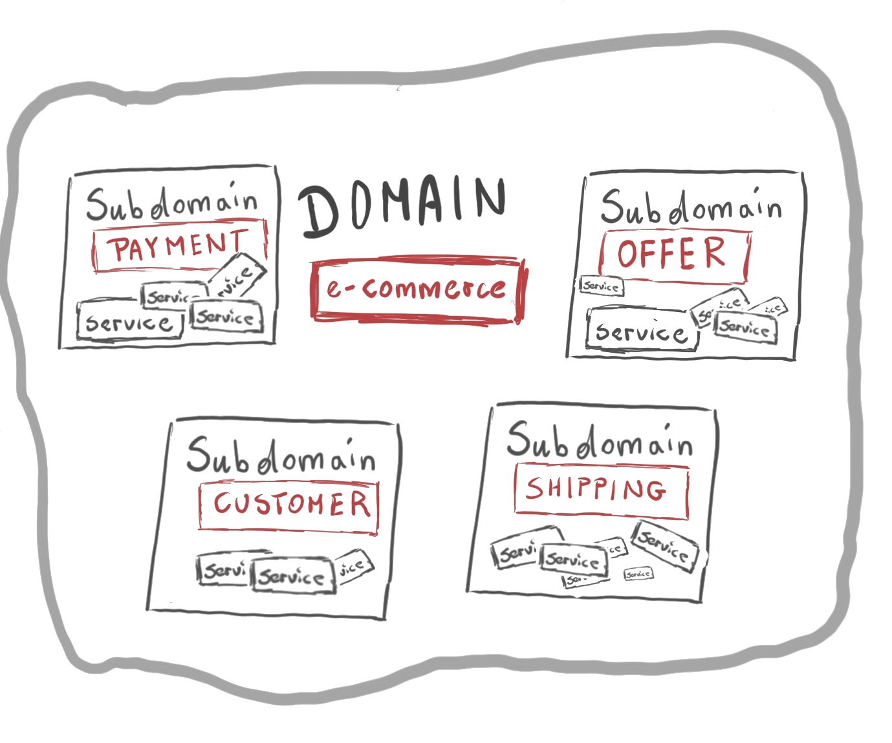
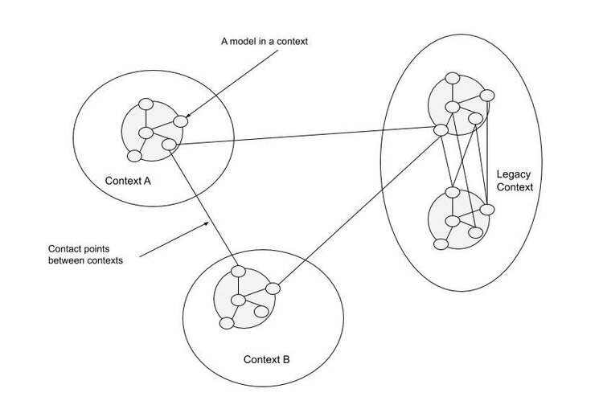
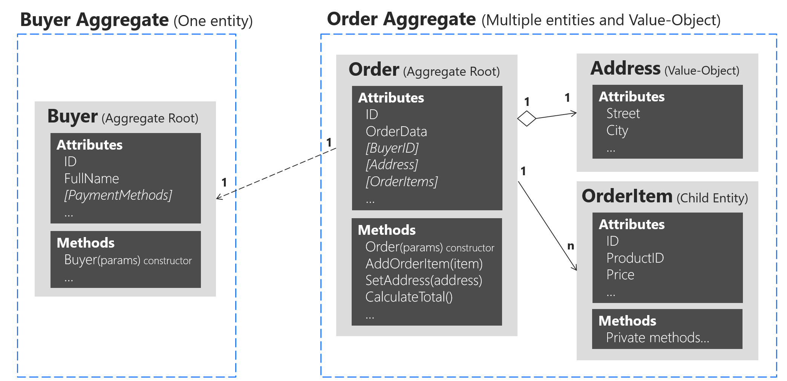
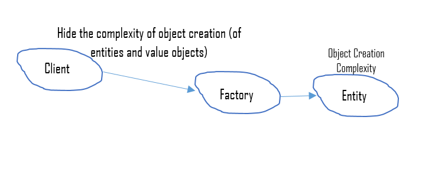
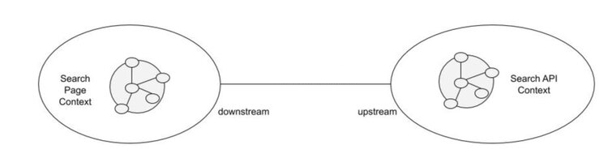
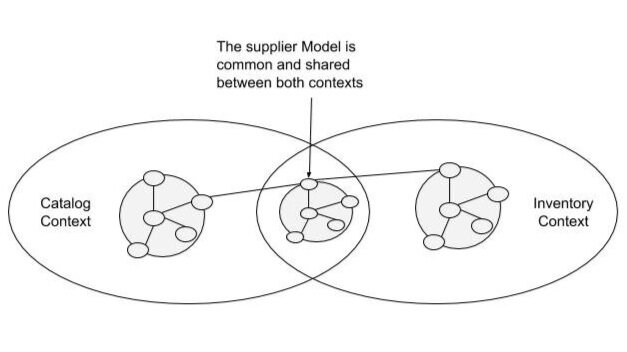
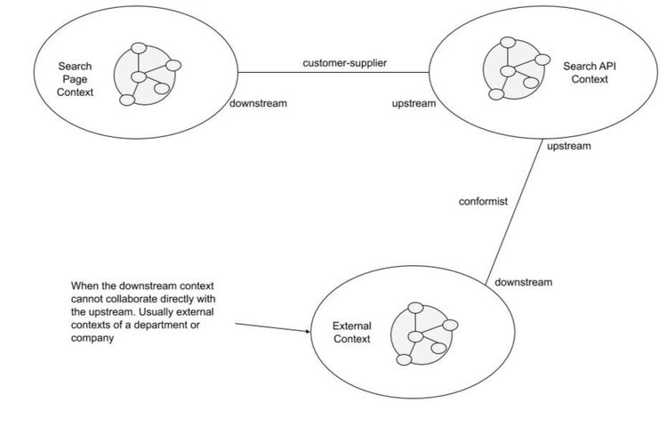
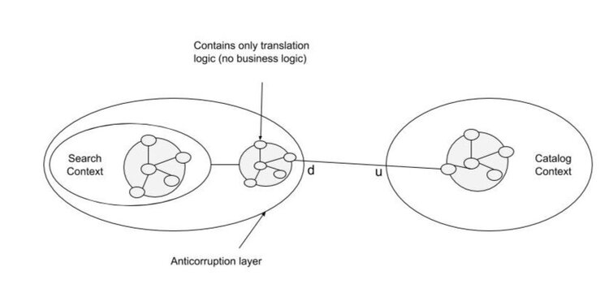
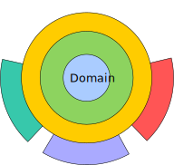
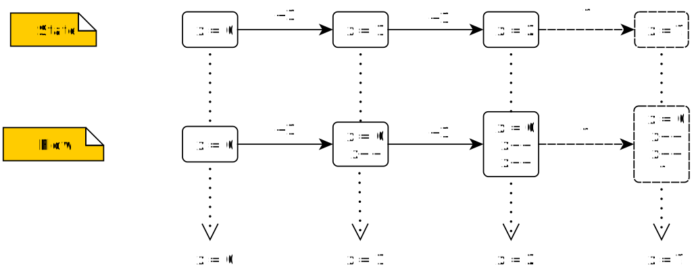

+++

title = "Domain Driven Design"
description = "Practical introduction to Domain Driven Design"
outputs = ["Reveal"]

[reveal_hugo.custom_theme_options]
targetPath = "css/custom-theme.css"
enableSourceMap = true

+++

# Domain Driven Design  

## 

 

### [Giovanni Ciatto --- `giovanni.ciatto@unibo.it`](mailto:giovanni.ciatto@unibo.it)

 

Compiled on:  --- [<i class="fa fa-print" aria-hidden="true"></i> printable version](?print-pdf&pdfSeparateFragments=false)

[<i class="fa fa-undo" aria-hidden="true"></i> back](..)

---

# Motivation and Context

---

## Why a structured design process?

- You know programming, in many _programming languages_

- You know about object-oriented programming and _design patterns_

- You know about _software architectures_ and _design principles_

- You know about _software engineering_ best practices

 

> What's the __criterion__ to choose __if__ and __when__ to adopt languages / patterns / architectures / principles / practices?

---

## Recommended workflow

### Problem $\xrightarrow{\color{red}analysis}$ **Model** $\xrightarrow{\color{red}design}$ Architecture $\xrightarrow{implementation}$ Solution

- yet, how to derive the model?

---

## Why Domain Driven Design?

- Here we present __domain-driven design__ (DDD)
    + one of many approaches to software design

 

- It consists of principles, best practices, and patterns leading design
    + unified under a common _philosophy_
    + focus is on the _design workflow_, other than the result

 

- Major benefits:
    + it stresses _adherence_ to the problem at hand
    + it focuses on delivering a _business-tailored_ model
        * and, therefore, a business-tailored solution
    + it harmonises _communication_ among managers, technicians, and users
    + it stresses the production of maintanable and _extensible_ software

---

#  Main notions of DDD

---

{}

## What is the domain?

- Definition of __domain__:
    + a well-established _sphere of knowledge_, influence or activity
    + the _subject area_ to which the user applies the software

 

- Remarks:
    + focus is on how __users and experts perceive the domain__
    + focus is __not__ on how __developers__ perceive the domain

 

- Examples of domains and the contexts composing them
    + some university (department, faculty, HR, etc.)
    + some given company (manufacturing, marketing, HR, etc.)
    + linear algebra (matrices, complex numbers, polynoms, etc.)
    + machine learning (classification, regression, feature selection, etc.)

---

## DDD Philosophy (pt. 1)

- _Software_ will represent a _solution_ to a _problem_ in some __business domain__
    + it should be _modelled_ & _implemented_ to match that domain
        * i.e. modelling should elicit the key aspects of a domain, possibly by interacting with experts
        * i.e. design and implementation should _mirror_ the domain

- Words do not have meaning per se, but rather w.r.t. a domain
    + i.e. the _same word_ may have _different meanings_ in different domains
    + each domain comes with a particular language characterising it
        * _software components_ (interfaces, classes, etc.) should be _named after_ that language
    + _interaction with experts_ is essential to identify a domain’s language

---

## DDD Philosophy (pt. 2)

- Software should stick to the domain, at any moment
    + archiecture and implementation should favour adherence to the domain
        * in spite of their evolution / modification

 

- Functionalities, structure, and UX should mirror the domain too
    - using the libraries should be natural for developers
    - UX should be natural for users

    as both developers and users are (supposed to be) immersed in the domain

{}

---

{}

## Overview of main notions 

- __Domain__: the reference area of knowledge

- __Context__: a portion of the domain

- __Model__: a reification of the domain in software

- __Ubiquitous Language__: language used by domain experts and mirrored by the model

---

## The _Domain_

> A well established sphere of knowledge, influence or activity

- e.g. some university (department, faculty, HR, etc.), linear algebra, etc.

---

## _Contexts_

> A _portion_ of the domain with a clear _boundary_:
> - relying on a sub-set of the concepts of the domain
> - where words/names have a unique, precise meaning
> - clearly distinguishable from other contexts

- e.g. departments, divisions, complex numbers, etc.

--- 

## Domain _vs._ Context

---

## The domain _Model_

> Set of __software__ abstractions mapping relevant _concepts_ of the domain

- e.g. Java/Kotlin/Scala projects, packages, interfaces, classes, records, methods, etc.

---

## The _Ubiquitous Language_

> - A _language_ structured around the domain model
>   + _used by all people_ involved into the domain
>   + which should be _used in the software_
>   + in such a way that their _semantics is preserved_

- underlying assumption:
    * different people call the same things differently
    * especially when they come from different contexts

- commonly reified into a __glossary__ of terms

- __used to name software components__

{}

---

{}

## Conceptual Workflow

1. Identify the __domain__, give a name to it

2. Identify the __main contexts__ within the domain, giving them names
    -  possibly, by interacting with experts

3. Identify the actual meaning of __relevant words__ from the domain, and track them into a __glossary__
    - possibly, by interacting with experts
    
    - _without assuming you already know the meaning of words_
        + i.e. do __not__ rely on (your) __common sense__

    - keep in mind that the meaning of words may vary among contexts
        + __homonyms__: similar names, different meanings
        + __synonyms__: different names, similar meanings 

4. Adhere to the language, use it, make it yours
    - especially when talking about the domain / model / software
    - design/sketch code mirroring the language

5. Draw a __context map__ tracking
    - the main contexts and their junctions
    - words whose meaning varies across contexts

6. Model the software around the ubiquitous language
    - rule of thumb: __1 concept $\approx$ 1 interface__

---

## Example of context map

{}

---

# DDD Building Blocks

---

## Towards building blocks


{}
Domain

- Concept
    + instance
{}
{}
$\xrightarrow{modelling}$
{}
{}
Model

- Type
    + object
{}


- Each _concept_ from each **context** shall become a _type_ in the **model**
    + type $\approx$ class, interface, structure, ADT, etc.
        * depends on what the programming language has to offer

 

- Use _building blocks_ as __archetypes__
    + let them guide and constrain your design

---

## Workflow

(continued)

7. _Chose_ the most adequate __building block__ for each concept
    - depending on the nature of the concept
    - ... or the properties of its instances

8. The building block dictates how to __design the type__ corresponding to the concept
    - objects in OOP are shaped by types

9. The choice of building block may lead to the identification of __other concepts / models__
    - e.g. entities may need value objects as identifiers
    - e.g. entities may need repositories to be stored
    - e.g. entities may need factories to be created
    - e.g. aggregates may be composed by entities or value objects

---

{}

## Building blocks (overview)

- __Entity__: objects with an identifier

- __Value Object__: objects without identity

- __Aggregate Root__: compound objects

- __Domain Event__: objects modelling relevant event (notifications)

- __Service__ objects: providing stateless functionalities

- __Repository__: objects providing storage facilities

- __Factory__: objects creating other objects

--- 

## Building blocks (concept)

---

## Entities vs. Value Objects

> Genus-differentia definition:
> - _genus_: both can be used to model __elementary__ concepts
> - _differentia_: entities have an explicit __identity__, value objects are __interchangeable__

 

### Quick modelling examples

#### Classroom

- Seats in classroom may be modelled as value-objects

- Attendees of a class may be modelled as entities

#### Seats on a plane

- Numbered seats $\rightarrow$ entities

- otherwise $\rightarrow$ value objects

---

## Entities vs. Value Objects (constraints)

### Value Objects

- Identified by their _attributes_
    + equality compares attributes alone
- Must be _stateless_ $\Rightarrow$ better to use _immutable_ design
    + read-only properties
    + lack of state-changing methods
- May be implemented as 
    - structures in .NET
    - _data classes_ in Kotlin, Scala, Python
    - records in Java
- _Must_ implement `equals()` and `hashCode()` on JVM
    + implementation must compare the objects' attributes

---

## Entities vs. Value Objects (constraints)

### Entities

- They have an inherent _identity_, which never changes during their lifespan
    + common modelling: __identifier attribute__, of some value type
    + equality compares identity
- Can be _stateful_ $\Rightarrow$ may have a _mutable_ design
    + modifiable properties
    + state-changing methods
- May be implemented via _classes_ in most languages
- Must implement `equals()` and `hashCode()` on JVM
    + implementation must compare (at least) the objects' identifiers

---

## Entities vs. Value Objects (example)


interface Customer {
    + CustomerID getID()
    ..
    + String getName()
    + void **setName**(name: String)
    + String getEmail()
    + void **setEmail**(email: String)
}
note left: Entity

interface CustomerID {
    + Object getValue()
}
note right: Value Object

interface TaxCode {
    + String getValue()
}
note left: Value Object

interface VatNumber {
    + long getValue()
}
note right: Value Object

VatNumber -d-|> CustomerID
TaxCode -d-|> CustomerID

Customer *-r- CustomerID


---

## Aggregate Root

### Definition

- A _composite_ entity, _aggregating_ related entities/value objects

- It _guarantees_ the _consistency_ of the objects it contains

- It _mediates_ the usage of the composing objects from the outside
    + acting as a _façade_ ([à la GOF](https://en.wikipedia.org/wiki/Facade_pattern))

- Outside objects should _avoid_ holding _references_ to composing objects

---

## Aggregate Root (constraints)

- They are usually _compound_ entities

- They can be or exploit _collections_ to contain composing items
    + they may leverage on the [composite pattern](https://en.wikipedia.org/wiki/Composite_pattern)

- May be better implemented as _classes_ in most programming languages

- _Must_ implement `equals()` and `hashCode()` on JVM (as any other entity)
    + implementation may take _composing_ items into account

- Components of an aggregate should _not_ hold **references** to components of _other_ aggregates
    + that's why they are called aggregate _roots_
    + notable exception: _references_ to _identifiers_ of other aggregates

    

---

## Aggregate Root (example)

(notice the link between `Order` and `Buyer` implemented by letting the `Order` hold a reference to the `BuyerID`)

---

## Factories (definition)

> Objects aimed at __creating__ other objects

 

---

## Factories (details)

### Purpose

+ Factories encapsulate the _creation logic_ for _complex objects_
    * making it evolvable, interchangeable, replaceable

+ They ease the enforcement of _invariants_

+ They support _dynamic selection_ of the most adequate _implementation_
    + while _hiding_ the actual implementation choice

### Remarks

- DDD's notion of factory is quite loose
    + DDD's Factories $\supset$ GOF's Factories $\cup$ Builders $\cup$ ...

---

## Factories (constraints)

- They are usually _identity-less_ and _state-less_ objects
    + recall the [abstract factory pattern](https://en.wikipedia.org/wiki/Abstract_factory_pattern)

- May be implemented as _classes_ in most OOP languages

- Provide methods to _instantiate_ entities or value objects

- Usually they require _no mutable_ field/property

- No need to implement `equals()` and `hashCode()` on JVM

---

## Factories (example)


interface CustomerID

interface TaxCode

interface VatNumber

interface Customer

Customer "1" *-- "1" CustomerID

VatNumber -u-|> CustomerID
TaxCode -u-|> CustomerID

interface CustomerFactory {
    + VatNumber computeVatNumber(String name, String surname, Date birthDate, String birthPlace)
    ..
    + Customer newCustomerPerson(TaxCode code, String fullName, string email)
    + Customer newCustomerPerson(String name, String surname, Date birthDate, String birthPlace, String email)
    ..
    + Customer newCustomerCompany(VatNumber code, String fullName, String email)
}
note bottom of CustomerFactory
- method for creating VAT numbers
- methods for creating person customers
- methods for creating company customers
end note

CustomerFactory -r-> VatNumber: creates
CustomerFactory -u-> Customer: creates


--- 

## Repositories (definition)

> Objects mediating the _persistent_ __storage/retrieval__ of other objects

---

## Repositories (details)

### Purpose

- Hiding (i.e. be backed by) some _database technology_ 
- Possibly realising some sort of [object-relational mapping (ORM)](https://en.wikipedia.org/wiki/Object%E2%80%93relational_mapping)
- _Storing_ / _retrieving_ aggregate roots as _wholes_
- Supporting _CRUD_ operations on aggregate roots
    - Create, Read, Update, Delete

### Remarks

- They may exploit _factories_ for turning retrieved data into objects
- If properly engineered, _avoids lock-in_ effect for database technologies 
- Design & implementation may require thinking about:
    - the architecture, 
    - the infrastructure, 
    - the expected load, 
    - etc.

---

## Repositories (constraints)

- They are usually _identity-less_, _stateful_, and _composed_ objects 
    + state may consist of the _stored objects_
    + state may consist of _DB connections_

- May be implemented as _classes_ in most OOP languages

- Provide methods to
    + _add_, _remove_, _update_ aggregate root entities 
    + _select_ and return one or more entities, possibly in a _lazy_ way
        * this should return `Iterable`, `Collection`, or `Stream` on JVM 

- _Non-trivial_ implementations should take care of
    + enforcing _consistency_, in spite of _concurrent_ access 
    + support complex _transactions_

---

## Repositories (example)


interface CustomerID 

interface Customer

Customer "1" *-u- "1" CustomerID

interface CustomerRegistry {
    + Iterable<Customer> getAllCustomers()
    ..
    + Customer findCustomerById(CustomerID id)
    + Iterable<Customer> findCustomerByName(string name)
    + Iterable<Customer> findCustomerByEmail(string email)
    ..
    + void addNewCustomer(Customer customer)
    + void updateCustomer(Customer customer)
    + void removeCustomer(Customer customer)
}

CustomerRegistry "1" o--> "N" Customer: contains
CustomerRegistry --> CustomerID: exploits


---

## Services

> _Functional_ objects encapsulating the _business logic_ of the software 
>   e.g. operations spanning through _several_ entities, objects, aggregates, etc.

### Purpose

- Reifying _control-related_ aspects of the software
- _Wiring_ aggregates, entities, and value objects _together_ 
- Exposing _coarse-grained functionalities_ to the users
- Providing a _façade_ for the domain
- Make the business logic evolvable, interchangeable, replaceable

### Remarks

- Services may be _exposed_ via ReSTful API
- Should be designed keeping _current uses cases_ into account (i.e. design services to be _purpose-specific_)
    + entities/objects should support _future use cases_, too (i.e. design entities/objects to be _general purpose_)

---

## Services (constraints)

- They are usually _identity-less_, _stateless_ objects 

- May be implemented as classes in OOP languages
    + or bare _functions_ in functional languages

- Commonly provide _procedures_ to do business-related stuff 
    + e.g. a particular operation...
        * ... concerning some particular aggregate root 
        * ... which does not support it directly through its methods
        * ... because the operation is use-case specific
    + e.g. proxying an external service
    + e.g. a complex operation involving several aggregates, repositories, factories, etc.

- Non-trivial implementations should take care of
    + supporting _concurrent access_ to the service’s facilities 
    + exposing _domain events_ to the external world

--- 

## Services (example)


interface OrderManagementService {
    + void performOrder(Order order)
}

interface Order {
    + OrderID getId()
    + Customer getCustomer()
    + void setCustomer(Customer customer)
    + Date getTimestamp()
    + void setTimestamp(Date timestamp)
    + Map<Product, long> Amounts getAmounts()
}

interface OrderID

interface Customer

interface Product

interface OrderStore

Order "1" *-r- "1" OrderID
Order "1" *-d- "1" Customer
Order "1" *-u- "N" Product
OrderStore "1" *-- "N" Order

OrderManagementService ..> Order: handles
OrderManagementService ..> OrderStore: updates

note bottom of OrderStore: repository
note top of Order: entity
note right of OrderID: value object
note right of Product: entity
note right of Customer: entity
note top of OrderManagementService: service

OrderID -u[hidden]- Product
OrderID -d[hidden]- Customer 



---

## Domain Events (definition)

> A value-like object capturing some domain-related _event_ 
>   (i.e., an observable _variation_ in the domain, which is _relevant_ to the software)

- actually, only the event _notification_/description is reified to a type

---

## Domain Events (details)

### Purpose
- _Propagate_ changes among portions of the domain model (e.g. contexts, aggregates, entities, etc.)
- _Record_ changes concerning the domain

### Remarks

- Strong relation with the [observer pattern](https://en.wikipedia.org/wiki/Observer_pattern) (i.e. publish-subscribe) 

- Strong relation with the _event sourcing_ approach (described later) 

- Strong relation with the _CQRS pattern_ (described later)

---

## Domain Events (constraints)

- They are usually _time-stamped_ value objects

- May be implemented as _data-classes_ or _records_

- They represent a _relevant variation_ in the domain
    + e.g. a _change_ in the _state_ of some entity / repository

- Event sources & listeners shall be identified too
    + who is _generating_ the event?
    + who is _consuming_ the event?

- _Infrastructural components_ may be devoted to _propagate_ events across contexts
    + e.g. a message broker, a message queue, etc.

- \[Teacher's Suggestion\]: prefer _neutral_ names for event classes in the model
    * e.g. `OrderEventArgs` instead of `OrderPerformedEventArgs`
    * e.g. `OrderEvent` instead of `OrderPerformedEvent`
    * the reason: the same OOP type may be used to represent different events:
        + e.g. `orderIssued`, `orderConfirmed`, `orderCancelled`, etc.

---

## Domain Events (example)


interface OrderManagementService {
    + void performOrder(Order order)
    ..
    + void **notifyOrderPerformed**(OrderEventArgs event)
}

interface OrderEventArgs {
    + OrderID getID()
    + CustomerID getCustomer()
    + Date **getTimestamp**()
    + Dictionary<ProductID, long> getAmounts()
}

interface OrderID

interface CustomerID

interface ProductID

OrderEventArgs "1" *-u- "1" OrderID
OrderEventArgs "1" *-r- "1" CustomerID
OrderEventArgs "1" *-d- "N" ProductID

OrderEventArgs .. OrderManagementService

note left of OrderEventArgs: domain event
note left of OrderID: value object
note left of ProductID: value object
note right of CustomerID: value object
note right of OrderManagementService: service


{}

--- 

# DDD Patterns

---

## Towards DDD patterns

### Further notions involving __contexts__

- __Bounded Context__: enforce a model’s _boundaries_ & make them explicit

- __Context Map__: providing a _global view_ on the domain and its contexts

---

## Actual definitions

### Context Boundary

> The _boundary_ of a context and its software model should be __explicit__.
> This is helpful from several perspectives:
> - technical (e.g., __dependencies__ among classes/interfaces)
> - physical (e.g., common database, __common facilities__)
> - organizational (e.g. __people/teams__ maintaining/using the code)

 

### Context Map

> A __map__ of _all_ the __contexts__ in a domain and their __boundaries__
> - and their __points of contact__
>   + e.g. their dependencies, homonyms, false friends, etc.
> - providing the whole picture of the domain

---

## Example of bounded context map

---

## Bounded Contexts & Context Maps (best practices)

- Clearly _identify & represent_ **boundaries** among contexts

- *Avoid* __responsibility diffusion__ over a single context
    + one responsible person / team for each context

- *Avoid changes* in the model for __problems__ arising __outside__ the context
    + rather, extend the domain by creating new contexts

- Enforce context’s __cohesion__ via automated unit and integration __testing__
    + to be (re)executed as frequently as possible

---

## Model integrity problem

### How to preserve the integrity of the model?

- As the __domain evolves__, the software _model should evolve_ with it
    + in order to maintain the coupling

- Yet, the domain rarely changes as a whole
    + more commonly, it changes in a __context-specific__ way

- Contexts-are bounded, but __not isolated__
    + so are models, which may _depend_ on each other

- Changes to a context, and its model may __propagate__ to other context / models

> Domain / model __changes are critical__ and should be done carefully

---

## Model integrity patterns

- __Shared kernel__: sharing a common model among contexts
- __Customer--supplier__: the consumer model's team requests changes in the supplier model
- __Conformist__: one model's team reacts to changes of some model they depend on
- __Anti-corruption layer__: a model's team isolates itself from another model

### Purposes

- _Preserve_ the integrity of the model w.r.t. the domain

- _Minimise_ the potential _impact_ / _reach_ of changes
    + each context should be as independent as possible
    + each change affect as few contexts as possible

--- 

## Model integrity patterns (background, pt. 1)

- Context maps highlight relations among contexts
    + yet, _not_ __all relations are equal__, nor symmetric

--- 

## Model integrity patterns (background, pt. 2)

Each relation among 2 contexts usually involves 2 ends/roles:
- __upstream__ end, i.e. the one _providing_ functionalities
- __downstream__ end, i.e. the one _consuming_ functionalities
    + the downstream _depends_ upon the upstream, but _not_ vice versa

 

__Integration__ among _contexts_ $\leftrightarrow$ __interaction__ among _teams_
- several strategies may be employed, depending on
    + mutual _trust_* among teams
    + ease of _communication_/cooperation among teams
    + technical / organizational / administrative / legal _constraints_

  

*trust $\approx$ willingness to collaborate + seek for stability

---

## Shared Kernel

- Best when: multiple contexts _share_ the __same team__ / organization / product

- Key idea: __factorise__ common portions of the model into a shared kernel

- Upstream and downstream __collaborate__ in designing / developing / maintaining the model
    + they are _peers_

- Keeping the __kernel__ as __small__ as possible is fundamental

---

## Customer--Supplier

- Best when: 
    + multiple teams
    + __mutual trust__ 
    + good communication

- Key idea:
    + __upstream__ acts as _supplier_, __downstream__ acts as _customer_
    + both sides collaborate to __maximise integration__ among their models
        * and interoperability among their software

- Customers may _ask_ for features, suppliers will do their best to __provide__ them

- Suppliers shall __warn__ before changing their model

---

## Conformist

- Best when: 
    + multiple teams
    + poor communication / different pace
    + some trust

- Key idea: downstream must conform to the upstream, reactively
    + adapting their model accordingly
    + whenever the upstream's one changes

---

## Anti-corruption layer

- Best when: 
    + multiple teams
    + poor communication 
    + poor trust

 - If upstream cannot be trusted, and interaction is pointless...
    + e.g. legacy code, poorly maintained library, etc.

- ... downstream must defend from unexpected / unanticipated change

- The upstream's model is then reverse engineered & __adapted__
    + e.g. often, repository types are anti-corruption layers for DB technologies

--- 

# Layered Architecture

---

## Layered Architecture (disclaimer)

- DDD does not enforce a particular architecture

- Any is fine as long the model is integer

- Layered architectures are well suited to preserve models' integrity

- Here we focus on the __hexagonal architecture__, a particular case of layered architecture
    + well suited to DDD

---

## Hexagonal architecture (concept)

- outer layers depend on innermost ones
    + the vice versa is not true

---

## Hexagonal architecture (explanation)

1. __Domain layer__: contains the domain model (entities, values, events, aggregates, etc.)
    - must support a wide range of applications
    - has no dependency from any other layer

2. __Application layer__: contains services providing business logic
    - supports a particular use case via services
    - depends on the domain layer

3. __Presentation layer__: provides conversion facilities to/from representation formats
    - e.g. JSON, BSON, XML, YAML, XDR, Avro, HTML, etc.
        + depends on the domain layer (and, possibly, on the application layer)

4. __Storage layer__: supports persistent storage/retrieval of domain data
    - this is where repositories are implemented
    - may involve some DB technology
    - depends on the domain layer (and, possibly, on the presentation layer)

5. __Interface layers__ (e.g. ReST API, MOM, View): let external entities access the software
    - via a GUI, or via some remote interface such as HTTP

---

## Enforcing the architecture in the code

- Layering may be enforced in the code

- By mapping layers into modules
    + module $\approx$ packaging unit
        * e.g. Gradle sub-projects, Maven modules, .NET assemblies, etc.
    + each module having its own build dependencies


top to bottom direction

component ":domain" as domain
component ":application" as application
component ":presentation" as presentation
component "third-party serialization library" as gson
component "third-party DB client library" as db
component ":storage" as storage
component ":web-api" as server
component ":message-queue" as mq 
component ":command-line" as cli
component product

domain <|-- application
application <|-- presentation
presentation <|-- server
presentation <|-- mq
application <|-- storage
presentation -r-|> gson
presentation <|-- cli
db <|-l- storage  
product -u-|> server
product -u-|> storage
product -u-|> mq    


---

# Advanced aspects of DDD

---

## Event sourcing (preliminaries)

- Whenever there is a _mutable_ entity ...
- ... whose state evolution over time must be tracked ...
- ... state transitions can be memorised in 2 ways:
    + one may track the __current state__
    + or the __flow__ of __variations__

---

## Event sourcing

> A pattern where _domain events_ are reified into _time-stamped data_ and the whole _evolution_ of a system is persistently _stored_

- perfect match with DDD as domain events are first-class citizens

---

## Event sourcing (pros & cons)

### Benefits

- Historical data can be analysed, to serve several purposes
    + e.g. predictive maintenance, optimization, analyse & anticipate faults

- Past situations can be replayed
    + e.g. which improves debugging, enables measurements

- Enables complex event detection & reaction

- Enables CQRS (described later)

### Limitations

- A lot of data is generated and must be stored, which costs _space_
- Reconstructing the (current) state costs _time_

--- 

## Command--Query Responsibility Segregation (__CQRS__)

- Advanced pattern for building _highly-scalable_ applications

- It leverages upon _event sourcing_ and _layered architecture_...

- ... to deliver **reactive**, **eventual-consistent** solutions where:
    + contexts boundaries can be easily enforced
    + single responsibility principle is applied extensively

---

## CQRS definition

> __Split__ the _domain_ and _application_ layers to _segregate_ __read/write__ responsibilities

- __Read__ model (a.k.a. _view_ or _query_ model)
    + accepts queries aimed at __observing__ the state of the system

- __Write__ model (a.k.a. _command_ model)
    + accepts commands aimed at __altering__ the state of the system

---

## CQRS concept

---

## CQRS workflow (writing)

Whenever users are willing to _perform an action_ into the system:
1. they create a __command__ and forward it to the __write model__
  - i.e. an object describing a _variation_ to be applied to some domain aspect

 

2. the command is possibly _validated_ & __stored__ onto some database
  - an ad-hoc __database__ is available in the model for storing commands

---

## CQRS workflow (reading)

Whenever users are willing to _inspect/observe the system_ at time $t$:
1. they perform a __query__ on the __read model__
    - asking for the state of the system _at time $t$_
    - e.g. $t$ $\equiv$ now

 

2. commands up to time $t$ are assumed to be __reified__ when reading
    - a __snapshot__ of the system state _at time $t$_ is returned to users

---

## CQRS -- When are commands reified?

> __Reification__: is the process of computing the state of the system at time $t$ by applying of commands recorded up to time $t$
 

- If queries and commands are stored on different databases
    + reification implies updating the query database
    + the query database should be __read-efficient__
    + the commands database should be __write-efficient__

- Several, non-mutually-exclusive strategies:
    + __eager__: commands are reified as soon as they are received
    + __pull__: commands are reified upon reading queries
    + __push__: commands are reified in background, periodically

---

# Exercises

---

{}

## Exercise 1 -- Simple Store (pt. 1)

A simple domain keeping track of: _customers_, _products_, and _orders_.

### Customers

- Customers can either be companies or persons

- Companies are identified by a VAT number

- Persons are identified by tax codes

- In any case a name and email are recorded for each customer

- Both the name and email may vary over time

### Products

- Products are identified by name and type/category

- They have a nominal price, expressed using some currency

- The availability of each product is tracked as well

- Both the price and the available quantity may vary over time

---

## Exercise 1 -- Simple Store (pt. 2)

### Money and exchange rates

- Money is represented by a decimal value and a currency

- Currencies are represented by a name, a symbol and an acronym
    - e.g. Euro, EUR, €
    - e.g. USA Dollar, USD, $

- Exchange rates keep track of the conversion rate
    + from a source currency
    + to a destination currency
    + in a particular moment

- Information about exchange rates can be attained from the Internet

- We can compute the price of each product, in any currency, at any moment

---

## Exercise 1 -- Simple Store (pt. 3)

### Orders

- Orders are identified by a serial number

- They keep track of the many products ordered by a customer
    * and the amount of copies ordered for each product

- Also, orders keep track of when they have been performed

- All such information may be modified before the order is delivered

- When a new order is registered, many actions should be performed in reaction

- It must be possible to compute the actual total price of an order
    * in a particular moment, using a particular currency

---

## Exercise 1 -- Simple Store (pt. 4)

### TO-DO

1. __Read__ informal domain description
2. __Identify__ the main __domain concepts__ composing the ubiquitous language
3. __Model__ the domain as __Java types__ (classes or _interfaces_)
    - the model should include entities, value objects, repositories, factories, and services
4. __Structure__ the Java types according to some module structure compliant with __hexagonal architecture__
    - i.e. put code into either the `domain` or `application` modules
5. Sketch _tests_ and, then, implementation for at least one
    - entity
    - value object 
    - factory
    - repository
    - value object

{}

---

{}

## Exercise 2 -- Trivial CQRS (pt. 1)

- Very simple repository type: the `Counter`
- It contains 1 `long` number, initially set to `0`
- The value may be read or changed arbitrarily
- Whenever the value changes, a new domain event is published, of type `Variation`
- However, the repository only memorises the _current_ value of the counter

--- 

## Exercise 2 -- Trivial CQRS (pt. 2)

### TO-DO 

1. Switch the design towards __event sourcing__, by memorising variations instead of snapshots.
2. Implement the __CQRS pattern__ by splitting the repository into 2 parts:
  - a __write-model__ for storing variations
  - a __read-model__ for retrieving a snapshot of the counter's value in a given moment

 

In practice:
1. provide __implementations__ for the `CounterReader` and `CounterWriter` interfaces
2. optionally, _test_ those implementations

{}

---

{}

## Exercise 3 -- Anti corruption layer (pt. 1)

- Very simple domain: `Table`s
    + i.e. 2-D containers of `Row`s...
    + ... where each row contains one or more `String` values

- Functionalities for __CSV__ _import/export_ are missing and need to be implemented via _third-party libraries_
    + [Apache Commons CSV](https://commons.apache.org/proper/commons-csv/)
        * Guide here: <https://www.baeldung.com/apache-commons-csv>
    + [OpenCSV](http://opencsv.sourceforge.net/)
        * Guide here: <https://www.baeldung.com/opencsv>

---

## Exercise 3 -- Anti corruption layer (pt. 2)

### TO-DO

1. Extend the model of our domain with new __interfaces__ supporting __CSV parsing / writing functionalities__
2. Design the interfaces so that they are __agnostic__ of the third-party libraries
    - without corrupting the domain model with library-specific types
3. Provide __implementations__ for the interfaces, using __one of the two__ libraries
4. Sketch _tests_ for the implementations
5. Provide __implementations__ for the interfaces, using __the other__ library
6. Use the same tests as above to prove the two implementations work _the same way_

{}