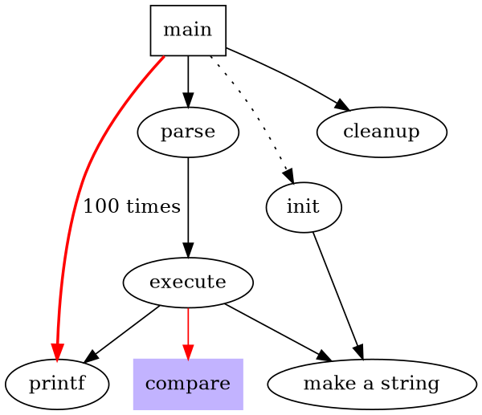
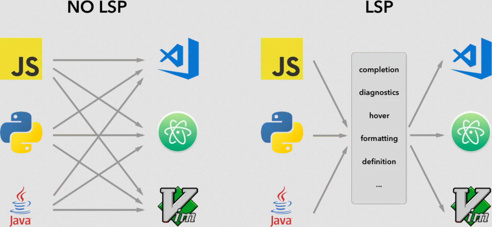
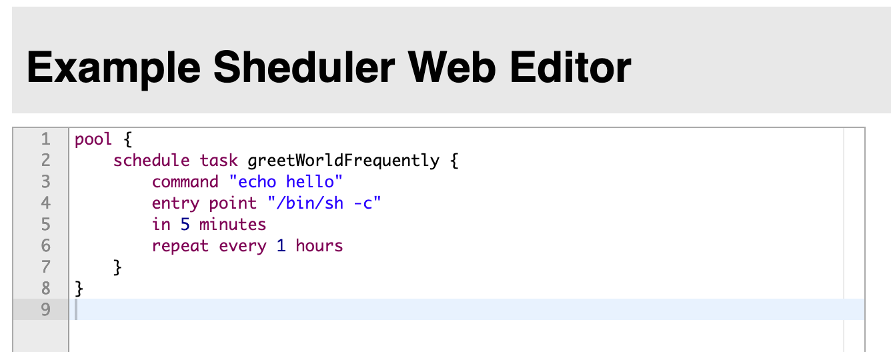

+++

title = "Model Driven Development"
description = "Practical introduction to Model Driven Development"
outputs = ["Reveal"]

[reveal_hugo.custom_theme_options]
targetPath = "css/custom-theme.css"
enableSourceMap = true

+++

<style>
.reveal blockquote {
    font-family: 'Georgia';
}
</style>

# Model Driven Development

---

## Lecture goals

- Understand __metamodelling__
- Understand __domain specific languages__
- Practice with __model driven development__ in _Xtext_

---

## Meta-modelling nomenclature

0. (Abstract) __Language__ $\approx$ (abstract) _syntax_ + _semantics_

1. __Model__ $\approx$ the abstract language by which we describe the possible entities involved in a __domain__
    + the model __abstracts__ a number of similar systems rooted in the domain
    + each system is an _instance_ of the model it has been designed from
    + a model is a _template_ for several systems

2. In which _language_ is the model __expressed__?
    + __Meta-model__ $\approx$ the abstract language by which we describe __models__
    + for instance __UML__ is the meta-model behind __object-oriented programming__
        * UML $\equiv$ [Unified Modeling Language](https://www.uml.org/)

3. In which language is the _meta_-model expressed?
    + __Meta-meta-model__ $\approx$ the abstract language by which we describe __meta-models__
    + for instance __MOF__ is the meta-meta-model behind __UML__ according to __OMG__
        * MOF $\equiv$ [Meta-Object Facility](https://www.omg.org/spec/MOF)
        * OMG $\equiv$ [Object Management Group](https://www.omg.org/)

---

## Meta-model hierarchy

cf. <https://www.omg.org/ocup-2/documents/Meta-ModelingAndtheMOF.pdf>


---

## Meta-model hierarchy example


---

## Why are meta-models important?

- __Meta-models__ are the very first thing you should try to identify whenever approaching a new __technology__

- If you grasp the meta-model, you grasp the __essence__ of the technology
    + which may be same for many other technologies

- E.g. after you learned the _basics of OOP_ (classes, methods, objects, etc.) you may easily learn _any_ __other OOP language__
    + by simply asking yourself how _each meta-model element_ is __expressed__ in the new language
        * e.g. how are classes / methods / objects expressed in the new language?

- When you model a domain (e.g. with DDD) you are always exploiting some __meta-model__
    + whether you are aware of it or not

---

## Model-driven whatever

- Several, slightly similar names, make create _confusion_
    * e.g. model-driven engineering / development / architecture / etc.

- Please read _Martin Fowler_'s article on [Model-Driven Software Architecture](https://martinfowler.com/bliki/ModelDrivenArchitecture.html) to clarify

- Despite the name the key ideas can be summarised as follow:
    1. _software engineering_ workflow should start by __modelling the domain__ at hand carefully
        * e.g. with DDD
        * as opposed to focussing on algorithms and data structures

    2. the production of a runnable implementation should be __automated__ as much as possible
        * e.g. by __generating__ code from models
        * as opposed to writing code by hand

---

## About code generation from models

- Assumption: the model is expressed by means of some __formal language__

- __Formal__ language $\approx$ interpretable by a machine

- Formality is a __prerequisite__ for __automation__
    1. the model is __parsed__ by a machine
    2. the model is __transformed__ into another formal language (e.g. _OO programming language_)
    3. the transformed model is __rendered__ into a file (e.g. _source code_)

- Is __UML__ adequate? Is it the only choice? _Any alternative?_
    * UML has a formal syntax and semantics (reified into __graphical representation rules__)
    * __rarely enforced__ by software tools
    * furthermore UML is focussing on __software__
        + only practical for _software engineers_

---

{}

## Towards domain specific languages

- __Domain-specific Languages__ (DSL) are _programming_ / _description_ / _specification languages_ targetting one __particular__ class of problems
    * e.g. they are _not_ meant to address all possible problems, but just the ones they are designed for

- As opposed to __general-purpose languages__ (GPL) which are targetting __as many__ classes of problems __as possible__
    * the programming languages you learned so far are GPL

- DSL may act as __custom meta-models__ for a given domain

- Examples of DSLs you may already know:
    + _regular expressions_ for text processing
    + _SQL_ for database querying
    + _CSS_ for styling web pages
    + _HTML_ for describing web pages content
    + _DOT_ for graph visualisation
    + _PlantUML_ for UML diagrams visualisation
    + _Gherkin_ for Behavior-Driven Development (BDD)
    + _VHDL_ for hardware description

---

## DSL Examples (pt. 1)
### DOT: a DSL to visualise graphs

{}
{}

{}
{}

{}
{}

+ DOT is a language that can describe graphs, for the sake of their visualisation

+ The most common implementation is the [Graphviz toolkit](https://graphviz.org/)

---

## DSL Examples (pt. 2)
### PlantUML: a DSL to visualise UML diagrams

{}
{}
```plantuml
interface Customer {
    + CustomerID getID()
    + String getName()
    + void **setName**(name: String)
    + String getEmail()
    + void **setEmail**(email: String)
}

note left: Entity

interface CustomerID {
    + Object getValue()
}
note right: Value Object

interface TaxCode {
    + String getValue()
}
note left: Value Object

interface VatNumber {
    + long getValue()
}
note right: Value Object

VatNumber -d-|> CustomerID
TaxCode -d-|> CustomerID

Customer *-r- CustomerID
```
{}
{}

interface Customer {
    + CustomerID getID()
    + String getName()
    + void **setName**(name: String)
    + String getEmail()
    + void **setEmail**(email: String)
}
note left: Entity

interface CustomerID {
    + Object getValue()
}
note right: Value Object

interface TaxCode {
    + String getValue()
}
note left: Value Object

interface VatNumber {
    + long getValue()
}
note right: Value Object

VatNumber -d-|> CustomerID
TaxCode -d-|> CustomerID

Customer *-r- CustomerID

{}
{}

---

## DSL Examples (pt. 3)
### Gherkin: a DSL to write BDD tests in a human-friendly way

```gherkin
Scenario: Verify withdraw at the ATM works correctly
Given John has 500$ on his account
When John ask to withdraw 200$
And John inserts the correct PIN
Then 200$ are dispensed by the ATM
And John has 300$ on his account
```

- Gherkin is a language that can describe __behavioural tests__ for software systems
    * i.e. what system should do in given scenario

- Syntax if very flexible and it seems like _natural language_

- Stakeholders and engineer will agree on a set of __behavioural specifications__ for the system
    + written in Gherking

- The most common implementation is [Cucumber](https://cucumber.io/)
    + allowing the semi-automated translation of Gherkin specifications into __executable tests__

---

## DSL Examples (pt. 4)
### VHDL: a DSL to design hardware circuits

```vhdl
DFF : process(RST, CLK) is
begin
if RST = '1' then
Q <= '0';
elsif rising_edge(CLK) then
Q <= D;
end if;
end process DFF;
```

- VHDL is a language that can describe __hardware circuits__
    * i.e. the logic gates and their interconnections

- Seems like an ordinary programming language, but:
    * "variables" are indeed signals
    * "functions" are indeed circuits

- Technologies exist to __automatically translate__ VHDL into __hardware circuits__
    + e.g. [Xilinx Vivado](https://www.xilinx.com/products/design-tools/vivado.html)

- ... or to __simulate__ the behaviour of the circuit (either _in software_ or _in FPGA_)

---

## DSL Examples (pt. 5)
### [Strumenta](https://strumenta.com)'s DSL for financial accounting

Details here: <https://tomassetti.me/financial-accounting-dsl>

> __Goal__: use a DSL to describe taxes, pension contributions, and general financial calculations

```
pension contribution InpsTerziario paid by owner {
    considered_salary = (taxable of IRES for employer - amount of IRES for employer - amount of IRAP for employer) by ownership share
    rate = brackets [to 46,123] -> 22.74%,
                    [to 76,872] -> 23.74%,
                    [above]     -> 0%
    amount = (rate for considered_salary) with minimum 3,535.61
}

pension contribution InpsGLA paid by employer 2/3 and employee 1/3 {
    considered_salary = gross_compensation of employee
    rate = brackets [to 100,323] -> 27.72%,
                    [above]      -> 0%
    amount = rate for considered_salary
}
```

{}

---

## Benefits of adopting DSL

1. To communicate with domain experts in their own language
    + e.g. Gherkin is a language that can be understood by both engineers and stakeholders

2. To let domain experts __write__ the specifications (i.e. the model) of the system they want
    + hence reducing ambiguities among stakeholders and engineers

3. To focus on the __domain__ rather than on the __implementation__

4. To hide the __implementation details__ from the domain experts
    + e.g. exposing only business-related concepts, at the domain level

---

## DSL vs. GPL

- DSLs are __not__ a replacement for GPLs
    + they are __complementary__

- Yet the difference is fuzzy, so lets try to clarify:

|                            |            **GPL**           |               **DSL**               |
|:--------------------------:|:----------------------------:|:-----------------------------------:|
|         **Domain**         |              any             |            clear boundary           |
| **Syntactical constructs** |      many and composable     |            few and static           |
|     **Expressiveness**     |        Turing-complete       | possibly, less than Turing-complete |
|     **Customisability**    |           maximised          |    minimised / confined / absent    |
|       **Defined by**       |    companies or committees   |       teams of domain expertes      |
|        **User base**       | large, anonymous, widespread |       small, accessible, local      |
|        **Evolution**       |     slow, well-structured    |              fast-paced             |
|       **Deprecation**      |           very slow          |        feasible, often abrupt       |

---

# DSL Engineering

---

## Semantics of DSL

- Most often, the focus is on the __syntax__ of the DSL
    + as that's how users will perceive it

- Yet, the __semantics__ of the DSL is equally important
    + that dictates how the DSL __works__
    + and this is what engineers (DSL implementers) focus upon

- Intuitively, __semantics__ is given to languages by writing the machinery supporting their execution
    + three main aspects:
        1. __conversion__ into _runnable code_ (e.g. _translation_ or _interpretation_) ...
        2. ... leveraging onto a __execution engine__ (i.e. _library functionalities_ supporting the runnable code) ...
        3. ... in turn relying on a __software platform__ (e.g. JVM, .NET, etc.)

> The role of _DSL engineers_ mostly focuses on __steps 1__ & __2__ (other than defining the __syntax__)

---

## Converting DSL into runnable code

Two main approaches:

- __Translation__: translates a DSL script into a language for which an _execution engine_ on a given _target platform_ exists
    * a.k.a. __code generation__ or _transpilation_ if the target language is high-level (e.g. Java, JS, or C#)
        + e.g. [Xtend](https://eclipse.dev/Xtext/xtend/), or [TypeScript](https://www.typescriptlang.org/), despite being GPL, are transpiled into Java and JS respectively
    * a.k.a. __compilation__ if the target language is low-level (e.g. assembly, JVM bytecode, CRL, etc.)
        + e.g. Java is compiled into JVM bytecode (despite being a GPL)

- __Interpretation__: the execution engine is able to _parse and execute_ the DSL script _directly_
    * a.k.a. __runtime interpretation__ or _runtime compilation_ if the execution engine is able to compile the DSL script into a runnable code
        + e.g. [2P-Kt](https://github.com/tuProlog/2p-kt) is a GPL interpreted by a custom execution engine, written in Kotlin, running on the JVM

<br>

In both cases, there are technical __prerequisites__:
- a __parser__ for the actual syntax of the DSL should exist / be generated
- the __execution engine__ for the target platform should exist

---

{}

## External vs. internal DSL

- So far we discussed the so-called __external DSLs__
    + i.e. where the syntax is totally custom, hence requiring a __custom parser__

- As opposed to __internal__ (a.k.a. _embedded_) __DSLs__
    + i.e. where the syntax is a subset of some pre-existing GPL...
    + ... whose syntax is __flexible__ enough to allow _costimisation_

- Creating _internal_ DSL is a recent trend enabled by the wide adoption of flexible GPL
    + e.g. Kotlin, Groovy, or Scala, which come with _ad-hoc constructs_
        * e.g. trailing-lambda convention, infix notation, operator overloading, etc.

- Examples of _internal_ DSL you may already know:
    - [Kotlin DSL for Gradle](https://docs.gradle.org/current/userguide/kotlin_dsl.html)
    - [SBT](https://www.scala-sbt.org/1.x/docs/sbt-by-example.html)

- More on this topic in prof. Pianini's slides

---

## Example of internal DSL: `build.gradle.kts`

```kotlin
plugins {
    `java-library`
}

dependencies {
    api("junit:junit:4.13")
    implementation("junit:junit:4.13")
    testImplementation("junit:junit:4.13")
}

configurations {
    implementation {
        resolutionStrategy.failOnVersionConflict()
    }
}

sourceSets {
    main {
        java.srcDir("src/core/java")
    }
}

java {
    sourceCompatibility = JavaVersion.VERSION_11
    targetCompatibility = JavaVersion.VERSION_11
}

tasks {
    test {
        testLogging.showExceptions = true
        useJUnit()
    }
}
```
+ domain: build-automation
+ this is pure Kotlin + Gradle library (containing an "_execution engine_")
+ Gradle library is designed to be used as Kotlin DSL


---

## Key aspects of _internal_ DSL

- Internal DSL may __ease adoption__ of the DSL it self
    + users may _already know_ the GPL
        + hence they may be able to use the DSL _without learning a new language_
        + hence they may use the same __toolkits__ _available for the GPL_ (e.g. debugger, IDE, etc.)


- Internal DSL __simplify__ the __DSL engineering__ process
    + _no need_ to write and maintain a __custom parser__
        * as the parser is _already_ provided by the GPL
    + _no need_ to write and maintain __custom toolkits__
        * as the GPL toolkits may be _reused_

- The __integration__ among the GPL and the DSL is __tight__
    + the DSL may exploit the __constructs of the GPL__, and this is commonly _desired_
    + the DSL is __technologically__ and __syntactically bound__ to the GPL, and this is commonly _undesired_

---

## About the execution engine

- Be it internal/external or transpiled/interpreted, the DSL needs an __execution engine__
    + i.e. a library providing the __functionalities__ of the DSL

- This is _no different_ from __any other library__ supporting some given domain

- Except that hacks could exploit to ease the adoption of the __target DSL syntax__

{}

---

# MDD in Practice

---

## Tools for MDD

- Eclipse's [Xtext](https://eclipse.dev/Xtext/) widespread tool for MDD

- JetBrains' [MPS](https://www.jetbrains.com/mps/) main competitor of Xtext

- [Langium](https://langium.org) clone of Xtext, but based on TypeScript

### Other relevant tools for language engineering

- [ANTLR](https://www.antlr.org/) only parser generation for Java, JS, Python, .Net, C++

- [Language Server Protocol](https://microsoft.github.io/language-server-protocol/overviews/lsp/overview/) (LSP)

---

## Key idea behind LSP



- de-facto standard protocol among IDEs

- providing various IDE-like capabilities as-a-service

- making it easier to support multiple IDEs for the same language

- must-have feature for any MDD tool we may consider for our DSL

---

## About Xtext

- A framework for MDD and, in particular, __external DSL__

- Xtext provides a language for defining languages...

- ... which is also a __meta-modelling language__

- __Meta-modelling__ and __DSL definition__ are done _simultaneously_

- It automatically generates the full language infrastructure, including
    + model interfaces / classes ([EMF](https://eclipse.dev/modeling/emf/) compliant)
    + parser
    + validator (with pluggable rules)
    + transpiler stub
    + scoping (with pluggable rules)
    + IDE support via LSP
    + syntax colouring
    + etc.
    + test stubs

- Exercises and examples about MDD will be based on Xtext

---

## Running example: the **task scheduling** domain

- Users may be willing to __schedule__ custom _tasks_ on a machine

- __Task__ $\equiv$ running any _command_ available on the OS
    + via some _shell_ (e.g. `bash`, `cmd`, `powershell`, etc.) of choice

- __Scheduling__ implied defining _when_ the task should be executed
    + _relatively_ to now: e.g. _**in** 5 minutes_, _**in** 1 hour_, etc.
    + _absolutely_: e.g. _today **at** 10:00_, _tomorrow **at** 12:00_, _**on** 2023/11/23 **at** 13:16_ etc.
    + _before_ or _after_ __some other task__
    + _periodically_: e.g. _**every** 5 minutes_, _**every** 48 hours_, etc.

- Notice that tasks may be _inter-**dependent**_ (e.g. because of before/after relations)

---

## Running example: the `Sheduler` DSL (pt. 1)

> __Sheduler__ $\equiv$ **Sh**ell + Sch**eduler**
>
> ¯\\_(ツ)_/¯

1. We shall use __Xtext's meta-modelling language__ to define the domain of _task scheduling_

1. Simultaneously, we will define the __syntax__ of the DSL

2. We will then add __scoping__ and __validation__ rules to the DSL, via the Xtext framework

3. The next step is designing and implementing the __execution engine__ for the DSL
    + we shall exploit Java's [`ScheduledExecutorService`s](https://docs.oracle.com/en/java/javase/17/docs/api/java.base/java/util/concurrent/ScheduledExecutorService.html) for this purpose

4. Finally, we will create a __code generator__ creating Java code from the DSL

---

## Running example: the `Sheduler` DSL (pt. 2)

Code: <https://github.com/unibo-spe/sheduler-lang>

1. Clone with Git the `exercises` branch

2. The cloned repository is and [Ecplise](https://www.eclipse.org/downloads/) project
    + please install [Eclipse for DSL developers](https://eclipse.dev/Xtext/download.html) from Xtext's website

4. In Eclipse, import the _repository root_ directory as a __Gradle project__

5. You may also use __IntelliJ__, in that case just import the `sheduler-lang/` directory as _Gradle project_
    + no syntax colouring or Xtext support on IntelliJ or VSCode

---

## Xtext project structure (pt. 1)

```
sheduler-lang/
├── build.gradle
├── gradle/
├── gradle.properties
├── gradlew
├── gradlew.bat
├── it.unibo.spe.mdd.sheduler/
│   ├── build.gradle
│   └── src/
│       └── main/
│           └── java/
│               └── it/unibo/spe/mdd/sheduler/
│                   └── sheduler
│                       ├── GenerateSheduler.mwe2
│                       └── Sheduler.xtext
├── it.unibo.spe.mdd.sheduler.ide/
│   └── build.gradle
├── it.unibo.spe.mdd.sheduler.web/
│   └── build.gradle
└── settings.gradle
```

---

## Xtext project structure (pt. 2)

- _root_ project is just the container of others
- `sheduler` project is where the domain is modelled, and the language is defined
    * including parser, validator, scoping, etc.
    * 2 very important files:
        + `Sheduler.xtext`: this is where modelling and language definition occurs
        + `GenerateSheduler.mwe2`: this is where the automated generation of scoping, validation, generation, testing facilities is configured
- `ide` project is where the generic IDE support via LSP is defined
    * depends on `sheduler` project
    * you don't really need to touch anything in here: LSP code is generated by Xtext
    * this project may be packed into a runnable Jar for starting the LSP server
- `web` project is where the web-based playground for our language is defined
    * depends on `ide` project
    * you don't really need to touch anything in here: the web playground is generated by Xtext
    * this project may be packed into a runnable Jar for starting the web playground

---

## Relevant Gradle tasks for Xtext

- `generateXtextLanguage` generates the language infrastructure
    * there including:
        + domain model interfaces / classes
        + parser
        + validator stub
        + scoping stub
        + code generation stub
    * this task is automatically executed by Gradle before compilation
    * you may run it manually if you want to force the generation of the language infrastructure

- `shadowJar` generates the runnable Jar for the LSP server
    * this task should be run manually if you want to deploy the LSP server

- `jettyRun` starts the Web-playground for the Sheduler language
    * this task should be run manually during manual testing of the language

- ordinary Gradle tasks for compilation, testing, etc. are as usual

---

## The `GenerateSheduler.mwe2` file

- This is automatically generated by Eclipse when setting up an Xtext project
- Pretty self-explanatory:

    ```kotlin
    module it.unibo.spe.mdd.sheduler.GenerateSheduler

    import org.eclipse.xtext.xtext.generator.*
    import org.eclipse.xtext.xtext.generator.model.project.*

    var rootPath = ".."

    Workflow {

        component = XtextGenerator {
            configuration = {
                project = StandardProjectConfig {
                    baseName = "it.unibo.spe.mdd.sheduler"
                    rootPath = rootPath
                    runtimeTest = { enabled = true }
                    web = { enabled = true }
                    mavenLayout = true
                }
                code = {
                    encoding = "UTF-8"
                    lineDelimiter = "\r\n"
                    fileHeader = "/*\n * generated by Xtext \${version}\n */"
                    preferXtendStubs = false
                }
            }
            language = StandardLanguage {
                name = "it.unibo.spe.mdd.sheduler.Sheduler"
                fileExtensions = "shed"
                serializer = { generateStub = false }
                validator = { generateDeprecationValidation = true }
                generator = {
                    generateXtendStub = false
                    generateJavaMain = true
                }
                junitSupport = {
                    junitVersion = "5"
                    generateXtendStub = false
                    generateStub = true
                }
            }
        }
    }
    ```

---

## Let's model a bit

```groovy
grammar it.unibo.spe.mdd.sheduler.Sheduler with org.eclipse.xtext.common.Terminals

generate sheduler "http://www.unibo.it/spe/mdd/sheduler/Sheduler"

TaskPoolSet: pools+=TaskPool+ ;

TaskPool: 'pool' name=ID? '{' tasks+=Task+ '}' ;

Task:
    'schedule' ('task' name=ID)? '{'
        'command' command=STRING
        ('entry' 'point' entrypoint=STRING)?
        (
            'in' relative=RelativeTime |
            'at' absolute=AbsoluteTime |
            'before' before=[Task] |            // square brackets denote references to other model elements
            'after' after=[Task]
        )
        ('repeat' 'every' period=RelativeTime)?
    '}'
;

AbsoluteTime: date=Date time=ClockTime ;

Date: year=INT '/' month=INT '/' day=INT;

ClockTime: hour=INT ':' minute=INT (':' second=INT (':' millisecond=INT (':' nanosecond=INT)?)?)? ;

RelativeTime: timeSpans += TimeSpan (('and' | ',' | '+') timeSpans += TimeSpan)* ;

TimeSpan: duration=INT unit=(TimeUnit|LongTimeUnit);

enum TimeUnit: NANOSECONDS = 'ns' | MILLISECONDS = 'ms' | SECONDS = 's' | MINUTES = 'm' | HOURS = 'h' | DAYS = 'd' | WEEKS = 'w' | 	YEARS = 'y' ;

enum LongTimeUnit returns TimeUnit:
    NANOSECONDS = 'nanoseconds' |
    MILLISECONDS = 'milliseconds' |
    SECONDS = 'seconds' |
    MINUTES = 'minutes' |
    HOURS = 'hours' |
    DAYS = 'days' |
    WEEKS = 'weeks' |
    YEARS = 'years' ;
```

---

## Generated interfaces


@startuml
left to right direction

interface AbsoluteTime  {
  + getDate(): Date
  + setDate(Date): void
  + setTime(ClockTime): void
  + getTime(): ClockTime
}
interface ClockTime  {
  + getMinute(): int
  + setMinute(int): void
  + getNanosecond(): int
  + setSecond(int): void
  + getMillisecond(): int
  + getHour(): int
  + setMillisecond(int): void
  + setHour(int): void
  + getSecond(): int
  + setNanosecond(int): void
}
interface Date  {
  + getYear(): int
  + getMonth(): int
  + setMonth(int): void
  + setDay(int): void
  + setYear(int): void
  + getDay(): int
}
interface RelativeTime  {
  + getTimeSpans(): EList<TimeSpan>
}
interface ShedulerFactory  {
  + createTask(): Task
  + createClockTime(): ClockTime
  + createTimeSpan(): TimeSpan
  + createDate(): Date
  + createRelativeTime(): RelativeTime
  + createTaskPoolSet(): TaskPoolSet
  + getShedulerPackage(): ShedulerPackage
  + createTaskPool(): TaskPool
  + createAbsoluteTime(): AbsoluteTime
}
interface Task  {
  + getCommand(): String
  + setPeriod(RelativeTime): void
  + setBefore(Task): void
  + setName(String): void
  + setEntrypoint(String): void
  + getAfter(): Task
  + setRelative(RelativeTime): void
  + getEntrypoint(): String
  + getName(): String
  + getAbsolute(): AbsoluteTime
  + setAfter(Task): void
  + setCommand(String): void
  + getPeriod(): RelativeTime
  + getRelative(): RelativeTime
  + setAbsolute(AbsoluteTime): void
  + getBefore(): Task
}
interface TaskPool  {
  + getName(): String
  + setName(String): void
  + getTasks(): EList<Task>
}
interface TaskPoolSet  {
  + getPools(): EList<TaskPool>
}
interface TimeSpan  {
  + setUnit(TimeUnit): void
  + getUnit(): TimeUnit
  + getDuration(): int
  + setDuration(int): void
}
enum TimeUnit  {
  + getName(): String
  + values(): TimeUnit[]
  + get(String): TimeUnit?
  + valueOf(String): TimeUnit
  + get(int): TimeUnit?
  + getLiteral(): String
  + getByName(String): TimeUnit?
  + getValue(): int
  + toString(): String
}

TaskPoolSet *-- TaskPool
TaskPool *-- Task
Task *-- RelativeTime
Task *-- AbsoluteTime
RelativeTime *-- TimeSpan
TimeSpan *-- TimeUnit
RelativeTime *-- Date
RelativeTime *-- ClockTime
@enduml


Classes are generated too!

---

## Try the syntax

- Run task `jettyRun` to start the web playground

- Open <http://localhost:8080>

- Copy-paste the following example program:
    ```
    pool {
        schedule task greetWorldFrequently {
            command "echo hello"
            entry point "/bin/sh -c"
            in 5 minutes
            repeat every 1 hours
        }
    }
    ```

- What you should see (press **Ctrl+Space** to see the _auto-completion_ menu)
    

---

## About validation rules (pt. 1)

- Validation rules are defined in the `ShedulerValidator` class
    * package: `it.unibo.spe.mdd.sheduler.validation`
    * Gradle sub-project: `sheduler-lang/`__`it.unibo.spe.mdd.sheduler`__

- Stub class is generated by Xtext when running the `generateXtextLanguage` task
    * which simply triggers the execution of the `GenerateSheduler.mwe2` file

- Content of the stub and validation rule example:
    ```java
    package it.unibo.spe.mdd.sheduler.validation;
    import it.unibo.spe.mdd.sheduler.sheduler.*;
    import org.eclipse.xtext.validation.Check;
    import org.eclipse.xtext.validation.CheckType;

    public class ShedulerValidator extends AbstractShedulerValidator {
        @Check(CheckType.FAST)
        public void ensureDateIsValid(Date date) {
            if (date.getYear() < 0) {
                error("Year must be positive", date, ShedulerPackage.Literals.DATE__YEAR, 0);
            }
            if (date.getMonth() < 1 || date.getMonth() > 12) {
                error("Month must be between 1 and 12", date, ShedulerPackage.Literals.DATE__MONTH, 0);
            }
            if (date.getDay() < 1 || date.getDay() > 31) {
                error("Day must be between 1 and 31", date, ShedulerPackage.Literals.DATE__DAY, 0);
            }
        }
    }
    ```

    + documentation here: <https://www.eclipse.org/Xtext/documentation/303_runtime_concepts.html#validation>

---

## About validation rules (pt. 2)

Remarks:
* the name of the validation method is meaning-less
* only the __type__ of the parameter matters
* plus the presence of the `@Check` annotation
* the `@CheckType` annotation is optional, and defaults to `CheckType.NORMAL`
    + `FAST` will run whenever a file is modified
    + `NORMAL` checks will run when saving the file, and
    + `EXPENSIVE` checks will run when explicitly validating the file via the menu option
* method `error(...)` may be replaced by `warning(...)` for minor issues

---

## Exercise 1: custom validation rules (pt. 1)

Write custom validation rules covering the following constraints:

1. Warning if attempting to represent some `RelativeTime` as [`java.time.Duration`](https://docs.oracle.com/en/java/javase/17/docs/api/java.base/java/time/Duration.html) object would result in an overflow
    + cf. the utility methods in class `TimeUtils`

2. Warning if attempting to represent some `AbsoluteTime` as [`java.time.LocalDateTime`](https://docs.oracle.com/en/java/javase/17/docs/api/java.base/java/time/LocalDateTime.html) object would result in an overflow
    + cf. the utility methods in class `TimeUtils`

3. Warning if some `AbsoluteTime` is in the past or in the present (only future admitted)
    + cf. the utility methods in class `TimeUtils`
    + cf. `LocalDateTime.now()`
    + cf. `LocalDateTime.isBefore()`

4. Error is some `ClockTime` is invalid
    - hour must be between 0 and 23
    - minute must be between 0 and 59
    - second must be between 0 and 59
    - millisecond must be between 0 and 999
    - nanosecond must be between 0 and 999

---

## Exercise 1: custom validation rules (pt. 2)

5. Error if some `TimeSpan` is invalid
    - negative duration
    - 1000 or more when the unit is nano/milli seconds
    - 60 or more when the unit is minutes/seconds
    - 24 or more when the unit is hours

6. Error if any two tasks from the same pool have the same name

7. Error if any two pools have the same name

8. No periodicity should be allowed for tasks that are scheduled before/after some other task

---

## About scoping rules

- Validation rules are defined in the `ShedulerScopeProvider` class
    * package: `it.unibo.spe.mdd.sheduler.scoping`
    * Gradle sub-project: `sheduler-lang/`__`it.unibo.spe.mdd.sheduler`__

- Stub class is generated by Xtext when running the `generateXtextLanguage` task

- Content of the stub and validation rule example:
    ```java
    public class ShedulerScopeProvider extends AbstractShedulerScopeProvider {
        @Override
        public IScope getScope(EObject context, EReference reference) {
            return super.getScope(context, reference);
        }
    }
    ```

    + Documentation here: <https://www.eclipse.org/Xtext/documentation/303_runtime_concepts.html#scoping>

- Remarks
    + only one method should be overridden
    + it should return an `IScope` object, for each `EObject` containing some `EReference`
    + in our case, this could only happen in `Task`s' `before` and `after` properties
    + the scope is essentially a container of `EObject`s, which are the possible values for the `EReference`
        + the implementer of the scope provide should select which `EObject`s to include in the scope

---

## Exercise 2: custom scoping rules

### TO-DO

Write a custom scoping policy for the `before` and `after` properties of `Task`s, such that:
- only `Task`s from the same `TaskPool` can be referenced by some `Task`
- `Task`s from some `TaskPool` cannot be referenced by `Task` from other `TaskPool`s
- anonymous `Task`s (i.e. those without a name) cannot be referenced at all

<br>

Documentation here: <https://www.eclipse.org/Xtext/documentation/303_runtime_concepts.html#scoping>

---

## Giving semantics to the language

- Two approaches:
    * __interpretation__: the DSL is interpreted by some __execution engine__
    * __translation__: the DSL is translated into some _executable code_, leveraging on the API of some __execution engine__

- Both approaches require the definition of an __execution engine__
    * i.e. a library providing the __functionalities__ of the DSL

---

## Focus on the execution engine

1. Is there functionality in the JDK which supports the __scheduling__ of tasks in the future?
    - if _yes_: let's use it! _otherwise_, let's look for some _third-party library_, or _implement_ it ourselves
    - luckily, we may use [`ScheduledExecutorService`s](https://docs.oracle.com/en/java/javase/17/docs/api/java.base/java/util/concurrent/ScheduledExecutorService.html) !

2. Same question for the __execution__ of custom __commands__ via some _shell_?
    - luckily, we may use [`ProcessBuilder`s](https://docs.oracle.com/en/java/javase/17/docs/api/java.base/java/lang/ProcessBuilder.html)!

3. Design insights:
    1. we may define some _custom_ notion of `ShedulerTask` encapsulating:
        + the _command_ to be executed
        + optionally, the _shell_ to be used
        + the initial _delay_
        + optionally, the _period_
        + optionally, the tasks to be executed _before/after_
        + the functionalities for __executing__ the command via `ProcessBuilder`s
    2. we may define some custom notion of `ShedulerRuntime`
        + leveraging on the `ScheduledExecutorService` API...
        + ... to schedule the `ShedulerTask`s for execution

---

## Example: the `ShedulerRuntime` and `ShedulerTask` classes

{}
{}
```java
public class ShedulerRuntime {
    private final ScheduledExecutorService delegate;

    public ShedulerRuntime(ScheduledExecutorService delegate) {
        this.delegate = Objects.requireNonNull(delegate);
    }

    public void schedule(SheduleTask task) {
        if (task.isPeriodic()) {
            delegate.scheduleWithFixedDelay(
                task.asRunnable(),
                task.getDelay().toMillis(),
                task.getPeriod().toMillis(),
                TimeUnit.MILLISECONDS
            );
        } else {
            delegate.schedule(
                task.asRunnable(),
                task.getDelay().toMillis(),
                TimeUnit.MILLISECONDS
            );
        }
    }
}
```
{}
{}
```java
public class ShedulerTask {
    private ShedulerTask(String name, String command, String entrypoint, Duration delay) { /*...*/ }

    public String getName() { /*...*/ }
    public String getCommand() { /*...*/ }
    public String getEntrypoint() { /*...*/ }
    public Duration getPeriod() { /*...*/ }
    public boolean isPeriodic() { /*...*/ }
    public SheduleTask setPeriod(Duration period) { /*...*/ }
    public Duration getDelay() { /*...*/ }

    public Process executeAsync() throws IOException {
        return new ProcessBuilder(entrypoint, command).inheritIO().start();
    }

    public Runnable asRunnable() {
        return () -> {
            try {
                executeAsync();
            } catch (IOException e) {
                e.printStackTrace();
            }
        };
    }


    public static ShedulerTask in(String name, String command, String entrypoint, Duration delay) { /*...*/ }
    public static ShedulerTask in(String command, String entrypoint, Duration delay) { /*...*/ }

    public static ShedulerTask at(String name, String command, String entrypoint, LocalDateTime dateTime) { /*...*/ }
    public static ShedulerTask at(String command, String entrypoint, LocalDateTime dateTime) { /*...*/ }
}
```
{}
{}

---

### Usage example:

{}
{}
```
pool myPool {
    schedule task greetFrequently {
        command "echo hello"
        entry point "/bin/sh -c"
        in 5 minutes
        repeat every 1 hours
    }
    schedule task greetOnce {
        command "echo hello"
        entry point "/bin/bash -c"
        at 2030/10/11 12:13
    }
}
pool otherPool {
    schedule task shutdownAfter1Day {
        command "sudo shutdown now"
        entry point "/bin/zsh -c"
        in 1 days
    }
}
```
{}
{}
```java
public static void main(String[] args) {
    ShedulerRuntime runtime = new ShedulerRuntime(Executors.newScheduledThreadPool(1));
    pool_myPool(runtime);
    pool_otherPool(runtime);
}

private static void pool_myPool(ShedulerRuntime runtime) {
    ShedulerTask task0 = ShedulerTask.in("greetFrequently", "echo hello", "/bin/sh -c", Duration.parse("PT5M"));
    task0.setPeriodic(Duration.parse("PT1H"));
    runtime.schedule(task0);
    ShedulerTask task1 = ShedulerTask.at("greetOnce", "echo hello", "/bin/bash -c", LocalDateTime.parse("2030-10-11T12:13"));
    runtime.schedule(task1);
}

private static void pool_otherPool(ShedulerRuntime runtime) {
    ShedulerTask task0 = ShedulerTask.in("shutdownAfter1Day", "sudo shutdown now", "/bin/zsh -c", Duration.parse("PT24H"));
    runtime.schedule(task0);
}
```
{}
{}

---

## Exercise 3: write a code generator for the `Sheduler` DSL

- The code generator should output code having a structure similar to the one shown in the previous slide

- The `ShedulerRuntime` and `ShedulerTask` classes may be generated as they are in the example

- The key part is generating the _main_, where components are assembled together

```java
public class ShedulerGenerator extends AbstractShedulerGenerator {
    @Override
    public void doGenerate(Resource resource, IFileSystemAccess2 fsa, IGeneratorContext context) {
        File inputFile = new File(resource.getURI().toFileString());
        TaskPoolSet taskPools = (TaskPoolSet) resource.getContents().get(0);
        String inputFileName = inputFile.getName().split("\\.")[0];

        fsa.generateFile("ShedulerRuntime.java", "CODE HERE");
        fsa.generateFile("ShedulerTask.java", "CODE HERE");
        fsa.generateFile("ShedulerSystem_" + inputFileName + ".java", "CODE HERE");
    }
}
```

---

## Exercise 4: write an interpreter for the `Sheduler` DSL

- No code generation, just a `main`
    1. parsing the DSL
    2. and converting each `Task` into a `ShedulerTask`
    3. and running each task via some `ShedulerRuntime`

- The `ShedulerRuntime` and `ShedulerTask` classes should be part of the runtime

- The key part is writing the `main`:

```java
public class ShedulerInterpreter {
    public static void main(String[] args) {
        if (args.length == 0) {
            System.err.println("Aborting: no path to .shed file provided!");
            return;
        }
        Injector injector = new ShedulerStandaloneSetup().createInjectorAndDoEMFRegistration();
        ShedulerInterpreter interpreter = injector.getInstance(ShedulerInterpreter.class);
        interpreter.runFile(args[0]);
    }

    @Inject private Provider<ResourceSet> resourceSetProvider;
    @Inject private IResourceValidator validator;

    protected void runFile(String string) {
        // Load the resource
        ResourceSet set = resourceSetProvider.get();
        Resource resource = set.getResource(URI.createFileURI(string), true);

        TaskPoolSet taskPools = (TaskPoolSet) resource.getContents().get(0);
        ShedulerRuntime runtime = new ShedulerRuntime(Executors.newScheduledThreadPool(1));
        for (TaskPool pool : taskPools.getPools()) {
            for (Task task : pool.getTasks()) {
                runtime.schedule(toShedulerTask(task));
            }
        }
    }

    private ShedulerTask toShedulerTask(Task task) {
        // TODO
    }
}
```

---

## Exercise 5: support for task dependencies

- Add support for __task dependencies__ (before/after) to the _execution engine_
    * the _parser_ already supports that
    * the _execution engine_ requires some _refactoring_

- Update the __code generator__ accordingly

- Update the __interpreter__ accordingly
