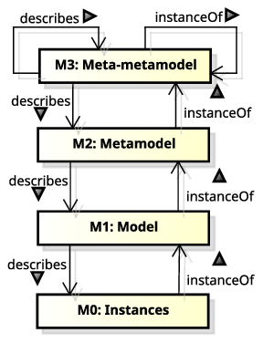
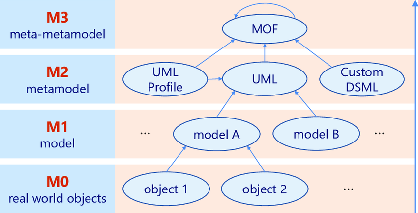
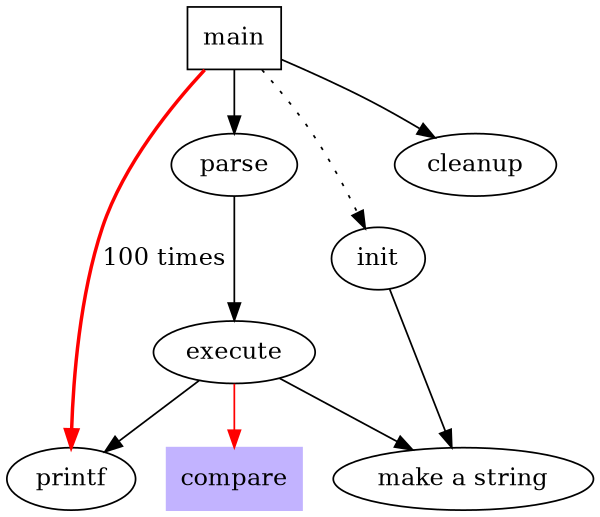

+++

title = "Model Driven Development"
description = "Practical introduction to Model Driven Development"
outputs = ["Reveal"]

[reveal_hugo.custom_theme_options]
targetPath = "css/custom-theme.css"
enableSourceMap = true

+++

<style>
.reveal blockquote {
    font-family: 'Georgia';
}
</style>

# Model Driven Development

---

## Lecture goals

- Understand __metamodelling__
- Understand __domain specific languages__
- Practice with __model driven development__ in _Xtext_

---

## Meta-modelling nomenclature

0. (Abstract) __Language__ $\approx$ (abstract) _syntax_ + _semantics_ 

1. __Model__ $\approx$ the abstract language by which we describe the possible entities involved in a __domain__
    + the model __abstracts__ a number of similar systems rooted in the domain
    + each system is an _instance_ of the model it has been designed from
    + a model is a _template_ for several systems

2. In which _language_ is the model __expressed__?
    + __Meta-model__ $\approx$ the abstract language by which we describe __models__
    + for instance __UML__ is the meta-model behind __object-oriented programming__
        * UML $\equiv$ [Unified Modeling Language](https://www.uml.org/)

3. In which language is the _meta_-model expressed?
    + __Meta-meta-model__ $\approx$ the abstract language by which we describe __meta-models__
    + for instance __MOF__ is the meta-meta-model behind __UML__ according to __OMG__
        * MOF $\equiv$ [Meta-Object Facility](https://www.omg.org/spec/MOF)
        * OMG $\equiv$ [Object Management Group](https://www.omg.org/)

---

## Meta-model hierarchy

cf. <https://www.omg.org/ocup-2/documents/Meta-ModelingAndtheMOF.pdf>



---

## Meta-model hierarchy example



---

## Why are meta-models important?

- __Meta-models__ are the very first thing you should try to identify whenever approaching a new __technology__

- If you grasp the meta-model, you grasp the __essence__ of the technology
    + which may be same for many other technologies

- E.g. after you learned the _basics of OOP_ (classes, methods, objects, etc.) you may easily learn _any_ __other OOP language__
    + by simply asking yourself how _each meta-model element_ is __expressed__ in the new language
        * e.g. how are classes / methods / objects expressed in the new language?

- When you model a domain (e.g. with DDD) you are always exploiting some __meta-model__
    + whether you are aware of it or not

> Is UML the only choice? Are there other relevant meta-models?

---

## Model-driven whatever

- Several, slightly similar names, make create _confusion_
    * e.g. model-driven engineering / development / architecture / etc.

- Please read _Martin Fowler_'s article on [Model-Driven Software Architecture](https://martinfowler.com/bliki/ModelDrivenArchitecture.html) to clarify

- Despite the name the key ideas can be summarised as follow:
    1. _software engineering_ workflow should start by __modelling the domain__ at hand carefully
        * e.g. with DDD
        * as opposed to focussing on algorithms and data structures

    2. the production of a runnable implementation should be __automated__ as much as possible
        * e.g. by __generating__ code from models
        * as opposed to writing code by hand

---

## About code generation from models

- Assumption: the model is expressed by means of some __formal language__

- __Formal__ language $\approx$ interpretable by a machine

- Formality is a __prerequisite__ for __automation__
    1. the model is __parsed__ by a machine
    2. the model is __transformed__ into another formal language (e.g. _OO programming language_)
    3. the transformed model is __rendered__ into a file (e.g. _source code_)

- Is __UML__ adequate? Is it the only choice? _Any alternative?_
    * UML has a formal syntax and semantics (reified into __graphical representation rules__) 
    * __rarely enforced__ by software tools
    * furthermore UML is __general-purpose__
        + only practical for _software engineers_

---

{}

## Towards domain specific languages

- __Domain-specific Languages__ (DSL) are _programming_ / _description_ / _specification languages_ targetting one __particular__ class of problems
    * e.g. they are _not_ meant to address all possible problems, but just the ones they are designed for

- As opposed to __general-purpose languages__ (GPL) which are targetting __as many__ classes of problems __as possible__
    * the programming languages you learned so far are GPL

- DSL may act as __custom meta-models__ for a given domain

- Examples of DSLs you may already know:
    + _regular expressions_ for text processing
    + _SQL_ for database querying
    + _CSS_ for styling web pages
    + _HTML_ for describing web pages content
    + _DOT_ for graph visualisation
    + _PlantUML_ for UML diagrams visualisation
    + _Gherkin_ for Behavior-Driven Development (BDD)
    + _VHDL_ for hardware description

---

## DSL Examples (pt. 1)
### DOT: a DSL to visualise graphs

{}
{}

{}
{}

{}
{}

+ DOT is a language that can describe graphs, for the sake of their visualisation

+ The most common implementation is the [Graphviz toolkit](https://graphviz.org/)

---

## DSL Examples (pt. 2)
### PlantUML: a DSL to visualise UML diagrams

{}
{}
```plantuml
interface Customer {
    + CustomerID getID()
    + String getName()
    + void **setName**(name: String)
    + String getEmail()
    + void **setEmail**(email: String)
}

note left: Entity

interface CustomerID {
    + Object getValue()
}
note right: Value Object

interface TaxCode {
    + String getValue()
}
note left: Value Object

interface VatNumber {
    + long getValue()
}
note right: Value Object

VatNumber -d-|> CustomerID
TaxCode -d-|> CustomerID

Customer *-r- CustomerID
```
{}
{}

interface Customer {
    + CustomerID getID()
    + String getName()
    + void **setName**(name: String)
    + String getEmail()
    + void **setEmail**(email: String)
}
note left: Entity

interface CustomerID {
    + Object getValue()
}
note right: Value Object

interface TaxCode {
    + String getValue()
}
note left: Value Object

interface VatNumber {
    + long getValue()
}
note right: Value Object

VatNumber -d-|> CustomerID
TaxCode -d-|> CustomerID

Customer *-r- CustomerID

{}
{}

---

## DSL Examples (pt. 3)
### Gherkin: a DSL to write BDD tests in a human-friendly way

```gherkin
Scenario: Verify withdraw at the ATM works correctly
Given John has 500$ on his account
When John ask to withdraw 200$
And John inserts the correct PIN
Then 200$ are dispensed by the ATM
And John has 300$ on his account
```

- Gherkin is a language that can describe __behavioural tests__ for software systems
    * i.e. what system should do in given scenario

- Syntax if very flexible and it seems like _natural language_

- Stakeholders and engineer will agree on a set of __behavioural specifications__ for the system
    + written in Gherking

- The most common implementation is [Cucumber](https://cucumber.io/)
    + allowing the semi-automated translation of Gherkin specifications into __executable tests__

---

## DSL Examples (pt. 4)
### VHDL: a DSL to design hardware circuits

```vhdl
DFF : process(RST, CLK) is
begin
if RST = '1' then
Q <= '0';
elsif rising_edge(CLK) then
Q <= D;
end if;
end process DFF;
```

- VHDL is a language that can describe __hardware circuits__
    * i.e. the logic gates and their interconnections

- Seems like an ordinary programming language, but:
    * "variables" are indeed signals
    * "functions" are indeed circuits

- Technologies exist to __automatically translate__ VHDL into __hardware circuits__
    + e.g. [Xilinx Vivado](https://www.xilinx.com/products/design-tools/vivado.html)

- ... or to __simulate__ the behaviour of the circuit (either _in software_ or _in FPGA_)

{}

---

## DSL Examples (pt. 5)
### [Strumenta](https://strumenta.com)'s DSL for financial accounting

Details here: <https://tomassetti.me/financial-accounting-dsl>

> __Goal__: use a DSL to describe taxes, pension contributions, and general financial calculations

```
pension contribution InpsTerziario paid by owner {
    considered_salary = (taxable of IRES for employer - amount of IRES for employer - amount of IRAP for employer) by ownership share
    rate = brackets [to 46,123] -> 22.74%,
                    [to 76,872] -> 23.74%,
                    [above]     -> 0%
    amount = (rate for considered_salary) with minimum 3,535.61
}

pension contribution InpsGLA paid by employer 2/3 and employee 1/3 {
    considered_salary = gross_compensation of employee
    rate = brackets [to 100,323] -> 27.72%,
                    [above]      -> 0%
    amount = rate for considered_salary
}
```

---

## Benefits of adopting DSL

1. To communicate with domain experts in their own language
    + e.g. Gherkin is a language that can be understood by both engineers and stakeholders

2. To let domain experts __write__ the specifications (i.e. the model) of the system they want
    + hence reducing ambiguities among stakeholders and engineers

3. To focus on the __domain__ rather than on the __implementation__

4. To hide the __implementation details__ from the domain experts
    + e.g. exposing only business-related concepts, at the domain level

---

## DSL vs. GPL

- DSLs are __not__ a replacement for GPLs
    + they are __complementary__

- Yet the difference is fuzzy, so lets try to clarify:

|                            |            **GPL**           |               **DSL**               |
|:--------------------------:|:----------------------------:|:-----------------------------------:|
|         **Domain**         |              any             |            clear boundary           |
| **Syntactical constructs** |      many and composable     |            few and static           |
|     **Expressiveness**     |        Turing-complete       | possibly, less than Turing-complete |
|     **Customisability**    |           maximised          |    minimised / confined / absent    |
|       **Defined by**       |    companies or committees   |       teams of domain expertes      |
|        **User base**       | large, anonymous, widespread |       small, accessible, local      |
|        **Evolution**       |     slow, well-structured    |              fast-paced             |
|       **Deprecation**      |           very slow          |        feasible, often abrupt       |

---

# DSL Engineering

---

## Semantics of DSL

- Most often, the focus is on the __syntax__ of the DSL
    + as that's how users will perceive it

- Yet, the __semantics__ of the DSL is equally important
    + that dictates how the DSL __works__
    + and this is what engineers (DSL implementers) focus upon

- Intuitively, __semantics__ is given to languages by writing the machinery supporting their execution
    + three main aspects:
        1. __conversion__ into _runnable code_ (e.g. _translation_ or _interpretation_) ...
        2. ... leveraging onto a __execution engine__ (i.e. _library functionalities_ supporting the runnable code) ...
        3. ... in turn relying on a __software platform__ (e.g. JVM, .NET, etc.)

> The role of _DSL engineers_ mostly focuses on __steps 1__ & __2__ (other than defining the __syntax__)

---

## Converting DSL into runnable code

Two main approaches:

- __Translation__: translates a DSL script into a language for which an _execution engine_ on a given _target platform_ exists
    * a.k.a. __code generation__ or _transpilation_ if the target language is high-level (e.g. Java, JS, or C#)
        + e.g. [Xtend](https://eclipse.dev/Xtext/xtend/), or [TypeScript](https://www.typescriptlang.org/), despite being GPL, are transpiled into Java and JS respectively
    * a.k.a. __compilation__ if the target language is low-level (e.g. assembly, JVM bytecode, CRL, etc.)
        + e.g. Java is compiled into JVM bytecode (despite being a GPL)

- __Interpretation__: the execution engine is able to _parse and execute_ the DSL script _directly_
    * a.k.a. __runtime interpretation__ or _runtime compilation_ if the execution engine is able to compile the DSL script into a runnable code
        + e.g. [2P-Kt](https://github.com/tuProlog/2p-kt) is a GPL interpreted by a custom execution engine, written in Kotlin, running on the JVM

<br>

In both cases, there are technical __prerequisites__:
- a __parser__ for the actual syntax of the DSL should exist / be generated
- the __execution engine__ for the target platform should exist

---

{}

## External vs. internal DSL

- So far we discussed the so-called __external DSLs__
    + i.e. where the syntax is totally custom, hence requiring a __custom parser__

- As opposed to __internal__ (a.k.a. _embedded_) __DSLs__ 
    + i.e. where the syntax is a subset of some pre-existing GPL...
    + ... whose syntax is __flexible__ enough to allow _costimisation_

- Creating _internal_ DSL is a recent trend enabled by the wide adoption of flexible GPL
    + e.g. Kotlin, Groovy, or Scala, which come with _ad-hoc constructs_
        * e.g. trailing-lambda convention, infix notation, operator overloading, etc.

- Examples of _internal_ DSL you may already know:
    - [Kotlin DSL for Gradle](https://docs.gradle.org/current/userguide/kotlin_dsl.html)
    - [SBT](https://www.scala-sbt.org/1.x/docs/sbt-by-example.html)

- More on this topic will be introduced by prof. Pianini in future lectures

---

## Example of internal DSL: `build.gradle.kts`

```kotlin
plugins {
    `java-library`
}

dependencies {                              
    api("junit:junit:4.13")
    implementation("junit:junit:4.13")
    testImplementation("junit:junit:4.13")
}

configurations {                            
    implementation {
        resolutionStrategy.failOnVersionConflict()
    }
}

sourceSets {                                
    main {                                  
        java.srcDir("src/core/java")
    }
}

java {                                      
    sourceCompatibility = JavaVersion.VERSION_11
    targetCompatibility = JavaVersion.VERSION_11
}

tasks {
    test {                                  
        testLogging.showExceptions = true
        useJUnit()
    }
}
```
+ domain: build-automation
+ this is pure Kotlin + Gradle library (containing an "_execution engine_")
+ Gradle library is designed to be used as Kotlin DSL


---

## Key aspects of _internal_ DSL

- Internal DSL may __ease adoption__ of the DSL it self
    + users may _already know_ the GPL
        + hence they may be able to use the DSL _without learning a new language_
        + hence they may use the same __toolkits__ _available for the GPL_ (e.g. debugger, IDE, etc.)


- Internal DSL __simplify__ the __DSL engineering__ process
    + _no need_ to write and maintain a __custom parser__
        * as the parser is _already_ provided by the GPL
    + _no need_ to write and maintain __custom toolkits__
        * as the GPL toolkits may be _reused_

- The __integration__ among the GPL and the DSL is __tight__
    + the DSL may exploit the __constructs of the GPL__, and this is commonly _desired_
    + the DSL is __technologically__ and __syntactically bound__ to the GPL, and this is commonly _undesired_

---

## About the execution engine

- Be it internal/external or transpiled/interpreted, the DSL needs an __execution engine__
    + i.e. a library providing the __functionalities__ of the DSL

- This is _no different_ from __any other library__ supporting some given domain

- Except that hacks could exploit to ease the adoption of the __target DSL syntax__

{}

---

# MDD in Practice with Xtext

---

## About Xtext

TBD
