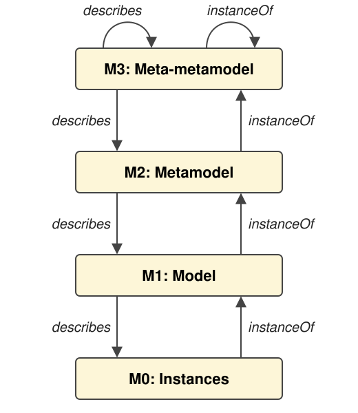
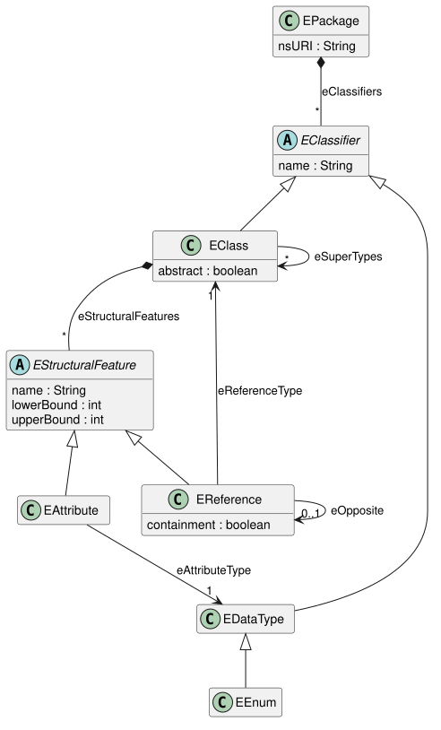
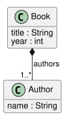
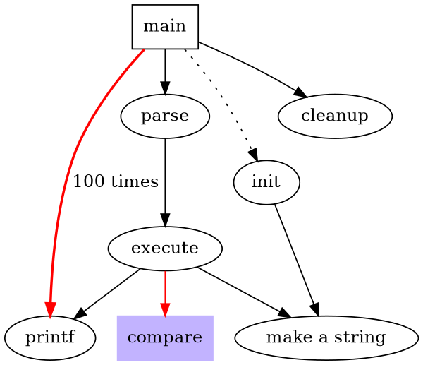
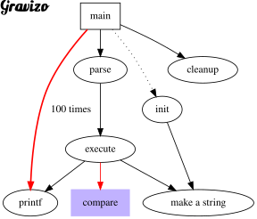
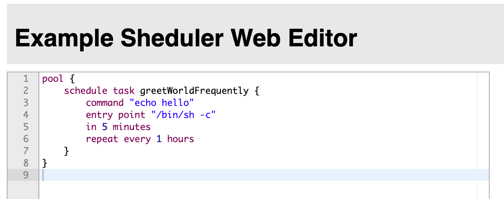

+++

title = "Model Driven Development"
description = "Practical introduction to Model Driven Development"
outputs = ["Reveal"]

[reveal_hugo.custom_theme_options]
targetPath = "css/custom-theme.css"
enableSourceMap = true

+++

<style>
.reveal blockquote {
    font-family: 'Georgia';
}

.reveal blockquote::before{
    content: "";
    padding-left: 0em;
}

.reveal blockquote::after{
    content: "";
}
</style>

# Model Driven Development

## 

<br>

### [Giovanni Ciatto --- `giovanni.ciatto@unibo.it`](mailto:giovanni.ciatto@unibo.it)

<br>

Compiled on:  --- [<i class="fa fa-print" aria-hidden="true"></i> printable version](?print-pdf&pdfSeparateFragments=false)

[<i class="fa fa-undo" aria-hidden="true"></i> back](..)

---

## Lecture goals

- Understand __metamodelling__
- Understand __domain specific languages__
- Discuss the role of DSLs and code generators __in the LLM era__
- Practice with __model driven development__ in _Xtext_

---

## Outline

1. [Meta-modelling](#/metamodelling): _models, meta-models, meta-meta-models, Ecore, abstract vs. concrete syntax_
2. [Model-driven development](#/mdd): _modelling first, automation of implementation_
3. [Domain-specific languages](#/dsl): _what they are, examples, DSL vs. GPL_
4. [DSL engineering](#/dsl-engineering): _semantics, translation vs. interpretation, internal vs. external DSLs_
5. [DSLs in the LLM era](#/dsl-llm): _LLMs vs. code generators, DSLs as targets for LLMs_
6. [MDD in practice](#/mdd-practice): _tools, LSP, Xtext_
7. [Running example: Sheduler](#/running-example): _grammar, validation, scoping, execution engine, generator, interpreter_
    + each exercise has its __solution__ in a vertical sub-section (press _down_ to see it, _right_ to skip it)

<br>

> Main references: [Völter et al., _DSL Engineering_, 2013](http://dslbook.org/), [Fowler, _Domain-Specific Languages_, 2010](https://martinfowler.com/books/dsl.html)

---



## Meta-modelling nomenclature

0. (Abstract) __Language__ $\approx$ (abstract) _syntax_ + _semantics_

1. __Model__ $\approx$ an abstract description of the possible entities involved in a __domain__, and their relations
    + the model __abstracts__ a number of similar systems rooted in the domain
    + each system is an _instance_ of the model it has been designed from
    + a model is a _template_ for several systems

2. In which _language_ is the model __expressed__?
    + __Meta-model__ $\approx$ the definition of the concepts (and rules) available for writing __models__ in a given language
    + for instance __UML__ is a modelling language commonly used to describe _object-oriented_ designs
        * its meta-model defines concepts such as _class_, _attribute_, _operation_, _association_
        * UML $\equiv$ [Unified Modeling Language](https://www.omg.org/spec/UML)

3. In which language is the _meta_-model expressed?
    + __Meta-meta-model__ $\approx$ the language by which we describe __meta-models__
    + for instance, according to __OMG__, the meta-model of __UML__ is defined in __MOF__
        * MOF $\equiv$ [Meta-Object Facility](https://www.omg.org/spec/MOF)
        * OMG $\equiv$ [Object Management Group](https://www.omg.org/)

---

## Meta-model hierarchy

{}
{}

{}
{}
OMG's four-layer architecture (cf. [MOF specification](https://www.omg.org/spec/MOF)):

- __M3__: _meta-meta-model_ (e.g. MOF), defining itself
- __M2__: _meta-model_ (e.g. UML), instance of M3
- __M1__: _model_ (e.g. a UML class diagram of your domain), instance of M2
- __M0__: _instances_ (e.g. actual customers, or the objects representing them at run-time), instances of M1

> Each layer is described by the language of the layer above
{}
{}

---

## Meta-model hierarchy example


---

## _Instance of_ vs. _conforms to_

- Between adjacent layers there are __two__ different relations, which are easy to confuse:
    1. __instance of__: an _element_ of a layer is an instance of an _element_ of the layer above
        + e.g. the class `Customer` (M1) is an instance of the meta-class `Class` (M2)
        + e.g. the object `john` (M0) is an instance of the class `Customer` (M1)
    2. __conforms to__: a _whole model_ conforms to a _whole meta-model_
        + i.e. every element is an instance of some meta-element, __and__ all the meta-model's rules are respected
        + e.g. multiplicities, types of references, uniqueness of names, etc.

- Checking conformance is a __mechanical__ activity
    + this is precisely what __parsers__ and __validators__ do (we will write one in [Exercise 1](#/exercise-1))

- The top layer is __reflexive__: MOF conforms to MOF
    + this is what stops the tower at M3 (no M4 is needed)
    + same trick as a compiler for language $L$ written in $L$

---

## Inside a meta-meta-model: Ecore

{}
{}

{}
{}
- MOF is large: its practical core is __EMOF__ (_Essential MOF_)
- [__Ecore__](https://eclipse.dev/modeling/emf/) is the _Eclipse Modeling Framework_ (EMF) implementation of (roughly) EMOF
    + it is what __Xtext__ uses under the hood
- Few concepts suffice to write _any_ meta-model:
    + `EPackage`: a namespace of meta-classes, identified by an URI
    + `EClass`: a _concept_ of the domain, possibly with super-types
    + `EAttribute`: a property whose value is a _datum_ (string, int, enum)
    + `EReference`: a property whose value is _another model element_
        * __containment__: the referenced element is _part of_ the container (a tree)
        * __cross-reference__: the referenced element lives elsewhere (a graph)
    + `lowerBound` / `upperBound`: __multiplicities__ (`0..1`, `1`, `*`)
    + `EEnum`: a finite set of literals
{}
{}

---

## Abstract vs. concrete syntax

- A meta-model defines the __abstract syntax__ of a language
    + _which_ concepts exist, and _how_ they can be related
    + it says _nothing_ about how models are written down

- The __concrete syntax__ is the notation users actually read / write
    + _textual_ (e.g. via [Xtext](https://eclipse.dev/Xtext/)), _graphical_ (e.g. via [Sirius](https://eclipse.dev/sirius/)), _tabular_, _tree-based_, ...
    + there may be __several__ concrete syntaxes for the __same__ meta-model

{}
{}
Meta-model (abstract syntax):

{}
{}
[YAML](https://yaml.org):
```yaml
title: Domain-Specific Languages
year: 2010
authors:
  - name: Martin Fowler
  - name: Rebecca Parsons
```
{}
{}
[XML](https://www.w3.org/XML/):
```xml
<book title="Domain-Specific Languages" year="2010">
  <author name="Martin Fowler"/>
  <author name="Rebecca Parsons"/>
</book>
```
{}
{}

- Different _notations_, __same__ abstract structure: both _conform_ to the meta-model on the left

---

## What a meta-model cannot say: static semantics

- Structural meta-models only capture __types__ and __multiplicities__

- Many rules of a domain are _not_ structural, e.g.:
    + "two authors of the same book cannot have the same name"
    + "the title of a book cannot be empty"
    + "a book cannot be published in the future"

- These are called __static semantics__ (or _well-formedness rules_)
    + OMG's way: constraints written in [OCL](https://www.omg.org/spec/OCL) (_Object Constraint Language_), attached to the meta-model
        ```
        context Book
        inv uniqueAuthorNames: self.authors->isUnique(a | a.name)
        inv nonEmptyTitle: self.title.size() > 0
        ```
    + Xtext's way: __validation rules__ written in a GPL (Java), see [Exercise 1](#/exercise-1)

- Takeaway: __meta-model + well-formedness rules__ = what it means for a model to be _correct_
    + _dynamic semantics_ (what a correct model __does__ when executed) comes later, from the [execution engine](#/dsl-engineering)

---

## Why are meta-models important?

- __Meta-models__ are the very first thing you should try to identify whenever approaching a new __technology__

- If you grasp the meta-model, you grasp the __essence__ of the technology
    + which may be the same for many other technologies

- E.g. after you learned the _basics of OOP_ (classes, methods, objects, etc.) you may easily learn _any_ __other OOP language__
    + by simply asking yourself how _each meta-model element_ is __expressed__ in the new language
        * e.g. how are classes / methods / objects expressed in the new language?

- When you model a domain (e.g. with DDD) you are always exploiting some __meta-model__
    + whether you are aware of it or not

---



## Model-driven whatever

- Several slightly similar names may create _confusion_
    * e.g. model-driven engineering / development / architecture / etc.

- Please read _Martin Fowler_'s article on [Model Driven Architecture](https://martinfowler.com/bliki/ModelDrivenArchitecture.html) to clarify

- Despite the name, the key ideas can be summarised as follows:
    1. _software engineering_ workflow should start by __modelling the domain__ at hand carefully
        * e.g. with DDD
        * as opposed to focussing on algorithms and data structures

    2. the production of a runnable implementation should be __automated__ as much as possible
        * e.g. by __generating__ code from models
        * as opposed to writing code by hand

---

## About code generation from models

- Assumption: the model is expressed by means of some __formal language__

- __Formal__ language $\approx$ interpretable by a machine

- Formality is a __prerequisite__ for __automation__
    1. the model is __parsed__ by a machine
    2. the model is __transformed__ into another formal language (e.g. _OO programming language_)
    3. the transformed model is __rendered__ into a file (e.g. _source code_)

- Is __UML__ adequate? Is it the only choice? _Any alternative?_
    * UML has a formal syntax and semantics (reified into __graphical representation rules__)
    * __rarely enforced__ by software tools
    * furthermore UML is focussing on __software__
        + only practical for _software engineers_

---

{}



## Towards domain specific languages

- __Domain-specific Languages__ (DSL) are _programming_ / _description_ / _specification languages_ targeting one __particular__ class of problems
    * e.g. they are _not_ meant to address all possible problems, but just the ones they are designed for

- As opposed to __general-purpose languages__ (GPL) which are targetting __as many__ classes of problems __as possible__
    * the programming languages you learned so far are GPL

- DSL may act as __custom meta-models__ for a given domain

- Examples of DSLs you may already know:
    + _regular expressions_ for text processing
    + _SQL_ for database querying
    + _CSS_ for styling web pages
    + _HTML_ for describing the content of web pages
    + _DOT_ for graph visualisation
    + _PlantUML_ for visualising UML diagrams
    + _Gherkin_ for Behavior-Driven Development (BDD)
    + _VHDL_ for hardware description

---

## DSL Examples (pt. 1)
### DOT: a DSL to visualise graphs

{}
{}

```dot
digraph G {
    size ="4,4";
    main [shape=box];
    main -> parse [weight=8];
    parse -> execute;
    main -> init [style=dotted];
    main -> cleanup;
    execute -> { make_string; printf}
    init -> make_string;
    edge [color=red];
    main -> printf [style=bold,label="100 times"];
    make_string [label="make a string"];
    node [shape=box,style=filled,color=".7 .3 1.0"];
    execute -> compare;
}
```
{}
{}

{}
{}

+ DOT is a language that can describe graphs, for the sake of their visualisation

+ The most common implementation is the [Graphviz toolkit](https://graphviz.org/)

---

## DSL Examples (pt. 2)
### PlantUML: a DSL to visualise UML diagrams

{}
{}
```plantuml
interface Customer {
    + CustomerID getID()
    + String getName()
    + void **setName**(name: String)
    + String getEmail()
    + void **setEmail**(email: String)
}

note left: Entity

interface CustomerID {
    + Object getValue()
}
note right: Value Object

interface TaxCode {
    + String getValue()
}
note left: Value Object

interface VatNumber {
    + long getValue()
}
note right: Value Object

VatNumber -d-|> CustomerID
TaxCode -d-|> CustomerID

Customer *-r- CustomerID
```
{}
{}

interface Customer {
    + CustomerID getID()
    + String getName()
    + void **setName**(name: String)
    + String getEmail()
    + void **setEmail**(email: String)
}
note left: Entity

interface CustomerID {
    + Object getValue()
}
note right: Value Object

interface TaxCode {
    + String getValue()
}
note left: Value Object

interface VatNumber {
    + long getValue()
}
note right: Value Object

VatNumber -d-|> CustomerID
TaxCode -d-|> CustomerID

Customer *-r- CustomerID

{}
{}

---

## DSL Examples (pt. 3)
### Gherkin: a DSL to write BDD tests in a human-friendly way

```gherkin
Scenario: Verify withdraw at the ATM works correctly
Given John has 500$ on his account
When John asks to withdraw 200$
And John inserts the correct PIN
Then 200$ are dispensed by the ATM
And John has 300$ on his account
```

- Gherkin is a language that can describe __behavioural tests__ for software systems
    * i.e. what the system should do in a given scenario

- Syntax is very flexible and it seems like _natural language_

- Stakeholders and engineers will agree on a set of __behavioural specifications__ for the system
    + written in Gherkin

- The most common implementation is [Cucumber](https://cucumber.io/)
    + allowing the semi-automated translation of Gherkin specifications into __executable tests__

---

## DSL Examples (pt. 4)
### VHDL: a DSL to design hardware circuits

```vhdl
DFF : process(RST, CLK) is
begin
    if RST = '1' then
        Q <= '0';
    elsif rising_edge(CLK) then
        Q <= D;
    end if;
end process DFF;
```

- VHDL is a language that can describe __hardware circuits__
    * i.e. the logic gates and their interconnections

- Seems like an ordinary programming language, but:
    * "variables" are indeed signals
    * "functions" are indeed circuits

- Technologies exist to __automatically translate__ VHDL into __hardware circuits__
    + e.g. [AMD (formerly Xilinx) Vivado](https://www.amd.com/en/products/software/adaptive-socs-and-fpgas/vivado.html)

- ... or to __simulate__ the behaviour of the circuit (either _in software_ or _in FPGA_)

---

## DSL Examples (pt. 5)
### [Strumenta](https://strumenta.com)'s DSL for financial accounting

Details here: <https://tomassetti.me/financial-accounting-dsl>

> __Goal__: use a DSL to describe taxes, pension contributions, and general financial calculations

```
pension contribution InpsTerziario paid by owner {
    considered_salary = (taxable of IRES for employer - amount of IRES for employer - amount of IRAP for employer) by ownership share
    rate = brackets [to 46,123] -> 22.74%,
                    [to 76,872] -> 23.74%,
                    [above]     -> 0%
    amount = (rate for considered_salary) with minimum 3,535.61
}

pension contribution InpsGLA paid by employer 2/3 and employee 1/3 {
    considered_salary = gross_compensation of employee
    rate = brackets [to 100,323] -> 27.72%,
                    [above]      -> 0%
    amount = rate for considered_salary
}
```

{}

---

## Benefits of adopting DSL

1. To communicate with domain experts in their own language
    + e.g. Gherkin is a language that can be understood by both engineers and stakeholders

2. To let domain experts __write__ the specifications (i.e. the model) of the system they want
    + hence reducing ambiguities among stakeholders and engineers

3. To focus on the __domain__ rather than on the __implementation__

4. To hide the __implementation details__ from the domain experts
    + e.g. exposing only business-related concepts, at the domain level

---

## DSL vs. GPL

- DSLs are __not__ a replacement for GPLs
    + they are __complementary__

- Yet the difference is fuzzy, so let's try to clarify (cf. [Völter et al., _DSL Engineering_, 2013](http://dslbook.org/)):

|                            |            **GPL**           |               **DSL**               |
|:--------------------------:|:----------------------------:|:-----------------------------------:|
|         **Domain**         |              any             |            clear boundary           |
| **Syntactical constructs** |      many and composable     |            few and static           |
|     **Expressiveness**     |        Turing-complete       | possibly, less than Turing-complete |
|     **Customisability**    |           maximised          |    minimised / confined / absent    |
|       **Defined by**       |    companies or committees   |       teams of domain experts      |
|        **User base**       | large, anonymous, widespread |       small, accessible, local      |
|        **Evolution**       |     slow, well-structured    |              fast-paced             |
|       **Deprecation**      |           very slow          |        feasible, often abrupt       |

---



# DSL Engineering

---

## Semantics of DSL

- Most often, the focus is on the __syntax__ of the DSL
    + as that's how users will perceive it

- Yet, the __semantics__ of the DSL is equally important
    + that dictates how the DSL __works__
    + and this is what engineers (DSL implementers) focus upon

- Intuitively, __semantics__ is given to languages by writing the machinery supporting their execution
    + three main aspects:
        1. __conversion__ into _runnable code_ (e.g. _translation_ or _interpretation_) ...
        2. ... leveraging an __execution engine__ (i.e. _library functionalities_ supporting the runnable code) ...
        3. ... in turn relying on a __software platform__ (e.g. JVM, .NET, etc.)

> The role of _DSL engineers_ mostly focuses on __steps 1__ & __2__ (besides defining the __syntax__)

---

## Converting DSL into runnable code

Two main approaches:

- __Translation__: translates a DSL script into a language for which an _execution engine_ on a given _target platform_ exists
    * a.k.a. __code generation__ or _transpilation_ if the target language is high-level (e.g. Java, JS, or C#)
        + e.g. [Xtend](https://eclipse.dev/Xtext/xtend/), or [TypeScript](https://www.typescriptlang.org/), despite being GPL, are transpiled into Java and JS respectively
    * a.k.a. __compilation__ if the target language is low-level (e.g. assembly, JVM bytecode, CIL, etc.)
        + e.g. Java is compiled into JVM bytecode (despite being a GPL)

- __Interpretation__: the execution engine is able to _parse and execute_ the DSL script _directly_
    * a.k.a. __runtime interpretation__ or _runtime compilation_ if the execution engine is able to compile the DSL script into runnable code
        + e.g. [2P-Kt](https://github.com/tuProlog/2p-kt) is a GPL interpreted by a custom execution engine, written in Kotlin, running on the JVM

<br>

In both cases, there are technical __prerequisites__:
- a __parser__ for the actual syntax of the DSL should exist / be generated
- the __execution engine__ for the target platform should exist

---

{}

## External vs. internal DSL

- So far we discussed the so-called __external DSLs__
    + i.e. where the syntax is totally custom, hence requiring a __custom parser__

- As opposed to __internal__ (a.k.a. _embedded_) __DSLs__
    + i.e. where the syntax is a subset of some pre-existing GPL...
    + ... whose syntax is __flexible__ enough to allow _customisation_

- Internal DSLs are an old idea (e.g. in Lisp, Smalltalk, Ruby), now widespread thanks to flexible mainstream GPLs
    + e.g. Kotlin, Groovy, or Scala, which come with _ad-hoc constructs_
        * e.g. trailing-lambda convention, infix notation, operator overloading, etc.

- Examples of _internal_ DSL you may already know:
    - [Kotlin DSL for Gradle](https://docs.gradle.org/current/userguide/kotlin_dsl.html)
    - [SBT](https://www.scala-sbt.org/1.x/docs/sbt-by-example.html)

- More on this topic in the [lecture on internal DSLs in Kotlin](../03-internal-dsls/)

---

## Example of internal DSL: `build.gradle.kts`

```kotlin
plugins {
    `java-library`
}

dependencies {
    implementation("com.google.guava:guava:33.7.2-jre")
    testImplementation("org.junit.jupiter:junit-jupiter:6.1.3")
    testRuntimeOnly("org.junit.platform:junit-platform-launcher")
}

configurations {
    implementation {
        resolutionStrategy.failOnVersionConflict()
    }
}

sourceSets {
    main {
        java.srcDir("src/core/java")
    }
}

java {
    toolchain {
        languageVersion = JavaLanguageVersion.of(21)
    }
}

tasks {
    test {
        testLogging.showExceptions = true
        useJUnitPlatform()
    }
}
```
+ domain: build-automation
+ this is pure Kotlin + Gradle library (containing an "_execution engine_")
+ Gradle library is designed to be used as Kotlin DSL
+ details in the [lecture on build automation](../04-build-automation/)


---

## Key aspects of _internal_ DSL

- Internal DSL may __ease adoption__ of the DSL itself
    + users may _already know_ the GPL
        + hence they may be able to use the DSL _without learning a new language_
        + hence they may use the same __toolkits__ _available for the GPL_ (e.g. debugger, IDE, etc.)


- Internal DSLs __simplify__ the __DSL engineering__ process
    + _no need_ to write and maintain a __custom parser__
        * as the parser is _already_ provided by the GPL
    + _no need_ to write and maintain __custom toolkits__
        * as the GPL toolkits may be _reused_

- The __integration__ between the GPL and the DSL is __tight__
    + the DSL may exploit the __constructs of the GPL__, and this is commonly _desired_
    + the DSL is __technologically__ and __syntactically bound__ to the GPL, and this is commonly _undesired_

---

## About the execution engine

- Be it internal/external or transpiled/interpreted, the DSL needs an __execution engine__
    + i.e. a library providing the __functionalities__ of the DSL

- This is _no different_ from __any other library__ supporting some given domain

- Except that hacks can be exploited to ease the adoption of the __target DSL syntax__

{}

---



# DSLs in the LLM era

---

## Isn't an LLM just a better code generator?

- _Large Language Models_ (LLMs) generate code from __natural language__ prompts
    + so, why bother writing grammars, validators, and generators?

- Because the two kinds of "code generators" have __different guarantees__:

| | **DSL + code generator** | **LLM prompted in natural language** |
|:--:|:--:|:--:|
| **Input** | _formal_ model, conforming to a meta-model | _informal_ text, possibly ambiguous |
| **Same input, same output?** | yes (deterministic program) | not guaranteed (sampling) |
| **Input checked before generation?** | yes (parser + validator) | no |
| **Correctness argument** | test the generator _once_, trust it for _all_ models | review / test _each_ output |
| **When the spec changes** | edit the model, _re-generate_ | re-prompt, _re-review_ the new code |
| **Cost of building** | high (language engineering) | low (prompt engineering) |

- Non-determinism is measurable: same prompt, different programs, even at temperature 0
    + cf. [Ouyang et al., _An Empirical Study of the Non-determinism of ChatGPT in Code Generation_, ACM TOSEM](https://doi.org/10.1145/3697010)

- [Martin Fowler](https://martinfowler.com/articles/2025-nature-abstraction.html) (2025) frames LLMs as moving programming _up_ the abstraction levels and, at the same time, _sideways_ into non-determinism

---

## DSLs as a _target_ for LLMs

- The two approaches can be __combined__: let the LLM write the _model_, not the _code_

    + _natural language_ $\xrightarrow{\text{LLM}}$ _DSL script_ $\xrightarrow{\text{parse + validate}}$ _model_ $\xrightarrow{\text{generator}}$ _code_
    + if validation fails, the __errors__ are sent back to the LLM, which _repairs_ the script (repair loop)

- Benefits:
    + the output space is __small__ and __constrained__ (few constructs, no Turing-complete escape hatches)
    + __validators__ catch wrong outputs, and their messages can be fed back to the LLM to _repair_ them
    + the DSL script is __reviewable by domain experts__, the generated code need not be
    + the deterministic part (generator + execution engine) is tested once
    + a grammar can even be used to __constrain decoding__, so that only syntactically valid scripts are produced
        * cf. [Poesia et al., _Synchromesh_, ICLR 2022](https://arxiv.org/abs/2201.11227), [Wang et al., _Grammar Prompting for DSL Generation with LLMs_, NeurIPS 2023](https://arxiv.org/abs/2305.19234)

- Caveat: LLMs know __little__ about _your_ DSL, as it is absent from their training data
    + LLMs are known to perform worse on _low-resource_ languages (cf. [Cassano et al., 2023](https://arxiv.org/abs/2308.09895))
    + practical mitigation: put the __grammar__, a few __examples__, and the __validator's errors__ into the prompt

---

## Meta-models are everywhere in LLM tooling

- Many mechanisms of LLM-based systems are __meta-modelling in disguise__:
    + [JSON Schema](https://json-schema.org/) for _structured outputs_ $\rightarrow$ a __meta-model__ the LLM's answer must _conform to_
    + _tool_ / _function_ definitions (e.g. in the [Model Context Protocol](https://modelcontextprotocol.io/)) $\rightarrow$ typed signatures, i.e. a meta-model of the admissible calls
    + [OpenAPI](https://www.openapis.org/) specifications $\rightarrow$ a DSL describing HTTP APIs, from which clients / servers are __generated__

- Same concepts as in this lecture:
    + _abstract syntax_ (the schema) vs. _concrete syntax_ (JSON text)
    + _conformance checking_ (schema validation) before _execution_ (tool call)

- Takeaway: the ability to __design a precise vocabulary__ for a domain did not lose value
    + it is what makes LLM outputs _checkable_

---

## When is a DSL worth it, today?

- __Likely__ worth it when:
    + the domain is __stable__ and many models will be written over time
    + domain experts must __read__ or __write__ the specifications (e.g. finance, hardware, regulations)
    + __guarantees__ matter: the same model must always produce the same behaviour
    + the same model must be turned into __several__ artifacts (code, docs, configurations, tests)

- __Likely not__ worth it when:
    + the code is _one-off_ glue, with a single user
    + the domain is still unclear or changing fast
    + an _internal_ DSL or a plain _library_ in a GPL is enough

- LLMs also _lower the cost of building_ DSL tooling (grammars, validators, generators are well-known patterns)
    + whether this changes the trade-off in practice is still an __open question__: the tooling must be _maintained_ anyway

---



# MDD in Practice

---

## Tools for MDD

| Tool | Approach | Platform | Docs |
|------|----------|----------|------|
| Eclipse __Xtext__ | _parser-based_: textual grammar $\rightarrow$ parser, meta-model (EMF), IDE support | JVM (Java / Xtend) | [eclipse.dev/Xtext](https://eclipse.dev/Xtext/) |
| JetBrains __MPS__ | _projectional_: users edit the syntax tree directly, no parser | JVM, own IDE | [jetbrains.com/mps](https://www.jetbrains.com/mps/) |
| Eclipse __Langium__ | _parser-based_, inspired by Xtext, LSP-first | TypeScript / Node.js | [langium.org](https://langium.org) |
| __ANTLR__ | _parser generation only_ (no meta-model, no IDE support) | Java, JS, Python, C#, C++, Go, ... | [antlr.org](https://www.antlr.org/) |

<br>

- [Language Server Protocol](https://microsoft.github.io/language-server-protocol/overviews/lsp/overview/) (LSP): relevant for any of the above, see next slide

- Maturity note: Xtext is mature and widely used, yet its own [release notes for 2.44 (Aug. 2026)](https://eclipse.dev/Xtext/releasenotes.html) state that its _future maintenance is at risk_ due to declining contributions (cf. [discussion](https://github.com/eclipse-xtext/xtext/issues/1721))

---

## Key idea behind LSP


- de-facto standard protocol among IDEs

- providing various IDE-like capabilities as-a-service

- making it easier to support multiple IDEs for the same language

- must-have feature for any MDD tool we may consider for our DSL

<!-- <small>Logos: <a href="https://simpleicons.org">Simple Icons</a> (CC0; Neovim logo CC-BY-SA-3.0); trademarks of their respective owners</small> -->

---

## About Xtext

- A framework for MDD and, in particular, __external DSL__

- Xtext provides a language for defining languages...

- ... which is also a __meta-modelling language__

- __Meta-modelling__ and __DSL definition__ are done _simultaneously_

- It automatically generates the full language infrastructure, including
    + model interfaces / classes ([EMF](https://eclipse.dev/modeling/emf/) compliant)
    + parser
    + validator (with pluggable rules)
    + transpiler stub
    + scoping (with pluggable rules)
    + IDE support via LSP
    + syntax colouring
    + test stubs
    + etc.

- Exercises and examples about MDD will be based on Xtext

---



## Running example: the **task scheduling** domain

- Users may want to __schedule__ custom _tasks_ on a machine

- __Task__ $\equiv$ running any _command_ available on the OS
    + via some _shell_ (e.g. `bash`, `cmd`, `powershell`, etc.) of choice

- __Scheduling__ implies defining _when_ the task should be executed
    + _relative_ to now: e.g. _**in** 5 minutes_, _**in** 1 hour_, etc.
    + _absolutely_: e.g. _today **at** 10:00_, _tomorrow **at** 12:00_, _**on** 2023/11/23 **at** 13:16_ etc.
    + _before_ or _after_ __some other task__
    + _periodically_: e.g. _**every** 5 minutes_, _**every** 48 hours_, etc.

- Notice that tasks may be _inter-**dependent**_ (e.g. because of before/after relations)

---

## Running example: the `Sheduler` DSL (pt. 1)

> __Sheduler__ $\equiv$ **Sh**ell + Sch**eduler**
>
> ¯\\_(ツ)_/¯

1. We shall use __Xtext's meta-modelling language__ to define the domain of _task scheduling_

1. Simultaneously, we will define the __syntax__ of the DSL

2. We will then add __scoping__ and __validation__ rules to the DSL, via the Xtext framework

3. The next step is designing and implementing the __execution engine__ for the DSL
    + we shall exploit Java's [`ScheduledExecutorService`s](https://docs.oracle.com/en/java/javase/21/docs/api/java.base/java/util/concurrent/ScheduledExecutorService.html) for this purpose

4. Finally, we will create a __code generator__ creating Java code from the DSL

---

## Running example: the `Sheduler` DSL (pt. 2)

Code: <https://github.com/unibo-spe/sheduler-lang>

1. Clone with Git the `exercises` branch

3. The cloned repository is an [Eclipse](https://www.eclipse.org/downloads/) project
    + please install [Eclipse for DSL developers](https://eclipse.dev/Xtext/download.html) from Xtext's website

4. In Eclipse, import the _repository root_ directory as a __Gradle project__

5. You may also use __IntelliJ__; in that case just import the _repository root_ directory as a _Gradle project_
    + no syntax colouring or Xtext support on IntelliJ or VSCode

---

## Running example: how to work on the exercises

- The `exercises` branch contains __placeholders__ for each exercise:
    + `TODO Ex N.M` comments break exercise _N_ into small steps _M_ (most IDEs list them in a _TODO_ view)
    + unimplemented methods throw `UnsupportedOperationException("TODO Ex N.M: ...")`

- Each exercise has __tests__ in `it.unibo.spe.mdd.sheduler/src/test/java`, marked as `@Disabled("TODO Ex N.M ...")`
    + remove the annotation once you are done, then run `./gradlew build`

- The __execution engine__ (`runtime/ShedulerRuntime.java`, `runtime/ShedulerTask.java`) is _given_, except for Exercise 5
    + a copy of both classes lives in `src/main/resources/.../generator/*.java.template`, for the code generator
    + `RuntimeTemplatesSyncTest` checks that the copies are identical: if you edit the classes, copy them over

- Solutions:
    + on the [`master` branch](https://github.com/unibo-spe/sheduler-lang/tree/master) of the repository
    + in these slides, in a _vertical_ sub-section after each exercise (press _down_ to see it, _right_ to skip it)

---

{}

## The Xtext project at a glance

- Three Gradle sub-projects:
    + `it.unibo.spe.mdd.sheduler`: __the language__ (grammar, validation, scoping, generator) $\leftarrow$ _you work here_
    + `it.unibo.spe.mdd.sheduler.ide`: LSP server, _fully generated_
    + `it.unibo.spe.mdd.sheduler.web`: web playground, _fully generated_

- Two files drive everything:
    + `Sheduler.xtext`: the __grammar__, which is _also_ the __meta-model__
    + `GenerateSheduler.mwe2`: _configuration_ of what Xtext should generate from the grammar

- Gradle tasks you will use:
    + `generateXtextLanguage`: re-generates the infrastructure after editing the grammar (runs automatically before compilation)
    + `jettyRun`: starts the web playground on <http://localhost:8080>
    + `shadowJar`: packs the command-line compiler and the LSP server as runnable Jars
    + `run` / `runInterpreter` (with `--args=/abs/path/file.shed`): generate code from / interpret a `.shed` file

> Details in the vertical slides below (press _down_), you only need them while setting up

---

## Xtext project structure (pt. 1)

```
sheduler-lang/
├── build.gradle
├── gradle/
├── gradle.properties
├── gradlew
├── gradlew.bat
├── it.unibo.spe.mdd.sheduler/
│   ├── build.gradle
│   └── src/
│       ├── main/
│       │   └── java/
│       │       └── it/unibo/spe/mdd/sheduler/
│       │           ├── GenerateSheduler.mwe2
│       │           ├── Sheduler.xtext
│       │           ├── TimeUtils.java
│       │           ├── generator/Main.java
│       │           ├── generator/ShedulerGenerator.java
│       │           ├── interpreter/ShedulerInterpreter.java
│       │           ├── runtime/ShedulerRuntime.java
│       │           ├── runtime/ShedulerTask.java
│       │           ├── scoping/ShedulerScopeProvider.java
│       │           └── validation/ShedulerValidator.java
│       ├── main/resources/   # templates for the code generator
│       └── test/
├── it.unibo.spe.mdd.sheduler.ide/
│   └── build.gradle
├── it.unibo.spe.mdd.sheduler.web/
│   └── build.gradle
└── settings.gradle
```

---

## Xtext project structure (pt. 2)

- _root_ project is just the container of others
- `sheduler` project is where the domain is modelled, and the language is defined
    * including parser, validator, scoping, etc.
    * 2 very important files:
        + `Sheduler.xtext`: this is where modelling and language definition occurs
        + `GenerateSheduler.mwe2`: this is where the automated generation of scoping, validation, generation, testing facilities is configured
- `ide` project is where the generic IDE support via LSP is defined
    * depends on `sheduler` project
    * you don't really need to touch anything in here: LSP code is generated by Xtext
    * this project may be packed into a runnable Jar for starting the LSP server
- `web` project is where the web-based playground for our language is defined
    * depends on `ide` project
    * you don't really need to touch anything in here: the web playground is generated by Xtext
    * this project may be packed into a runnable Jar for starting the web playground

---

## Relevant Gradle tasks for Xtext

- `generateXtextLanguage` generates the language infrastructure
    * including:
        + domain model interfaces / classes
        + parser
        + validator stub
        + scoping stub
        + code generation stub
    * this task is automatically executed by Gradle before compilation
    * you may run it manually if you want to force the generation of the language infrastructure

- `shadowJar` generates runnable Jars
    * in the `ide` sub-project: the LSP server (`*-ls.jar`)
    * in the `sheduler` sub-project: the command-line compiler (`*-compiler.jar`)
    * this task should be run manually if you want to deploy them

- `jettyRun` starts the Web-playground for the Sheduler language
    * this task should be run manually during manual testing of the language

- `run --args=/abs/path/file.shed` runs the code generator on a file, and `runInterpreter --args=...` interprets it

- ordinary Gradle tasks for compilation, testing, etc. are as usual

---

## The `GenerateSheduler.mwe2` file

- This is automatically generated by Eclipse when setting up an Xtext project
- Pretty self-explanatory:

    ```kotlin
    module it.unibo.spe.mdd.sheduler.GenerateSheduler

    import org.eclipse.xtext.xtext.generator.*
    import org.eclipse.xtext.xtext.generator.model.project.*

    var rootPath = ".."

    Workflow {

        component = XtextGenerator {
            configuration = {
                project = StandardProjectConfig {
                    baseName = "it.unibo.spe.mdd.sheduler"
                    rootPath = rootPath
                    runtimeTest = { enabled = true }
                    web = { enabled = true }
                    mavenLayout = true
                }
                code = {
                    encoding = "UTF-8"
                    lineDelimiter = "\r\n"
                    fileHeader = "/*\n * generated by Xtext \${version}\n */"
                    preferXtendStubs = false
                }
            }
            language = StandardLanguage {
                name = "it.unibo.spe.mdd.sheduler.Sheduler"
                fileExtensions = "shed"
                serializer = { generateStub = false }
                validator = { generateDeprecationValidation = true }
                generator = {
                    generateXtendStub = false
                    generateJavaMain = true
                }
                junitSupport = {
                    junitVersion = "5"
                    generateXtendStub = false
                    generateStub = true
                }
            }
        }
    }
    ```

---

## The `GenerateSheduler.mwe2` file: what to notice

- MWE2 (_Modeling Workflow Engine 2_) is _yet another_ DSL, describing a __workflow of generators__
    + `Workflow`, `XtextGenerator`, `StandardLanguage` are Java classes, configured declaratively

- `StandardLanguage` enables the default components: parser, validator, scoping, generator, serializer, formatter, ...

- `fileExtensions = "shed"` is what associates `.shed` files with our language

- `web = { enabled = true }` is what produces the `web` sub-project (and the playground)

- `generateXtendStub = false` / `preferXtendStubs = false`: stubs are generated in _Java_ rather than in [_Xtend_](https://eclipse.dev/Xtext/xtend/)

- `generateJavaMain = true` produces the `Main` class of the command-line compiler (see [Exercise 4](#/exercise-4))

{}

---

## Let's model a bit

```groovy
grammar it.unibo.spe.mdd.sheduler.Sheduler with org.eclipse.xtext.common.Terminals

generate sheduler "http://www.unibo.it/spe/mdd/sheduler/Sheduler"

TaskPoolSet: pools+=TaskPool+ ;

TaskPool: 'pool' name=ID? '{' tasks+=Task+ '}' ;

Task:
    'schedule' ('task' name=ID)? '{'
        'command' command=STRING
        ('entry' 'point' entrypoint=STRING)?
        (
            'in' relative=RelativeTime |
            'at' absolute=AbsoluteTime |
            'before' before=[Task] |            // square brackets denote references to other model elements
            'after' after=[Task]
        )
        ('repeat' 'every' period=RelativeTime)?
    '}'
;

AbsoluteTime: date=Date time=ClockTime ;

Date: year=INT '/' month=INT '/' day=INT;

ClockTime: hour=INT ':' minute=INT (':' second=INT (':' millisecond=INT (':' nanosecond=INT)?)?)? ;

RelativeTime: timeSpans += TimeSpan (('and' | ',' | '+') timeSpans += TimeSpan)* ;

TimeSpan: duration=INT unit=(TimeUnit|LongTimeUnit);

enum TimeUnit: NANOSECONDS = 'ns' | MILLISECONDS = 'ms' | SECONDS = 's' | MINUTES = 'm' | HOURS = 'h' | DAYS = 'd' | WEEKS = 'w' | 	YEARS = 'y' ;

enum LongTimeUnit returns TimeUnit:
    NANOSECONDS = 'nanoseconds' |
    MILLISECONDS = 'milliseconds' |
    SECONDS = 'seconds' |
    MINUTES = 'minutes' |
    HOURS = 'hours' |
    DAYS = 'days' |
    WEEKS = 'weeks' |
    YEARS = 'years' ;
```

---

## From grammar to meta-model

Xtext _infers_ an Ecore meta-model from the grammar, following a few rules:

| Grammar construct | Example from `Sheduler.xtext` | Inferred meta-model element |
|---|---|---|
| `generate` | `generate sheduler "http://..."` | an `EPackage` with that URI |
| parser rule | `Task: ... ;` | an `EClass` named `Task` |
| `feature=` + terminal | `name=ID`, `command=STRING` | an `EAttribute` (`EString`, `EInt`, ...) |
| `feature=` + rule | `relative=RelativeTime` | a __containment__ `EReference` |
| `feature=[Type]` | `after=[Task]` | a __cross__-`EReference` (resolved by _linking_, see [scoping](#/exercise-2)) |
| `+=` | `tasks+=Task+` | a _many-valued_ feature (`upperBound = *`) |
| `?` on a feature | `('task' name=ID)?` | an _optional_ feature (`lowerBound = 0`) |
| `enum` rule | `enum TimeUnit: ...` | an `EEnum` |
| keywords | `'schedule'`, `'{'`, `'in'` | _nothing_: they belong to the __concrete__ syntax only |

- Alternatives (`'in' ... | 'at' ...`) become _optional_ features: "_exactly one is set_" is guaranteed by the __parser__, not by the meta-model

---

## The inferred meta-model


{}
{}
- Diamonds ($\blacklozenge$) are __containments__: a `.shed` file is a _tree_ of objects...
- ... plus __cross-references__ (`before` / `after`), turning it into a _graph_
{}
{}
- From this meta-model, Xtext generates (in `src-gen/`):
    + one Java __interface__ per `EClass` (with getters / setters), plus its __implementation__ class
    + a `ShedulerFactory` to create instances
    + a `ShedulerPackage`, describing the meta-model _reflectively_
        * e.g. `ShedulerPackage.Literals.TASK__NAME` is the `EAttribute` object for `Task.name`, used in [validation](#/exercise-1)
{}
{}

---

## Sheduler across the four layers

| Layer | What it is, for Sheduler | Where it lives |
|:--:|---|---|
| __M3__ | Ecore: `EClass`, `EAttribute`, `EReference`, ... | EMF library |
| __M2__ | the Sheduler meta-model: `Task`, `TaskPool`, `TimeSpan`, ... | inferred from `Sheduler.xtext` |
| __M1__ | a Sheduler _model_, e.g. the task `greetOnce` in `myPool` | a `.shed` file |
| __M0__ | the actual execution: a `ShedulerTask` object, an OS process running `echo hello` | the JVM / OS, at run time |

<br>

- Each row _conforms to_ the row above it:
    + `Sheduler.xtext` is written by _you_ (DSL engineer)
    + `.shed` files are written by _users_ (domain experts)
    + M0 is produced by the __execution engine__ (via generated code, or via an interpreter)

- The __same__ M3 is shared by all EMF-based languages
    + hence generic tools (editors, serialisers, comparators, transformations) work for _any_ of them

---

## Try the syntax

- Run task `jettyRun` to start the web playground

- Open <http://localhost:8080>

- Copy-paste the following example program:
    ```
    pool {
        schedule task greetWorldFrequently {
            command "echo hello"
            entry point "/bin/sh -c"
            in 5 minutes
            repeat every 1 hours
        }
    }
    ```

- What you should see (press **Ctrl+Space** to see the _auto-completion_ menu)
    

---



## The language pipeline

![Pipeline of the Sheduler language: a .shed file is (1) parsed into a model by the parser generated from Sheduler.xtext, (2) linked, i.e. its [Task] references are resolved by the ShedulerScopeProvider (Exercise 2), (3) validated by the ShedulerValidator (Exercise 1), then either (4a) translated into Java code by the ShedulerGenerator (Exercise 3) or (4b) interpreted by the ShedulerInterpreter (Exercise 4); both rely on the execution engine made of ShedulerRuntime and ShedulerTask (Exercise 5). Errors from stages 1 to 3 are shown in the editor via LSP, stage 4 only runs on error-free models](./xtext-pipeline.svg)

- Every tool for external DSLs implements (a variant of) this pipeline
- Xtext __generates__ stage 1 entirely, and gives _default_ implementations for stages 2 and 3
- The exercises below _customise_ stages 2–3, and _implement_ stage 4 and the engine

---

## About validation rules (pt. 1)

- Validation rules are defined in the `ShedulerValidator` class
    * package: `it.unibo.spe.mdd.sheduler.validation`
    * Gradle sub-project: `sheduler-lang/`__`it.unibo.spe.mdd.sheduler`__

- Stub class is generated by Xtext when running the `generateXtextLanguage` task
    * which simply triggers the execution of the `GenerateSheduler.mwe2` file

- Content of the stub and validation rule example:
    ```java
    package it.unibo.spe.mdd.sheduler.validation;
    import it.unibo.spe.mdd.sheduler.sheduler.*;
    import org.eclipse.xtext.validation.Check;
    import org.eclipse.xtext.validation.CheckType;

    public class ShedulerValidator extends AbstractShedulerValidator {
        @Check(CheckType.FAST)
        public void ensureDateIsValid(Date date) {
            if (date.getYear() < 0) {
                error("Year must be positive", date, ShedulerPackage.Literals.DATE__YEAR, 0);
            }
            if (date.getMonth() < 1 || date.getMonth() > 12) {
                error("Month must be between 1 and 12", date, ShedulerPackage.Literals.DATE__MONTH, 0);
            }
            if (date.getDay() < 1 || date.getDay() > 31) {
                error("Day must be between 1 and 31", date, ShedulerPackage.Literals.DATE__DAY, 0);
            }
        }
    }
    ```

    + documentation here: <https://eclipse.dev/Xtext/documentation/303_runtime_concepts.html#validation>

---

## About validation rules (pt. 2): what to notice

* the __name__ of the validation method is _meaningless_
* only the __type__ of the parameter matters, plus the presence of the `@Check` annotation
    + Xtext walks the whole model, and calls each `@Check` method on _every_ object of the matching type
    + e.g. `ensureDateIsValid(Date)` is called once per `Date` in the file
* the `CheckType` argument of `@Check` is optional, and defaults to `CheckType.NORMAL`
    + `FAST` checks run whenever a file is modified
    + `NORMAL` checks run when saving the file
    + `EXPENSIVE` checks run when explicitly validating the file via the menu option
* `error(message, object, feature, ...)` reports a problem __on a specific feature__ of a specific object
    + `ShedulerPackage.Literals.DATE__MONTH` is the meta-model element for `Date.month` (M2 used at run time!)
    + this is what makes the editor underline exactly the month, rather than the whole date
* `error(...)` may be replaced by `warning(...)` (or `info(...)`) for minor issues
    + _errors_ mean the model is not well-formed, so it must __not__ be executed; _warnings_ are advice
* the validator only sees __parsed__ models: syntax errors are reported by the parser, _before_ validation

---



## Exercise 1: custom validation rules (pt. 1)

Write custom validation rules covering the following constraints:

1. Warning if attempting to represent some `RelativeTime` as [`java.time.Duration`](https://docs.oracle.com/en/java/javase/21/docs/api/java.base/java/time/Duration.html) object would result in an overflow
    + cf. the utility methods in class `TimeUtils`

2. Warning if attempting to represent some `AbsoluteTime` as [`java.time.LocalDateTime`](https://docs.oracle.com/en/java/javase/21/docs/api/java.base/java/time/LocalDateTime.html) object would result in an overflow
    + cf. the utility methods in class `TimeUtils`

3. Warning if some `AbsoluteTime` is in the past or in the present (only future admitted)
    + cf. the utility methods in class `TimeUtils`
    + cf. `LocalDateTime.now()`
    + cf. `LocalDateTime.isBefore()`

4. Error if some `ClockTime` is invalid
    - hour must be between 0 and 23
    - minute must be between 0 and 59
    - second must be between 0 and 59
    - millisecond must be between 0 and 999
    - nanosecond must be between 0 and 999

---

{}

## Exercise 1: custom validation rules (pt. 2)

5. Error if some `TimeSpan` is invalid
    - zero or negative duration

6. Error if any two tasks from the same pool have the same name

7. Error if any two pools have the same name

8. No periodicity should be allowed for tasks that are scheduled before/after some other task

<br>

> __Solution__ in the vertical slides below (press _down_), or press _right_ to skip it

---

## Exercise 1: solution (pt. 1)
### Rules 1–3: representability and future times

```java
@Check
public void checkRelativeTimeIsRepresentable(RelativeTime relativeTime) {
    try {
        TimeUtils.toDuration(relativeTime).toMillis(); // the runtime schedules in milliseconds
    } catch (ArithmeticException e) {
        warning("Relative time is not representable on the JVM", relativeTime, ShedulerPackage.Literals.RELATIVE_TIME__TIME_SPANS);
    }
}

@Check
public void checkAbsoluteTimeIsRepresentable(AbsoluteTime absoluteTime) {
    try {
        Duration.between(LocalDateTime.now(), TimeUtils.toLocalDateTime(absoluteTime)).toMillis();
    } catch (ArithmeticException | DateTimeException e) {
        warning("Absolute time is not representable on the JVM", absoluteTime, ShedulerPackage.Literals.ABSOLUTE_TIME__DATE);
    }
}

@Check
public void checkAbsoluteTimeIsInTheFuture(AbsoluteTime absoluteTime) {
    LocalDateTime dateTime;
    try {
        dateTime = TimeUtils.toLocalDateTime(absoluteTime);
    } catch (DateTimeException e) {
        return; // already reported by checkAbsoluteTimeIsRepresentable
    }
    if (!dateTime.isAfter(LocalDateTime.now())) {
        warning("Absolute time should be in the future", absoluteTime, ShedulerPackage.Literals.ABSOLUTE_TIME__TIME);
    }
}
```

---

## Exercise 1: solution (pt. 1): what to notice

- Rules 1–3 __reuse__ `TimeUtils`, i.e. the _same_ conversions used later by the generator and the interpreter
    + so the validator complains about _exactly_ the models that would fail at run time
    + e.g. the runtime calls `toMillis()`, which overflows much earlier than `Duration` itself (`in 2147483647 years`): the check must do the same
    + a validator re-implementing the conversion logic could disagree with the runtime

- Catch the __right__ exception:
    + `Duration` / `toMillis()` overflows throw `ArithmeticException`
    + invalid or out-of-range dates (e.g. `2030/13/45`) throw `DateTimeException`, which is _not_ an `ArithmeticException`
    + an uncaught exception in a `@Check` method does not produce a nice marker: the check is simply broken

- Rule 3 _returns early_ on that exception, on purpose: the same problem should be reported __once__

- Rule 3 depends on `LocalDateTime.now()`: the _same_ file may be valid today and invalid tomorrow
    + validation is no longer a _pure function of the model_: keep this kind of check rare, and make it a _warning_

- `!isAfter(now)` (rather than `isBefore(now)`) also covers the "_present_" case required by the rule

---

## Exercise 1: solution (pt. 2)
### Rules 4–5: well-formed times

```java
@Check(CheckType.FAST)
public void ensureClockTimeIsValid(ClockTime clockTime) {
    if (clockTime.getHour() > 23) {
        error("Hour must be between 0 and 23", clockTime, ShedulerPackage.Literals.CLOCK_TIME__HOUR);
    }
    if (clockTime.getMinute() > 59) {
        error("Minute must be between 0 and 59", clockTime, ShedulerPackage.Literals.CLOCK_TIME__MINUTE);
    }
    if (clockTime.getSecond() > 59) {
        error("Second must be between 0 and 59", clockTime, ShedulerPackage.Literals.CLOCK_TIME__SECOND);
    }
    if (clockTime.getMillisecond() > 999) {
        error("Millisecond must be between 0 and 999", clockTime, ShedulerPackage.Literals.CLOCK_TIME__MILLISECOND);
    }
    if (clockTime.getNanosecond() > 999) {
        error("Nanosecond must be between 0 and 999", clockTime, ShedulerPackage.Literals.CLOCK_TIME__NANOSECOND);
    }
}

@Check(CheckType.FAST)
public void ensureTimeSpanIsValid(TimeSpan timeSpan) {
    if (timeSpan.getDuration() <= 0) {
        error("Duration must be strictly positive", timeSpan, ShedulerPackage.Literals.TIME_SPAN__DURATION);
    }
}
```

- Notice:
    + the `INT` terminal (from `org.eclipse.xtext.common.Terminals`) only matches __digits__: negative numbers _cannot_ be parsed, so lower bounds of `0` need no check
        * the __grammar__ already enforces some constraints: know what it guarantees before writing validators
    + the interesting case for rule 5 is __zero__ (`in 0 minutes`), hence `<= 0`
    + do _not_ add constraints the domain does not require: e.g. `repeat every 48 hours` is perfectly fine, no need for `hours < 24`
    + optional parts of a `ClockTime` (e.g. seconds in `12:13`) are simply `0`: EMF gives `int` features a _default value_
    + the reference solution adds one more rule, not required by the exercise: a `repeat every` period must be at least 1 ms, as `scheduleAtFixedRate` rejects a period of `0` ms (e.g. `repeat every 500 ns`)

---

## Exercise 1: solution (pt. 3)
### Rules 6–8: names and periodicity

```java
@Check(CheckType.FAST)
public void ensureTaskNamesAreUniqueWithinPool(TaskPool pool) {
    Set<String> names = new HashSet<>();
    for (Task task : pool.getTasks()) {
        if (task.getName() != null && !names.add(task.getName())) {
            error("Repeated task ID: " + task.getName(), task, ShedulerPackage.Literals.TASK__NAME);
        }
    }
}

@Check(CheckType.FAST)
public void ensurePoolNamesAreUniqueWithinPool(TaskPoolSet pools) {
    Set<String> names = new HashSet<>();
    for (TaskPool pool : pools.getPools()) {
        if (pool.getName() != null && !names.add(pool.getName())) {
            error("Repeated pool ID: " + pool.getName(), pool, ShedulerPackage.Literals.TASK_POOL__NAME);
        }
    }
}

@Check(CheckType.FAST)
public void ensureDependentTasksAreNotPeriodic(Task task) {
    if ((task.getBefore() != null || task.getAfter() != null) && task.getPeriod() != null) {
        error("Tasks scheduled before/after another task cannot be periodic", task, ShedulerPackage.Literals.TASK__PERIOD);
    }
}
```

---

## Exercise 1: solution (pt. 3): what to notice

- Rules 6–7 are about a __collection__ of elements, so the check is attached to the _container_ (`TaskPool`, `TaskPoolSet`)
    + rule of thumb: attach the check to the _smallest_ element that "sees" all the elements involved
    + the error is reported on the _offending_ element (the second occurrence), not on the container

- Anonymous tasks and pools (`name == null`) are skipped: they cannot clash

- `Set.add` returns `false` if the element was already there: no need for a separate `contains`

- Xtext also provides a _generic_ uniqueness check, `NamesAreUniqueValidator`, to be enabled in the `.mwe2` file
    + cf. [Xtext docs on validation](https://eclipse.dev/Xtext/documentation/303_runtime_concepts.html#validation)

- Rule 8 could also have been enforced by the __grammar__ (allowing `repeat every` only after `in` / `at`)
    + grammar-level: _syntax error_, generic message ("_mismatched input_"), no completion proposal
    + validator-level: _domain_ message, pointing to the exact feature
    + both are legitimate: here the validator gives a better user experience

- Why rule 8 at all? A task scheduled `after` another one inherits its timing from it (see [Exercise 5](#/exercise-5))

{}

---

## About scoping rules

- Scoping rules are defined in the `ShedulerScopeProvider` class
    * package: `it.unibo.spe.mdd.sheduler.scoping`
    * Gradle sub-project: `sheduler-lang/`__`it.unibo.spe.mdd.sheduler`__

- Stub class is generated by Xtext when running the `generateXtextLanguage` task

- Content of the stub and scoping rule example:
    ```java
    public class ShedulerScopeProvider extends AbstractShedulerScopeProvider {
        @Override
        public IScope getScope(EObject context, EReference reference) {
            return super.getScope(context, reference);
        }
    }
    ```

    + Documentation here: <https://eclipse.dev/Xtext/documentation/303_runtime_concepts.html#scoping>

- Remarks
    + only one method should be overridden
    + it should return an `IScope` object, for each `EObject` containing some `EReference`
    + in our case, this could only happen in `Task`s' `before` and `after` properties
    + the scope is essentially a container of `EObject`s, which are the possible values for the `EReference`
        + the implementer of the scope provider should select which `EObject`s to include in the scope

---

{}



## Exercise 2: custom scoping rules

### TO-DO

Write a custom scoping policy for the `before` and `after` properties of `Task`s, such that:
- only `Task`s from the same `TaskPool` can be referenced by some `Task`
- `Task`s from some `TaskPool` cannot be referenced by `Task` from other `TaskPool`s
- anonymous `Task`s (i.e. those without a name) cannot be referenced at all

<br>

Documentation here: <https://eclipse.dev/Xtext/documentation/303_runtime_concepts.html#scoping>

<br>

> __Solution__ in the vertical slides below (press _down_), or press _right_ to skip it

---

## Exercise 2: solution

```java
public class ShedulerScopeProvider extends AbstractShedulerScopeProvider {
    @Override
    public IScope getScope(EObject context, EReference reference) {
        if (context instanceof Task) {
            if (Set.of(ShedulerPackage.Literals.TASK__AFTER, ShedulerPackage.Literals.TASK__BEFORE).contains(reference)) {
                TaskPool pool = EcoreUtil2.getContainerOfType(context, TaskPool.class);
                return Scopes.scopeFor(
                        pool.getTasks().stream()
                                .filter(it -> !context.equals(it))     // a task cannot refer to itself
                                .filter(it -> it.getName() != null)    // anonymous tasks cannot be referenced
                                .toList()
                );
            }
        }
        return super.getScope(context, reference);         // default behaviour for any other reference
    }
}
```

What to notice:
- References are identified by comparing them with __meta-model__ elements (`ShedulerPackage.Literals.TASK__AFTER` / `TASK__BEFORE`)
- `EcoreUtil2.getContainerOfType` walks the __containment__ tree _upwards_, until it finds a `TaskPool`
- `Scopes.scopeFor` builds a scope where each element is visible by its `name` attribute
- One method, __two__ effects:
    + _linking_: `after foo` resolves only if `foo` is in the scope, otherwise "_Couldn't resolve reference to Task 'foo'_"
    + _content assist_: <kbd>Ctrl</kbd>+<kbd>Space</kbd> after `after` proposes _only_ the tasks in the scope
- Same constraints could be checked by a _validator_, but then completion would still propose wrong candidates
- Excluding the task itself is _not_ required, yet it prevents the simplest cycle (longer cycles: [Exercise 5](#/exercise-5))

{}

---

## Giving semantics to the language

- Two approaches:
    * __interpretation__: the DSL is interpreted by some __execution engine__
    * __translation__: the DSL is translated into some _executable code_, leveraging the API of some __execution engine__

- Both approaches require the definition of an __execution engine__
    * i.e. a library providing the __functionalities__ of the DSL

---

## Focus on the execution engine

1. Is there functionality in the JDK which supports the __scheduling__ of tasks in the future?
    - if _yes_: let's use it! _otherwise_, let's look for some _third-party library_, or _implement_ it ourselves
    - luckily, we may use [`ScheduledExecutorService`s](https://docs.oracle.com/en/java/javase/21/docs/api/java.base/java/util/concurrent/ScheduledExecutorService.html) !

2. Same question for the __execution__ of custom __commands__ via some _shell_?
    - luckily, we may use [`ProcessBuilder`s](https://docs.oracle.com/en/java/javase/21/docs/api/java.base/java/lang/ProcessBuilder.html)!

3. Design insights:
    1. we may define some _custom_ notion of `ShedulerTask` encapsulating:
        + the _command_ to be executed
        + optionally, the _shell_ to be used
        + the initial _delay_
        + optionally, the _period_
        + optionally, the tasks to be executed _before/after_
        + the functionalities for __executing__ the command via `ProcessBuilder`s
    2. we may define some custom notion of `ShedulerRuntime`
        + leveraging the `ScheduledExecutorService` API...
        + ... to schedule the `ShedulerTask`s for execution

---

## Example: the `ShedulerRuntime` and `ShedulerTask` classes

Given in package `it.unibo.spe.mdd.sheduler.runtime` (`ShedulerTask` shown _before_ [Exercise 5](#/exercise-5)):

{}
{}
```java
public class ShedulerRuntime {
    private final ScheduledExecutorService delegate;

    public ShedulerRuntime(ScheduledExecutorService delegate) {
        this.delegate = Objects.requireNonNull(delegate);
    }

    public void schedule(ShedulerTask task) {
        if (task.isPeriodic()) {
            delegate.scheduleAtFixedRate(
                task.asRunnable(),
                task.getDelay().toMillis(),
                task.getPeriod().toMillis(),
                TimeUnit.MILLISECONDS
            );
        } else {
            delegate.schedule(
                task.asRunnable(),
                task.getDelay().toMillis(),
                TimeUnit.MILLISECONDS
            );
        }
    }
}
```
{}
{}
```java
public class ShedulerTask {
    private ShedulerTask(String name, String command, String entrypoint, Duration delay) { /*...*/ }

    public String getName() { /*...*/ }
    public String getCommand() { /*...*/ }
    public String getEntrypoint() { /*...*/ }
    public Duration getPeriod() { /*...*/ }
    public boolean isPeriodic() { /*...*/ }
    public ShedulerTask setPeriod(Duration period) { /*...*/ }
    public Duration getDelay() { /*...*/ }

    public Process executeAsync() throws IOException {
        List<String> cmd = new ArrayList<>(List.of(entrypoint.trim().split("\\s+")));
        cmd.add(command); // e.g. ["/bin/sh", "-c", "echo hello"]
        return new ProcessBuilder(cmd).inheritIO().start();
    }

    public Runnable asRunnable() {
        return () -> {
            try {
                executeAsync();
            } catch (IOException e) {
                e.printStackTrace();
            }
        };
    }

    public static ShedulerTask in(String name, String command, String entrypoint, Duration delay) { /*...*/ }
    public static ShedulerTask in(String command, String entrypoint, Duration delay) { /*...*/ }

    public static ShedulerTask at(String name, String command, String entrypoint, LocalDateTime dateTime) { /*...*/ }
    public static ShedulerTask at(String command, String entrypoint, LocalDateTime dateTime) { /*...*/ }
}
```
{}
{}

---

## The execution engine: what to notice

- The engine is a __thin layer__ over the JDK: it knows _nothing_ about Xtext, EMF, or the grammar
    + it is an ordinary library, which could be used (and tested) without the DSL
    + it speaks the language of the _domain_ (`in`, `at`, `period`), not the one of the _platform_ (`ScheduledExecutorService`)

- `ShedulerTask` has a _private_ constructor and _static factories_ named after the DSL keywords (`in`, `at`)
    + the generated code will read almost like the DSL script (see next slide)
    + `at(...)` turns an absolute time into a _delay_, computed when the task is created
    + a `null` entry point (it is optional in the DSL) is replaced by `ShedulerTask.DEFAULT_ENTRYPOINT`, i.e. `/bin/sh -c`

- `scheduleAtFixedRate` vs. `scheduleWithFixedDelay`: "`repeat every 1 hours`" means a fixed __rate__
    + i.e. a run starts every hour, regardless of how long the previous one took

- `ProcessBuilder` does __not__ use a shell: the entry point (e.g. `/bin/sh -c`) must be _split_ into separate arguments
    + otherwise the OS looks for an executable literally named "`/bin/sh -c`"

- `executeAsync` does _not_ wait for the process to terminate
    + fine for independent tasks, _not_ enough for dependencies (see [Exercise 5](#/exercise-5))

---

## Usage example

{}
{}
```
pool myPool {
    schedule task greetFrequently {
        command "echo hello"
        entry point "/bin/sh -c"
        in 5 minutes
        repeat every 1 hours
    }
    schedule task greetOnce {
        command "echo hello"
        entry point "/bin/bash -c"
        at 2030/10/11 12:13
    }
}
pool otherPool {
    schedule task shutdownAfter1Day {
        command "sudo shutdown now"
        entry point "/bin/zsh -c"
        in 1 days
    }
}
```
{}
{}
```java
public static void main(String[] args) {
    ShedulerRuntime runtime = new ShedulerRuntime(
        Executors.newScheduledThreadPool(Runtime.getRuntime().availableProcessors()));
    pool_myPool(runtime);
    pool_otherPool(runtime);
}

private static void pool_myPool(ShedulerRuntime runtime) {
    ShedulerTask task0 = ShedulerTask.in("greetFrequently", "echo hello", "/bin/sh -c", Duration.parse("PT5M"));
    task0.setPeriod(Duration.parse("PT1H"));
    ShedulerTask task1 = ShedulerTask.at("greetOnce", "echo hello", "/bin/bash -c", LocalDateTime.parse("2030-10-11T12:13"));
    runtime.schedule(task0);
    runtime.schedule(task1);
}

private static void pool_otherPool(ShedulerRuntime runtime) {
    ShedulerTask task0 = ShedulerTask.in("shutdownAfter1Day", "sudo shutdown now", "/bin/zsh -c", Duration.parse("PT24H"));
    runtime.schedule(task0);
}
```
{}
{}

- Notice the __structural correspondence__: one method per `pool`, one variable per `task`, one statement per clause
- Times are converted __at generation time__ into ISO-8601 literals (`in 1 days` $\rightarrow$ `PT24H`), parsed back at run time
- Java variables are named by _position_ (`task0`, `task1`), as DSL names are optional and may clash with Java keywords

---

{}



## Exercise 3: write a code generator for the `Sheduler` DSL

- The code generator should output code having a structure similar to the one shown in the previous slide
    + one `ShedulerSystem_<file name>` class, with a `main`, plus one method per pool

- The `ShedulerRuntime` and `ShedulerTask` classes should be generated _as they are_
    + their source code is already available as `ShedulerRuntime.java.template` and `ShedulerTask.java.template` (in `src/main/resources`)
    + `AbstractShedulerGenerator` provides `javaTemplateFile(name, replacements)`, which loads a template and fills its `__PLACEHOLDERS__`

- The key part is generating the _main_ class, where components are assembled together:
    + follow the `TODO Ex 3.*` comments in `ShedulerGenerator.java` (skeleton below, comments omitted)

```java
public class ShedulerGenerator extends AbstractShedulerGenerator {
    @Override
    public void doGenerate(Resource resource, IFileSystemAccess2 fsa, IGeneratorContext context) {
        File inputFile = new File(resource.getURI().toFileString());
        TaskPoolSet taskPools = (TaskPoolSet) resource.getContents().get(0);
        String inputFileName = inputFile.getName().split("\\.")[0];
        fsa.generateFile("ShedulerRuntime.java", "// TODO Ex 3.2");
        fsa.generateFile("ShedulerTask.java", "// TODO Ex 3.3");
        fsa.generateFile("ShedulerSystem_" + inputFileName + ".java", "// TODO Ex 3.4");
    }
    private String generateTaskPoolMethodName(TaskPool taskPool, int index) { /* TODO Ex 3.7 */ }
    private String generateTaskPoolsDefinitions(TaskPoolSet taskPools) throws IOException { /* TODO Ex 3.8 */ }
    private String generateTaskPoolsCalls(TaskPoolSet taskPools) { /* TODO Ex 3.9 */ }
    private String generateTaskPool(TaskPool pool) { /* TODO Ex 3.10 */ }
    private String generateTask(int i, Task task) { /* TODO Ex 3.12 */ }
    static String javaString(String s) { /* TODO Ex 3.16 */ }
}
```

> __Solution__ in the vertical slides below (press _down_), or press _right_ to skip it

---

## Exercise 3: solution (pt. 1)
### Overall structure: templates with placeholders

{}
{}
```java
@Override
public void doGenerate(Resource resource, IFileSystemAccess2 fsa, IGeneratorContext context) {
    File inputFile = new File(resource.getURI().toFileString());
    TaskPoolSet taskPools = (TaskPoolSet) resource.getContents().get(0);
    String inputFileName = inputFile.getName().split("\\.")[0].replaceAll("\\W", "_"); // e.g. my-tasks.shed
    try {
        fsa.generateFile("ShedulerRuntime.java", javaTemplateFile("ShedulerRuntime"));
        fsa.generateFile("ShedulerTask.java", javaTemplateFile("ShedulerTask"));
        fsa.generateFile("ShedulerSystem_" + inputFileName + ".java",
            javaTemplateFile("ShedulerSystem", Map.of(
                "INPUT", inputFileName,
                "TASK_POOLS_CALLS", generateTaskPoolsCalls(taskPools),
                "TASK_POOLS_DEFS", generateTaskPoolsDefinitions(taskPools)
            ))
        );
    } catch (IOException e) {
        throw new Error("Buggy generator: missing template.", e);
    }
}
```
{}
{}
`ShedulerSystem.java.template` (a _resource_ file):
```java
package it.unibo.spe.mdd.sheduler;

import it.unibo.spe.mdd.sheduler.runtime.ShedulerRuntime;
import it.unibo.spe.mdd.sheduler.runtime.ShedulerTask;

import java.time.Duration;
import java.time.LocalDateTime;
import java.util.concurrent.Executors;

public class ShedulerSystem___INPUT__ {
    public static void main(String[] args) {
        ShedulerRuntime runtime = new ShedulerRuntime(...);
        __TASK_POOLS_CALLS__
    }

    __TASK_POOLS_DEFS__
}
```

- `javaTemplateFile(name, map)` loads a template and replaces each `__KEY__` with the corresponding value
- `ShedulerRuntime` and `ShedulerTask` are _copied verbatim_: no placeholders
- `taskPool.java.template` (not shown) is the skeleton of a pool method: `__ID__` (name) and `__TASKS__` (body)
{}
{}

---

## Exercise 3: solution (pt. 2)
### Generating one pool

```java
private String generateTaskPool(TaskPool pool) {
    StringBuilder sb = new StringBuilder();
    List<Task> tasks = pool.getTasks();
    for (int i = 0; i < tasks.size(); i++) {                    // 1. declare all tasks
        sb.append(generateTask(i, tasks.get(i))).append("\n");
    }
    for (int i = 0; i < tasks.size(); i++) {                    // 2. schedule them
        sb.append("runtime.schedule(task" + i + ");\n");
    }
    return sb.toString();
}

private String generateTask(int i, Task task) {
    String args = javaString(task.getName()) + ", " + javaString(task.getCommand()) + ", " + javaString(task.getEntrypoint());
    String factoryCall;
    if (task.getRelative() != null) {
        factoryCall = "ShedulerTask.in(" + args + ", Duration.parse(\"" + TimeUtils.toDuration(task.getRelative()) + "\"))";
    } else if (task.getAbsolute() != null) {
        factoryCall = "ShedulerTask.at(" + args + ", LocalDateTime.parse(\"" + TimeUtils.toLocalDateTime(task.getAbsolute()) + "\"))";
    } else {
        throw new UnsupportedOperationException("before/after: see Exercise 5");
    }
    String result = "ShedulerTask task" + i + " = " + factoryCall + ";";
    if (task.getPeriod() != null) {
        result += "\ntask" + i + ".setPeriod(Duration.parse(\"" + TimeUtils.toDuration(task.getPeriod()) + "\"));";
    }
    return result;
}

private static String javaString(String value) { // turns a value into a Java string literal
    if (value == null) return "null";
    return "\"" + value.replace("\\", "\\\\").replace("\"", "\\\"").replace("\n", "\\n").replace("\r", "\\r").replace("\t", "\\t") + "\"";
}
```

---

## Exercise 3: solution: what to notice

- A code generator is a __model-to-text__ (M2T) transformation: _walk_ the model, _emit_ text
    + its structure follows the __containment tree__: set $\rightarrow$ pools $\rightarrow$ tasks $\rightarrow$ clauses

- The generated code is _code_: it must __compile__, for _every_ valid model
    + e.g. `command "echo \"hi\""` would break a naive `"\"" + command + "\""`: hence `javaString`
    + an optional entry point becomes a Java `null`, _not_ the string `"null"`
    + good practice: a test that generates code from sample models and __compiles__ it

- The generator assumes a __valid__ model, and does not re-check it
    + validation is a _precondition_ of generation (see [the pipeline](#/pipeline))

- Static parts (`ShedulerRuntime`, `ShedulerTask`) are _copied_ into the output
    + pro: the output is _self-contained_; con: a fix to the engine requires _re-generating_ every system
    + the templates duplicate the engine's classes: a test (`RuntimeTemplatesSyncTest`) checks that they do not drift apart
    + alternative: ship the engine as a __library__ the generated code depends on

- Placeholders + `StringBuilder` are the simplest option, not the only one:
    + _template languages_ (e.g. [Xtend's template expressions](https://eclipse.dev/Xtext/xtend/documentation/203_xtend_expressions.html#templates), designed for Xtext generators)
    + _code-building APIs_ (e.g. [JavaPoet](https://github.com/square/javapoet)), which cannot produce syntactically broken code

- Generated files are __not__ meant to be edited by hand: the next generation overwrites them

{}

---



## Exercise 4: write an interpreter for the `Sheduler` DSL

- No code generation, just a `main` (`interpreter/ShedulerInterpreter.java`, run via `./gradlew runInterpreter --args=...`):
    _parse_ and _validate_ the DSL, _convert_ each `Task` (model) into a `ShedulerTask` (engine), _schedule_ it via `ShedulerRuntime`
    + the engine classes are the _same_ ones used by the generated code (package `runtime`)

- Parsing, validation, and scheduling are given: the key part is writing `toShedulerTask` (see `TODO Ex 4.*`):

```java
public class ShedulerInterpreter {
    public static void main(String[] args) {
        // checks args, then:
        Injector injector = new ShedulerStandaloneSetup().createInjectorAndDoEMFRegistration();
        injector.getInstance(ShedulerInterpreter.class).runFile(args[0]);
    }

    @Inject private Provider<ResourceSet> resourceSetProvider;
    @Inject private IResourceValidator validator;

    protected void runFile(String string) {
        // 1. parse: load the file as an EMF resource, whose root is the TaskPoolSet
        ResourceSet set = resourceSetProvider.get();
        Resource resource = set.getResource(URI.createFileURI(string), true);
        // 2. validate: warnings are printed, errors stop us
        List<Issue> issues = validator.validate(resource, CheckMode.ALL, CancelIndicator.NullImpl);
        issues.forEach(System.err::println);
        if (issues.stream().anyMatch(i -> i.getSeverity() == Severity.ERROR)) {
            return;
        }
        // 3. execute: turn each Task (model) into a ShedulerTask (runtime), then schedule it
        TaskPoolSet taskPools = (TaskPoolSet) resource.getContents().get(0);
        ShedulerRuntime runtime = new ShedulerRuntime(Executors.newScheduledThreadPool(Runtime.getRuntime().availableProcessors()));
        for (TaskPool pool : taskPools.getPools()) {
            for (Task task : pool.getTasks()) {
                runtime.schedule(toShedulerTask(task));
            }
        }
    }

    static ShedulerTask toShedulerTask(Task task) {
        throw new UnsupportedOperationException("TODO Ex 4.1: convert a Task (model) into a ShedulerTask (runtime)");
    }
}
```
---

{}

## The interpreter skeleton: what to notice

- `ShedulerStandaloneSetup` bootstraps the language _outside_ Eclipse / LSP
    + it registers the meta-model (`EPackage`) and the `.shed` extension in EMF's global registries
    + this is why `set.getResource(...)` knows how to __parse__ a `.shed` file
    + it returns a [Guice](https://github.com/google/guice) `Injector`, configured by `ShedulerRuntimeModule`

- `@Inject` fields are filled by Guice: _Xtext is built around dependency injection_
    + any Xtext service (parser, validator, scope provider, ...) can be obtained the same way, or _replaced_ by binding another class

- The front-end is __identical__ to the one of the generator (`Main`, generated because of `generateJavaMain = true`)
    + parse $\rightarrow$ link $\rightarrow$ validate $\rightarrow$ _abort on errors_
    + only the back-end differs: _run_ the model instead of _translating_ it

> __Solution__ in the vertical slides below (press _down_), or press _right_ to skip it

---

## Exercise 4: solution

```java
static ShedulerTask toShedulerTask(Task task) {
    ShedulerTask result;
    if (task.getRelative() != null) {
        result = ShedulerTask.in(task.getName(), task.getCommand(), task.getEntrypoint(), TimeUtils.toDuration(task.getRelative()));
    } else if (task.getAbsolute() != null) {
        result = ShedulerTask.at(task.getName(), task.getCommand(), task.getEntrypoint(), TimeUtils.toLocalDateTime(task.getAbsolute()));
    } else {
        throw new UnsupportedOperationException("before/after: see Exercise 5");
    }
    if (task.getPeriod() != null) {
        result.setPeriod(TimeUtils.toDuration(task.getPeriod()));
    }
    return result;
}
```

What to notice:
- Compare with `generateTask` in the [generator](#/exercise-3): __same__ case analysis, but here we _call_ the factories instead of _printing_ calls to them
    + interpreter and generator are two back-ends of the same language: they must have the _same semantics_
    + a good test: run both on the same models, and compare the resulting `ShedulerTask`s
- An _optional_ entry point is passed as `null`: `ShedulerTask` falls back to a default one (`/bin/sh -c`)
- Interpretation vs. translation, in this case:
    + _interpreter_: no build step, faster iteration; but Xtext + EMF are needed __at run time__
    + _generator_: plain Java output, with no dependency on Xtext; one more step (generate + compile) for each change
- The JVM keeps running after `runFile` returns: the executor's threads are _non-daemon_, and tasks are pending

{}

---

{}



## Exercise 5: support for task dependencies

- Add support for __task dependencies__ (before/after) to the _execution engine_
    * the _parser_ already supports that
    * the _execution engine_ requires some _refactoring_ (`TODO Ex 5.1`–`5.9` in package `runtime`)
    * then copy the refactored classes over their `.java.template` counterparts

- Update the __code generator__ accordingly

- Update the __interpreter__ accordingly

<br>

> __Solution__ in the vertical slides below (press _down_), or press _right_ to skip it

---

## Exercise 5: solution (pt. 1)
### First, decide the semantics

- The grammar says _how to write_ dependencies, not _what they mean_: we have to __decide__
    + `A after B`: every time `B` runs, `A` runs right __after__ `B` has _terminated_
    + `A before B`: every time `B` runs, `A` runs (and terminates) right __before__ `B`
    + `B` is the __anchor__ of `A`: `A` has no timing of its own (hence rule 8 of [Exercise 1](#/exercise-1))

- Consequences on the __engine__:
    + a task must be able to _wait_ for its process to terminate (`Process.waitFor()`)
    + a task must know its _predecessors_ and _successors_
    + _dependent_ tasks are never scheduled directly: their anchor triggers them

- Consequences on the __validator__: dependencies must not form _cycles_
    + e.g. `A after B` and `B after A`: neither task would ever run

- Mapping from the DSL to the engine:

| DSL | Engine |
|---|---|
| `schedule task A { ... after B }` | `B.addSuccessor(A)` |
| `schedule task A { ... before B }` | `B.addPredecessor(A)` |
| `A` has no `in` / `at` | `A = ShedulerTask.dependent(...)`, not passed to `runtime.schedule` |

---

## Exercise 5: solution (pt. 2)
### The refactored engine

{}
{}
```java
public class ShedulerTask {
    private final Duration delay; // null iff dependent
    private final List<ShedulerTask> predecessors = new ArrayList<>(); // run right BEFORE this one
    private final List<ShedulerTask> successors = new ArrayList<>();   // run right AFTER this one
    // ... other fields, constructor, in(...), at(...) as before

    public static ShedulerTask dependent(String name, String command, String entrypoint) {
        return new ShedulerTask(name, command, entrypoint, null);
    }

    public boolean isDependent() { return delay == null; }

    public ShedulerTask addPredecessor(ShedulerTask task) {
        predecessors.add(Objects.requireNonNull(task));
        return this;
    }

    public ShedulerTask addSuccessor(ShedulerTask task) {
        successors.add(Objects.requireNonNull(task));
        return this;
    }

    void runChain() throws IOException, InterruptedException {
        for (ShedulerTask p : predecessors) p.runChain();
        executeAsync().waitFor();
        for (ShedulerTask s : successors) s.runChain();
    }

    public Runnable asRunnable() {
        return () -> {
            try { runChain(); }
            catch (IOException e) { e.printStackTrace(); }
            catch (InterruptedException e) { Thread.currentThread().interrupt(); }
        };
    }
}
```
{}
{}
```java
public class ShedulerRuntime {
    // ... as before

    public void schedule(ShedulerTask task) {
        if (task.isDependent()) {
            throw new IllegalArgumentException("Task " + task.getName()
                + " is dependent: it is triggered by its anchor task");
        }
        // ... as before
    }
}
```

- `runChain` is __recursive__: dependents of dependents work out of the box
- `waitFor` makes the order _real_: "after" means after __termination__
- A dependent task has __no delay__ (`null`): "dependent" is not an extra flag, it is the _absence_ of timing
- _Fail fast_: scheduling a dependent task is a bug in the caller (generator or interpreter), not in the user's model
{}
{}

---

## Exercise 5: solution (pt. 3)
### No cycles allowed

```java
@Check
public void ensureNoDependencyCycles(Task task) {
    Set<Task> visited = new HashSet<>();
    for (Task current = task; current != null; current = anchorOf(current)) {
        if (!visited.add(current)) {
            if (current == task) {
                error("Cyclic dependency: task never reaches a timed task", task,
                      task.getBefore() != null ? ShedulerPackage.Literals.TASK__BEFORE : ShedulerPackage.Literals.TASK__AFTER);
            }
            return;
        }
    }
}

private static Task anchorOf(Task task) {
    return task.getBefore() != null ? task.getBefore() : task.getAfter();
}
```

What to notice:
- In general, cycle detection on a graph requires a _depth-first search_
- Here the __grammar__ helps: `before` and `after` are _alternatives_, so each task has __at most one__ anchor
    + following anchors from a task yields a _chain_, which either reaches a timed task (`anchorOf == null`), or loops
- The error is reported only on the tasks _belonging_ to the cycle (`current == task`)
    + tasks merely _depending_ on a cycle get no error of their own: the problem is reported once, where it is
- Unresolved references (e.g. `after foo` with no `foo`) are already reported by _linking_, and they simply end the chain

---

## Exercise 5: solution (pt. 4)
### Back-ends: interpreter and generator

{}
{}
Interpreter: from one pass to __three__ passes, per pool
```java
for (TaskPool pool : taskPools.getPools()) {
    Map<Task, ShedulerTask> tasks = new LinkedHashMap<>();
    for (Task task : pool.getTasks()) {                   // 1. create
        tasks.put(task, toShedulerTask(task));
    }
    for (Map.Entry<Task, ShedulerTask> entry : tasks.entrySet()) {
        Task task = entry.getKey();                       // 2. wire
        if (task.getAfter() != null) {
            tasks.get(task.getAfter()).addSuccessor(entry.getValue());
        } else if (task.getBefore() != null) {
            tasks.get(task.getBefore()).addPredecessor(entry.getValue());
        }
    }
    for (ShedulerTask t : tasks.values()) {               // 3. schedule
        if (!t.isDependent()) {
            runtime.schedule(t);
        }
    }
}
```
where `toShedulerTask` now returns `ShedulerTask.dependent(...)` instead of throwing
{}
{}
Generator: same _three_ passes, emitted as code
```java
for (int i = 0; i < tasks.size(); i++) {      // 2. wire
    Task task = tasks.get(i);
    if (task.getAfter() != null) {
        sb.append("task" + tasks.indexOf(task.getAfter())
            + ".addSuccessor(task" + i + ");\n");
    } else if (task.getBefore() != null) {
        sb.append("task" + tasks.indexOf(task.getBefore())
            + ".addPredecessor(task" + i + ");\n");
    }
}
```
Generated code, for `notify` scheduled `after backup`:
```java
ShedulerTask task0 = ShedulerTask.in("backup", "tar czf b.tgz docs", null, Duration.parse("PT1H"));
ShedulerTask task1 = ShedulerTask.dependent("notify", "echo done", null);
task0.addSuccessor(task1);
runtime.schedule(task0);
```
{}
{}

---

## Exercise 5: solution: what to notice

- The __syntax__ of dependencies existed since the beginning: the __semantics__ required decisions and a refactoring
    + adding a feature to a DSL means touching _every_ stage of the [pipeline](#/pipeline): grammar, scoping, validation, engine, back-ends

- _Separate passes_ are needed because references may point __forward__ (`A after B`, with `B` declared later)
    + this is the same reason why compilers resolve names _after_ parsing

- `tasks.indexOf(task.getAfter())` works because, thanks to our [scoping](#/exercise-2), anchors are always in the __same pool__
    + the generator silently __relies__ on scoping and validation: change one, and the others may break

- `waitFor` blocks a thread of the executor until the process terminates
    + with `Executors.newScheduledThreadPool(1)`, a long task would delay _all_ the others
    + this is why both back-ends use `Executors.newScheduledThreadPool(Runtime.getRuntime().availableProcessors())`

- Interpreter and generator share the __same__ engine: the refactoring is done _once_
    + this is the main argument for keeping the execution engine as a separate, well-designed __library__

{}

---

{}
