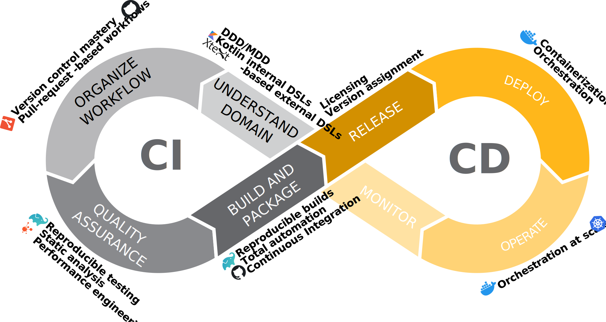

+++

title = "Development and Operations"
description = "Introduction to DevOps"
outputs = ["Reveal"]

[reveal_hugo]
transition = "slide"
transition_speed = "fast"
custom_theme = "custom-theme.scss"
custom_theme_compile = true

[reveal_hugo.custom_theme_options]
targetPath = "css/custom-theme.css"
enableSourceMap = true

+++

# :  why it matters

### [Danilo Pianini](mailto:danilo.pianini@unibo.it)
### [Giovanni Ciatto](mailto:giovanni.ciatto@unibo.it)

---

## Course themes

* Domain-Driven Design (DDD) and Model-Driven Design (MDD)
* Internal and external DSLs
    * Kotlin internal DSLs, Xtext external DSLs
* Version control mastery (with `git`)
* Multi-platform programming
    * Kotlin multiplatform as reference tool
* Build automation
    * Including quality assurance automation
    * Including using DSLs to define builds
    * Including reproducibility
    * Gradle as reference tool, but others are discussed
* Containerisation and orchestration
* Continuous integration and delivery
    * With GitHub Actions as reference tool
* Bug hunting and performance engineering
* Proper license selection and versioning

---

---

## Why it strengthens a software engineering curriculum

* Shows you can **design the process**, not just code
    * You learn to move from domain analysis to running systems using *DDD/MDD*, supported by *DSLs* and *generators*.
    * *set up and evolve agile pipelines* with build, test, CI, and CD.
* You practice build automation, containerization, and orchestration so your code runs **reproducibly** in teams and production
     * Employers value engineers who ship *reliably*.
* Proves **version-control mastery** beyond basics, including complex histories and multi-repo work.
* Signals **licensing and versioning literacy** for open-source and enterprise contexts.
* Adds **DDD/MDD and DSL** skills that differentiate you for platform, tooling, and architecture roles.
* You build **habits** of **automated quality and delivery**.
    * *reduces repetitive* work
    * *reduces* incident *risk* across any stack
* It converts theory into **end-to-end engineering practice** (a the gap most graduates need to close):
    * domain analysis → DSLs → builds → tests → CI/CD → deploy

---

## Course details

### Teachers

* Danilo Pianini -- [danilo.pianini@unibo.it](mailto:danilo.pianini@unibo.it)
* Giovanni Ciatto -- [giovanni.ciatto@unibo.it](mailto:giovanni.ciatto@unibo.it)

### Exam

Project, can be shared with other courses: the required techniques are orthogonal to any software system.

### Prerequisites

* *Java* or *C#* knowledge, *Scala* is a plus
* *Basic git* knowledge
    * Stage management / commit / remote / fetch / pull / push

### Schedule

* First semester
* 6 CFU
