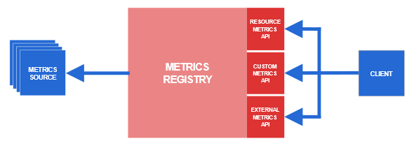
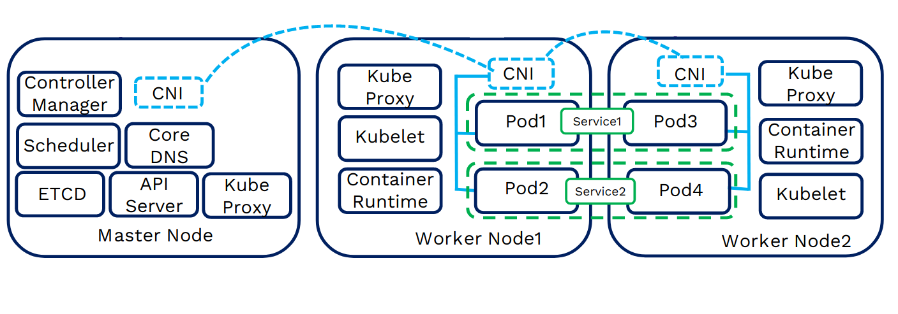

+++

title = "Kubernetes"
description = "Introduction to Kubernetes main aspects"
outputs = ["Reveal"]

[reveal_hugo]
transition = "slide"
transition_speed = "fast"
custom_theme = "custom-theme.scss"
custom_theme_compile = true

[reveal_hugo.custom_theme_options]
targetPath = "css/custom-theme.css"
enableSourceMap = true

+++

# 

## Intoduction to Kubernetes

### [Martina Baiardi - m.baiardi@unibo.it](mailto:m.baiardi@unibo.it)

---

## Long story short

Originally developed by Google, 
since its introduction in 2014, 
Kubernetes has grown to be on of the largest and most popular *open source* project in the world.

<br/>

<script type="text/javascript" src="https://ssl.gstatic.com/trends_nrtr/3523_RC02/embed_loader.js"></script> <script type="text/javascript"> trends.embed.renderExploreWidget("TIMESERIES", {"comparisonItem":[{"keyword":"Docker Swarm","geo":"","time":"2015-01-01 2023-01-01"},{"keyword":"Kubernetes","geo":"","time":"2015-01-01 2023-01-01"}],"category":0,"property":""}, {"exploreQuery":"date=2015-01-01%202023-01-01&q=Docker%20Swarm,Kubernetes","guestPath":"https://trends.google.com:443/trends/embed/"}); </script>

---

## Long story short

Built for *distributed systems* suitable for *cloud developers* of all scales, 
it provides the software necessary to successfully build and deploy *reliable* and *scalable* software systems.

{}
- __Reliability__: Services cannot fail, they must maintain *availability* even during software rollouts
- __Scalability__: Services must grow their capacity to keep up with ever-increasing usage without redesigning the distributed system. Obviously, this includes both a scale-up and a scale-down of the service.
- __Distributed Systems__: Pieces of software that together make up the service; they may run on different machines connected, and coordinating, via the network.
{}


---

## Key freatures
- Immutability
- Everything is a declarative configuration object
- Broader range of object to create, and manage, the production environment
- Automatic scaling (up and down)
- Built-in monitoring
- Security

---

## Immutability

Just like Docker Swarm, Kubernetes is a container orchestrator. 
Containers represent a declarative way to package and run applications, giving an immutable environment that can be deployed anywhere.

<br>

__So, why Docker Swarm is not enough?__

Docker Swarm is built to manage microservices, so it does not fit properly for large production deployments at scale.

---

## Declarative configuration objects

{}
{}

### Docker Swarm 
- stuck to the docker ecosystem,
  - it does not support other container runtimes,
  - it requires docker primitives to be used to manage the environment.
- the only way to manage the environment is through the `docker-compose.yml` file.

<br>
<br>
<br>


Example with a Docker Stack: 
```
docker stack deploy -c docker-compose.yml <stack_name>
```
__[!!!] Docker primitives are required to build the environment__


{} {}

### Kubernetes 
- **"everything is an object"**
  - broader range of objects to customise the production environment,
  - external declarative tool, named `kubectl`, to manage the environment.
- it can be configured to work upon different container runtimes, such as *Docker*, *containerd*, *CRI-O*, etc.

<br>

[Spoiler] Example with a Kubernetes Deployment: 
```
kubectl create -f configuration-file.yaml
```
__This command is valid for every existing resource in the Kubernetes ecosystem__

{}
{}

---

### An example of existing Kubernetes resources types

```
NAME                              SHORTNAMES   API VERSION                            NAMESPACED   KIND                             VERBS                                                     
namespaces                        ns           v1                                     false        Namespace                        create,delete,get,list,patch,update,watch                 
nodes                             no           v1                                     false        Node                             create,delete,deletecollection,get,list,patch,update,watch
persistentvolumeclaims            pvc          v1                                     true         PersistentVolumeClaim            create,delete,deletecollection,get,list,patch,update,watch
persistentvolumes                 pv           v1                                     false        PersistentVolume                 create,delete,deletecollection,get,list,patch,update,watch
pods                              po           v1                                     true         Pod                              create,delete,deletecollection,get,list,patch,update,watch
podtemplates                                   v1                                     true         PodTemplate                      create,delete,deletecollection,get,list,patch,update,watch
replicationcontrollers            rc           v1                                     true         ReplicationController            create,delete,deletecollection,get,list,patch,update,watch
resourcequotas                    quota        v1                                     true         ResourceQuota                    create,delete,deletecollection,get,list,patch,update,watch
secrets                                        v1                                     true         Secret                           create,delete,deletecollection,get,list,patch,update,watch
serviceaccounts                   sa           v1                                     true         ServiceAccount                   create,delete,deletecollection,get,list,patch,update,watch
services                          svc          v1                                     true         Service                          create,delete,deletecollection,get,list,patch,update,watch
apiservices                                    apiregistration.k8s.io/v1              false        APIService                       create,delete,deletecollection,get,list,patch,update,watch
replicasets                       rs           apps/v1                                true         ReplicaSet                       create,delete,deletecollection,get,list,patch,update,watch
deployments                       deploy       apps/v1                                true         Deployment                       create,delete,deletecollection,get,list,patch,update,watch
statefulsets                      sts          apps/v1                                true         StatefulSet                      create,delete,deletecollection,get,list,patch,update,watch
horizontalpodautoscalers          hpa          autoscaling/v2                         true         HorizontalPodAutoscaler          create,delete,deletecollection,get,list,patch,update,watch
cronjobs                          cj           batch/v1                               true         CronJob                          create,delete,deletecollection,get,list,patch,update,watch
jobs                                           batch/v1                               true         Job                              create,delete,deletecollection,get,list,patch,update,watch
nodes                                          metrics.k8s.io/v1beta1                 false        NodeMetrics                      get,list
pods                                           metrics.k8s.io/v1beta1                 true         PodMetrics                       get,list
clusterrolebindings                            rbac.authorization.k8s.io/v1           false        ClusterRoleBinding               create,delete,deletecollection,get,list,patch,update,watch
clusterroles                                   rbac.authorization.k8s.io/v1           false        ClusterRole                      create,delete,deletecollection,get,list,patch,update,watch
rolebindings                                   rbac.authorization.k8s.io/v1           true         RoleBinding                      create,delete,deletecollection,get,list,patch,update,watch
roles                                          rbac.authorization.k8s.io/v1           true         Role                             create,delete,deletecollection,get,list,patch,update,watch
storageclasses                    sc           storage.k8s.io/v1                      false        StorageClass                     create,delete,deletecollection,get,list,patch,update,watch
volumeattachments                              storage.k8s.io/v1                      false        VolumeAttachment                 create,delete,deletecollection,get,list,patch,update,watch
```

<br>

And the list goes on...

---

## Automatic scaling

{}
{}

### Docker Swarm
- `Services` can scale their replica number,
  - but only after a manual intervention.

- The cluster can grow its capacity, 
  - after the manual addition of another node.

{} {}

### Kubernetes
- Can scale up and down the replicas of a resource,
  - both automatically and after a manual intervention,
  - the automatic scaling can be configured to be based on observed metrics (i.e. the usage of the CPU/Memory). 
- The cluster can grow its capacity, 
  - *automatically* and after a manual intervention.
  - supported only when running on [some](https://github.com/kubernetes/autoscaler/tree/master/cluster-autoscaler#faqdocumentation) cloud providers.

<br>

- __Replicas and metrics are managed by resource objects too__


{}
{}

---

## Built-in monitoring

{}
{}

### Docker Swarm
- Monitoring is performed using third-party tools, 
  - such as *Prometheus*, *Grafana*, etc.

{} {}

### Kubernetes
- A basic monitoring is provided built-in with the cluster,
  - is necessary to install the `Metrics Server` plugin to enable the monitoring,
  - this comprehends the usage of the *CPU* and *Memory* of the cluster nodes and containers
- The monitoring can be extended using third-party tools,
  - such as *Prometheus*, *Grafana*, etc.

{}
{}

---

## Metrics in Kubernetes
<br>


---

## Security

{}
{}

### Docker Swarm
- Simple access control based on TLS, 
  - requires the direct access to a cluster node, and,
  - it is not configurable for the single use case.
- For a better access control is necessary to use a third-party management dashboard,
  - i.e. *Portainer*, etc.

{} {}

### Kubernetes
- Fine grained access control based on RBAC,
  - configurable for the single use case

- Resources management is performed using the `kubectl` tool,
  - it connects remotely to a cluster => no need to access a cluster node
  - it is configured with specific user credentials
    - with a RBAC authorization
    - using access tokens, connects using TLS

- Cluster resources can be split logically into *namespaces*
  - resources not visible between namespaces
  - each one have its own RBAC configuration
  - each one is assigned to a different team

{}
{}

---

## Kubernetes architecture



---

## Kubernetes objects: Pods

{}
{}


<div class="overlay">
   <div class="transparent-circle-5"></div>
</div>

{}{}

### Kubernetes smallest deployable unit.
- Runs one (or more) containers
  - this allow to deploy toghether two different containers that are symbiotic between themself
    - for example, a web server container and the git synchronizer one that keeps it updated 
    - this is not the case of a web server and its database, which can be deployed in two different nodess

{}
{}

---

## Kubernetes objects: Pods

{}
{}


<div class="overlay">
   <div class="transparent-circle-5"></div>
</div>

{}{}

- Containers running in the same Pod share:
  - network namespace (ports),
  - IP address,
  - host name,
  - storage (volumes), 
  - inter-process communication (IPC),
  - Process identifiers (PIDs).

{}
{}

---

## Kubernetes objects: Pods

<div class="custom">

{}

apiVersion: v1
kind: Pod
metadata:
  name: hello-world
spec:
  containers:
    - name: hello
      image: busybox:latest
      command: ['sh', '-c', 'echo "Hello, Kubernetes!" && sleep 3600']
      restartPolicy: OnFailure
      imagePullPolicy: IfNotPresent
      resources:
        requests:
          memory: "64Mi"
          cpu: "250m"
        limits:
          memory: "128Mi"
          cpu: "500m"
      ports:
        - containerPort: 80
          protocol: TCP


{}

</div> 

---

## Kubernetes objects: Pods

<div class="custom">

{}

apiVersion: v1
kind: Pod
metadata:
  name: hello-world
spec:
  containers:
    - name: hello
      image: busybox:latest
      command: ['sh', '-c', 'echo "Hello, Kubernetes!" && sleep 3600']
      restartPolicy: OnFailure
      imagePullPolicy: IfNotPresent
      resources:
        requests:
          memory: "64Mi"
          cpu: "250m"
        limits:
          memory: "128Mi"
          cpu: "500m"
      ports:
        - containerPort: 80
          protocol: TCP


{}

</div> 
<div class="overlay">
   <div class="restart-policy"></div>
</div>

---

## Kubernetes objects: Pods

<div class="custom">

{}

apiVersion: v1
kind: Pod
metadata:
  name: hello-world
spec:
  containers:
    - name: hello
      image: busybox:latest
      command: ['sh', '-c', 'echo "Hello, Kubernetes!" && sleep 3600']
      restartPolicy: OnFailure
      imagePullPolicy: IfNotPresent
      resources:
        requests:
          memory: "64Mi"
          cpu: "250m"
        limits:
          memory: "128Mi"
          cpu: "500m"
      ports:
        - containerPort: 80
          protocol: TCP

{}

</div> 
<div class="overlay">
   <div class="image-pull-policy"></div>
</div>

---

## Kubernetes objects: Pods

<div class="custom">

{}

apiVersion: v1
kind: Pod
metadata:
  name: hello-world
spec:
  containers:
    - name: hello
      image: busybox:latest
      command: ['sh', '-c', 'echo "Hello, Kubernetes!" && sleep 3600']
      restartPolicy: OnFailure
      imagePullPolicy: IfNotPresent
      resources:
        requests:
          memory: "64Mi"
          cpu: "250m"
        limits:
          memory: "128Mi"
          cpu: "500m"
      ports:
        - containerPort: 80
          protocol: TCP

{}

</div> 
<div class="overlay">
   <div class="resources"></div>
</div>

---

## Kubernetes objects: Pods

<div class="custom">

{}

apiVersion: v1
kind: Pod
metadata:
  name: hello-world
spec:
  containers:
    - name: hello
      image: busybox:latest
      command: ['sh', '-c', 'echo "Hello, Kubernetes!" && sleep 3600']
      restartPolicy: OnFailure
      imagePullPolicy: IfNotPresent
      resources:
        requests:
          memory: "64Mi"
          cpu: "250m"
        limits:
          memory: "128Mi"
          cpu: "500m"
      ports:
        - containerPort: 80
          protocol: TCP

{}

</div> 
<div class="overlay">
   <div class="ports"></div>
</div>

---

## Kubernetes objects: Services

{}
{}


<div class="overlay">
   <div class="transparent-circle-5"></div>
</div>

{}{}

- 

{}
{}

---

Pods are not directly managed by the user, but through by a higher-level object called `Deployment`.

## Deployment

---

## ReplicaSet

- Managed directly by a deployment object

---

Deployments are not the only road:
- Job
- CronJob
- StatefulSet
- DaemonSet

---

## Service

Connected to pods using labels *selectors*.

Same as docker swarm, they expose the Pods to the outside world.

---

## Access Control

Service Account 
- RBAC management over a namespace
- used to configure the client tool kubectl

Some rbac configuration pre-existing in the kubernetes instance, others can be created custom.
The control can be defined over a single resource type.

---

# In practice

---

## Installation of Kubernetes

- Several tools support the installation of a *production-ready Kubernetes cluster*, because is a **complex** process
  - [kubeadm](https://kubernetes.io/docs/setup/production-environment/tools/kubeadm/)
  - [kubespray](https://kubernetes.io/docs/setup/production-environment/tools/kubespray/)
  - [kops](https://kubernetes.io/docs/setup/production-environment/tools/kops/)
  - [k3s](https://k3s.io/)
  - etc.

- For testing purposes, Kubernetes can be installed on a single machine using [minikube](https://minikube.sigs.k8s.io/docs/start/)
  - single-node Kubernetes cluster 
  - works on Windows, Linux and macOS
  - runs inside a VM/container, on your choice
  - not suitable for production environments
  - comes with a set of built-in plugins to be installed, for example: 
    - Metrics Server
    - Kubernetes Dashboard
    - and others, we'll see them later

---

## Minikube

```bash
minikube start
```

```bash
😄  minikube v1.32.0 on Arch 23.1.0
🆕  Kubernetes 1.28.3 is now available. If you would like to upgrade, specify: --kubernetes-version=v1.28.3
✨  Using the virtualbox driver based on existing profile
👍  Starting control plane node minikube in cluster minikube
🔄  Restarting existing virtualbox VM for "minikube" ...
❗  Image was not built for the current minikube version. To resolve this you can delete and recreate your minikube cluster using the latest images. Expected minikube version: v1.30.1 -> Actual minikube version: v1.32.0
🐳  Preparing Kubernetes v1.26.3 on Docker 20.10.23 ...
    ▪ kubelet.housekeeping-interval=10s
🔗  Configuring bridge CNI (Container Networking Interface) ...
    ▪ Using image gcr.io/k8s-minikube/storage-provisioner:v5
    ▪ Using image registry.k8s.io/metrics-server/metrics-server:v0.6.4
🔎  Verifying Kubernetes components...
🌟  Enabled addons: storage-provisioner, metrics-server, default-storageclass
❗  /usr/bin/kubectl is version 1.28.4, which may have incompatibilities with Kubernetes 1.26.3.
    ▪ Want kubectl v1.26.3? Try 'minikube kubectl -- get pods -A'
🏄  Done! kubectl is now configured to use "minikube" cluster and "default" namespace by default

```
