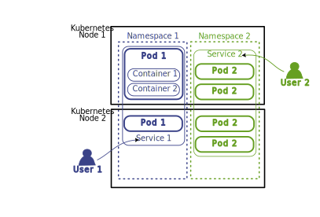

+++

title = "Kubernetes"
description = "Introduction to Kubernetes main aspects"
outputs = ["Reveal"]

[reveal_hugo]
transition = "slide"
transition_speed = "fast"
custom_theme = "custom-theme.scss"
custom_theme_compile = true

[reveal_hugo.custom_theme_options]
targetPath = "css/custom-theme.css"
enableSourceMap = true

+++

<style>
.reveal blockquote {
    font-family: 'Georgia';
    text-align: center;
    font-size: 0.8em; 
    font-style: italic;
    padding: 30px;
}

.reveal blockquote p{
	content: "";
  text-align: center;
}

.reveal pre code {
  font-size: 1.2em;
}

.center{
	text-align: center;
}


</style>

# 

## Intoduction to Kubernetes

### [Martina Baiardi - m.baiardi@unibo.it](mailto:m.baiardi@unibo.it)

---

## Long story short

Originally developed by Google, 
since its introduction in 2014, 
Kubernetes has grown to be on of the largest and most popular *open source* project in the world.

<br/>

<script type="text/javascript" src="https://ssl.gstatic.com/trends_nrtr/3523_RC02/embed_loader.js"></script> <script type="text/javascript"> trends.embed.renderExploreWidget("TIMESERIES", {"comparisonItem":[{"keyword":"Docker Swarm","geo":"","time":"2015-01-01 2025-01-01"},{"keyword":"Kubernetes","geo":"","time":"2015-01-01 2025-01-01"}],"category":0,"property":""}, {"exploreQuery":"date=2015-01-01%202023-01-01&q=Docker%20Swarm,Kubernetes","guestPath":"https://trends.google.com:443/trends/embed/"}); </script>

---

## Long story short

Built for *distributed systems* suitable for *cloud developers* of all scales, 
it is meant to support *reliable* and *scalable* software systems.

{}
- __Reliability__: Services cannot fail, they must maintain *availability* even during software rollouts
- __Scalability__: Services can adapt their capacity to keep up with the usage, without redesigning the distributed system. This includes both a *scale-up* and a *scale-down* of the service.
- __Distributed System__: Pieces of software the service is composed of; they may run on different machines (connected to each-other), and may coordinate their behaviour through the network.
{}


---

## Key features
- Immutability
- Everything is a declarative configuration object
- Broader range of object to create, and manage, the production environment with respect to Docker Swarm
- Automatic scaling of resources (horizontal, vertical, increasing and decreasing)
- Built-in monitoring
- Security

---

## Immutability

Just like Docker Swarm, Kubernetes is a container orchestrator. 
- Containers represent a declarative way to package and run applications 
- Containers can be deployed anywhere
- They are meant to be stateless, thus changed at any time

<br>

__Why Docker Swarm is not enough?__

Docker Swarm do support large production deployments at scale, 
while Kubernetes natively support it.

---

## Declarative configuration objects

{}
{}

### Docker Swarm 
- makes use of the docker ecosystem:
  - it does not support other container runtimes,
  - relies on docker primitives to be used to manage the environment.
- the environment is managed through the `docker-compose.yml` file.

### Example with a Docker Stack: 

```
docker stack deploy -c docker-compose.yml <stack_name>
```
__Docker primitives to build the environment__

{} {}

### Kubernetes 
- Adheres to the principle **"everything is an object"**
  - broader range of objects to shape the production environment,
  - external declarative tool, named `kubectl`, to manage the environment.
- it can be configured to work upon different container runtimes, such as *Docker*, *containerd*, *CRI-O*, etc.


### Example with a Kubernetes Deployment: 

```
kubectl create -f configuration-file.yaml
```
__Instruction valid for every resource in the Kubernetes ecosystem__

{}
{}

---

### An example of existing Kubernetes resources types

<div class="custom">

```bash
NAME                              SHORTNAMES   API VERSION                            NAMESPACED   KIND                   
namespaces                        ns           v1                                     false        Namespace              
nodes                             no           v1                                     false        Node                   
persistentvolumeclaims            pvc          v1                                     true         PersistentVolumeClaim  
persistentvolumes                 pv           v1                                     false        PersistentVolume       
pods                              po           v1                                     true         Pod                    
podtemplates                                   v1                                     true         PodTemplate            
replicationcontrollers            rc           v1                                     true         ReplicationController  
resourcequotas                    quota        v1                                     true         ResourceQuota          
secrets                                        v1                                     true         Secret                 
serviceaccounts                   sa           v1                                     true         ServiceAccount         
services                          svc          v1                                     true         Service                
apiservices                                    apiregistration.k8s.io/v1              false        APIService             
replicasets                       rs           apps/v1                                true         ReplicaSet             
deployments                       deploy       apps/v1                                true         Deployment             
statefulsets                      sts          apps/v1                                true         StatefulSet            
horizontalpodautoscalers          hpa          autoscaling/v2                         true         HorizontalPodAutoscaler
cronjobs                          cj           batch/v1                               true         CronJob                
jobs                                           batch/v1                               true         Job                    
nodes                                          metrics.k8s.io/v1beta1                 false        NodeMetrics            
pods                                           metrics.k8s.io/v1beta1                 true         PodMetrics             
clusterrolebindings                            rbac.authorization.k8s.io/v1           false        ClusterRoleBinding
clusterroles                                   rbac.authorization.k8s.io/v1           false        ClusterRole 
rolebindings                                   rbac.authorization.k8s.io/v1           true         RoleBinding 
roles                                          rbac.authorization.k8s.io/v1           true         Role        
storageclasses                    sc           storage.k8s.io/v1                      false        StorageClass
volumeattachments                              storage.k8s.io/v1                      false        VolumeAttachment
```

</div>

<br>

And the list goes on...

---

## Automatic scaling

{}
{}

### Docker Swarm
- `Services` can scale their replica number,
  - but only after a manual intervention.

- The cluster can grow its capacity, 
  - after the manual addition of another node.

{} {}

### Kubernetes
- Can scale up and down replicas of a resource,
  - both automatically and with a manual intervention,
  - the automatic scaling can be configured on the observation of *metrics* (i.e. the usage of the CPU/Memory). 
- The cluster can grow its capacity, 
  - *automatically* and after a manual intervention.
  - supported only when running on [some](https://github.com/kubernetes/autoscaler/tree/master/cluster-autoscaler#faqdocumentation) cloud providers.

<br>

- __Replicas and metrics are resource objects too__


{}
{}

---

## Built-in monitoring

{}
{}

### Docker Swarm
- Monitoring is performed using third-party tools, 
  - such as *Prometheus*, *Grafana*, etc.

{} {}

### Kubernetes
- A basic monitoring is provided built-in with the cluster,
  - is necessary to install the `Metrics Server` plugin to enable the monitoring,
  - this comprehends the usage of the *CPU* and *Memory* of the cluster nodes and containers
- The monitoring can be extended using third-party tools,
  - such as *Prometheus*, *Grafana*, etc.

{}
{}

---

## Metrics in Kubernetes

- *Metrics Registry* is the component of the Kubernetes' Control Plane that exposes **API** to watch for cluster's metrics.
  - *Metrics Server* is the built-in implementation of this service
  - there are external Metrics Servers which can be adopted instead of it. 
- There are mainly three kinds of metrics: 
  - **Resource Metrics**: concerning *memory* and *cpu* of Kubernetes' resource objects.
  - **Custom Metrics**: other information about Kubernetes' resource objecs.
  - **External Metrics**: metrics not related with Kubernetes' resources (i.e. number of incoming HTTP requests)

--- 

## Metrics in Kubernetes
<br>


---

## Security

{}
{}

### Docker Swarm
- Simple access control based on TLS, 
  - requires the direct access to a cluster node, and,
  - it is not configurable for the single use case.
- For a better access control is necessary to use a third-party management dashboard,
  - i.e. *Portainer*, etc.

{} {}

### Kubernetes
- Fine grained access control based on RBAC,
  - configurable for the single use case

- Resources are externally managed with `kubectl` tool,
  - it connects remotely to a cluster => no need to access a cluster node
  - it is configured with specific user credentials
    - with a RBAC authorization
    - using access tokens, connects using TLS

- Cluster resources can be split logically into *namespaces*
  - resources not visible between namespaces
  - each one have its own RBAC configuration
  - each one is assigned to a different team

{}
{}

---

## Kubernetes architecture


---

## Kubernetes objects: Pods

{}
{}



{}{}

<br>
<br>

### Kubernetes smallest deployable unit.
- Runs one (or more) containers
  - Pods allow to deploy toghether two different containers that are symbiotic between themself
    - for example, a web server container and the git synchronizer one that keeps it updated 
    - this is not the case of a web server and its database, which can be deployed in two different nodess

{}
{}

---

## Kubernetes objects: Pods

{}
{}


{}{}

<br>
<br>

- Containers running in the same Pod share:
  - network namespace (ports),
  - IP address,
  - host name,
  - storage (volumes), 
  - inter-process communication (IPC),
  - Process identifiers (PIDs).

{}
{}

---

## Kubernetes objects: Pods

<div class="custom">

{}

apiVersion: v1
kind: Pod
metadata:
  name: hello-world
spec:
  containers:
    - name: hello
      image: busybox:latest
      command: ['sh', '-c', 'echo "Hello, Kubernetes!" && sleep 3600']
      restartPolicy: OnFailure
      imagePullPolicy: IfNotPresent
      resources:
        requests:
          memory: "64Mi"
          cpu: "250m"
        limits:
          memory: "128Mi"
          cpu: "500m"
      ports:
        - containerPort: 80
          protocol: TCP


{}

</div> 

---

## Kubernetes objects: Pods

<div class="custom">

{}

apiVersion: v1
kind: Pod
metadata:
  name: hello-world
spec:
  containers:
    - name: hello
      image: busybox:latest
      command: ['sh', '-c', 'echo "Hello, Kubernetes!" && sleep 3600']
      restartPolicy: OnFailure
      imagePullPolicy: IfNotPresent
      resources:
        requests:
          memory: "64Mi"
          cpu: "250m"
        limits:
          memory: "128Mi"
          cpu: "500m"
      ports:
        - containerPort: 80
          protocol: TCP


{}

</div> 
<div class="overlay">
   <div class="restart-policy"></div>
</div>

---

## Kubernetes objects: Pods

<div class="custom">

{}

apiVersion: v1
kind: Pod
metadata:
  name: hello-world
spec:
  containers:
    - name: hello
      image: busybox:latest
      command: ['sh', '-c', 'echo "Hello, Kubernetes!" && sleep 3600']
      restartPolicy: OnFailure
      imagePullPolicy: IfNotPresent
      resources:
        requests:
          memory: "64Mi"
          cpu: "250m"
        limits:
          memory: "128Mi"
          cpu: "500m"
      ports:
        - containerPort: 80
          protocol: TCP

{}

</div> 
<div class="overlay">
   <div class="image-pull-policy"></div>
</div>

---

## Kubernetes objects: Pods

<div class="custom">

{}

apiVersion: v1
kind: Pod
metadata:
  name: hello-world
spec:
  containers:
    - name: hello
      image: busybox:latest
      command: ['sh', '-c', 'echo "Hello, Kubernetes!" && sleep 3600']
      restartPolicy: OnFailure
      imagePullPolicy: IfNotPresent
      resources:
        requests:
          memory: "64Mi"
          cpu: "250m"
        limits:
          memory: "128Mi"
          cpu: "500m"
      ports:
        - containerPort: 80
          protocol: TCP

{}

</div> 
<div class="overlay">
   <div class="resources"></div>
</div>

---

## Metrics in Kubernetes

{}{}

> **CPU** resources are expressed in *millicpu* units. <br>
  A millicpu, or millicore, is equivalent to 1/1000th of a CPU core. <br>
  `0.1 = 10% = 100m`

{}{}

> **Memory** resources are measured in bytes. <br>
  You can express memory as a plain integer or with quantity suffixes, for example E, P, T, G, M, k. <br> 
  You can also use the power-of-two equivalents, such as Ei, Pi, Ti, Gi, Mi, Ki. <br>
  `128974848 = 129e6 = 129M = 123Mi`

{}
{}

---

## Kubernetes objects: Pods

<div class="custom">

{}

apiVersion: v1
kind: Pod
metadata:
  name: hello-world
spec:
  containers:
    - name: hello
      image: busybox:latest
      command: ['sh', '-c', 'echo "Hello, Kubernetes!" && sleep 3600']
      restartPolicy: OnFailure
      imagePullPolicy: IfNotPresent
      resources:
        requests:
          memory: "64Mi"
          cpu: "250m"
        limits:
          memory: "128Mi"
          cpu: "500m"
      ports:
        - containerPort: 80
          protocol: TCP

{}

</div> 
<div class="overlay">
   <div class="ports"></div>
</div>

---

## Kubernetes objects: Deployment
{}
{}
<div class="custom">

```bash
apiVersion: apps/v1
kind: Deployment
metadata:
  name: nginx-deployment
  labels:
    app: nginx
spec:
  replicas: 3
  selector:
    matchLabels:
      app: nginx
  template:
    metadata:
      labels:
        app: nginx
    spec:
      containers:
      - name: nginx
        image: nginx:1.14.2
        ports:
        - containerPort: 80               
```
</div>
{}{}

<br>
<br>

`Pods` are not directly managed by the user, but through higher-level objects called `Deployment`.
- They exist to manage the release of a new version of the application
- Avoid downtime during the update process of a Pod
- Ties together `ReplicaSets` and `Pods`

{}
{}

---

## Kubernetes objects: Deployment
{}
{}
<div class="custom">

```bash
apiVersion: apps/v1
kind: Deployment
metadata:
  name: nginx-deployment
  labels:
    app: nginx
spec:
  replicas: 3
  selector:
    matchLabels:
      app: nginx
  template:
    metadata:
      labels:
        app: nginx
    spec:
      containers:
      - name: nginx
        image: nginx:1.14.2
        ports:
        - containerPort: 80               
```
</div>
{}{}

<br>
<br>

The connection between `Deployments` and `Pods` is done using the `selector` field
 - they are unique labels that identify the `Pods` that the `Deployment` will manage

{}
{}

---

## Kubernetes objects: ReplicaSets

The object that manages the `Pod` number
 - usually not directly managed by the user, but through a `Deployment`
 - allows to scale the number of `Pods` up and down


<br>
<br>

<div class="center">
Since a <code>Deployment</code> object manages a <code>ReplicaSet</code>, users can scale dynamically the <code>Pod</code>'s number using:
</div>

<div class="custom">

```bash
kubectl scale deployment <name> --replicas=<number>
```

</div>

---

## Kubernetes objects: Services

{}
{}


{}{}

<br>
<br>

Service discovery in Kubernetes is done with *Service* objects. 
  - They are the entry-point of the application
  - They redirect requests to the Pods in the cluster nodes
    - **why?** Pods are ephemeral, so they can be moved between nodes, and their IP address is subject to changes
  - They group Pods in a network
    - meaning that Services know how many replicas exist for one Pod 

<br>

**How do they work?**
They exploit the labels selectors.

{}
{}

---

## Kubernetes objects: Services

<div class="center">
There are three main types of Services:
</div>

<br>

| Name | Description |
| --- | --- |
| `ClusterIP` | Exposes the Service on a cluster-internal IP, only reachable <br> from within the cluster. This is the *default* value. |
| `NodePort` | Exposes the Service on the Node’s IP with a fixed port. |
| `LoadBalancer` | Exposes the server *externally* using a load balancer. <br> This type of Service is not offered directly from Kubernetes.  |

---

`Deployments` are not the only solution:

{}
{}
## Job 
Object that runs short-lived, one-off tasks.
Useful to for things to do once, and then stop, for example a database migration.

{}{}
## CronJob
CronJob is meant for performing regular scheduled actions such as backups, report generation, and so on.
{}
{}

{}
{}
## StatefulSet
Like a Deployment, a StatefulSet manages Pods that are based on an identical container spec. 
Unlike a Deployment, a StatefulSet maintains a sticky identity for each of its Pods. 
These pods are created from the same spec, but are not interchangeable: each has a persistent identifier that it maintains across any rescheduling.
{}{}
## DaemonSet
A DaemonSet ensures that all (or some) Nodes run a copy of a Pod. 
As nodes are added to the cluster, Pods are added to them.
As nodes are removed from the cluster, those Pods are garbage collected. 
{}
{}

---

## Access Control

Enforced through the `Service Account` resource object, which:
- represents a distinct identity in the cluster
- is *bound* to a specific `Namespace`
- grants access to the Kubernetes' API server
- grants permissions with *RBAC* to users
- can be used to configure the authentication within `kubectl`

---

# In practice

---

## Installation of Kubernetes

- Several tools support the installation of a *production-ready Kubernetes cluster*, because is a **complex** process
  - [kubeadm](https://kubernetes.io/docs/setup/production-environment/tools/kubeadm/)
  - [kubespray](https://kubernetes.io/docs/setup/production-environment/tools/kubespray/)
  - [kops](https://kubernetes.io/docs/setup/production-environment/tools/kops/)
  - [k3s](https://k3s.io/)
  - etc.

- For testing purposes, Kubernetes can be installed on a single machine using [minikube](https://minikube.sigs.k8s.io/docs/start/)
  - single-node Kubernetes cluster 
  - works on Windows, Linux and macOS
  - runs inside a VM, a container, or on the bare-metal, on your choice
  - not suitable for production environments
  - comes with a set of built-in plugins to be installed, for example: 
    - Metrics Server
    - Kubernetes Dashboard
    - and others, we'll see them later

---

## Minikube

<div class="custom">


{}

minikube start --driver='virtualbox' --extra-config=kubelet.housekeeping-interval=10s

{}

</div>

<br>

<blockquote>

The driver specifies where to install the kubernetes infrastructure, in this case inside a virtual machine managed by VirtualBox 

(that is pre-installed on the machine).

Admissible values are: `virtualbox`, `kvm2`, `qemu2`, `vmware`, `docker`, `none`, `ssh`, `podman`. Default is `auto-detect`

</blockquote>

<blockquote>

The `--extra-config` param is used to configure Kubernetes' `kubelet` during the initial startup.

The flag `kubelet.housekeeping-interval` specifies the frequency at which the kubelet evaluates eviction thresholds, 

we need it to execute correctly the example provided in the next slides.

</blockquote>

---

## Minikube


<div class="custom">

```bash
$ minikube start

😄  minikube v1.32.0 on Arch 23.1.0
✨  Using the virtualbox driver based on existing profile
👍  Starting control plane node minikube in cluster minikube
🔄  Restarting existing virtualbox VM for "minikube" ...
🐳  Preparing Kubernetes v1.28.3 on Docker 24.0.7 ...
    ▪️ kubelet.housekeeping-interval=10s
🔗  Configuring bridge CNI (Container Networking Interface) ...
    ▪️ Using image gcr.io/k8s-minikube/storage-provisioner:v5
🔎  Verifying Kubernetes components...
🌟  Enabled addons: storage-provisioner, default-storageclass
🏄  Done! kubectl is now configured to use "minikube" cluster and "default" namespace by default
```

</div>

### What happened? 

- Now you have a virtual machine running on VirtualBox, and hosting a Kubernetes cluster.
  - You can look for it using the VirtualBox GUI
- Minikube configured your `kubectl` environment
  - **But you don't have `kubectl` installed yet!**

---

## Minikube

<div class="center">
Useful commands: 
</div>

<br>

| Command | Description |
| --- | --- |
| `minikube start` | Start the cluster |
| `minikube stop` | Stop the cluster |
| `minikube delete` | Delete the cluster |
| `minikube status` | Show the status of the cluster |
| `minikube dashboard` | Expose the builtin dashboard in localhost |
| `minikube addons list/enable/disable` | Lists/Enables/Disables available plugins into the cluster |

---

## Kubectl

The Kubernetes command-line tool, `kubectl`, allows you to run commands against Kubernetes clusters.

- You can install it following the official [guide](https://kubernetes.io/docs/tasks/tools/#kubectl).

After a successful installation, you can verify that kubectl is correctly connected to our minikube cluster

<br>
<div class="custom">

```bash
$ kubectl cluster-info

Kubernetes control plane is running at https://192.168.59.101:8443
CoreDNS is running at https://192.168.59.101:8443/api/v1/namespaces/kube-system/services/kube-dns:dns/proxy

To further debug and diagnose cluster problems, use 'kubectl cluster-info dump'.
```

</div>

<br>

<b class="center">
A different output means that the cluster is not configured correctly
</b>

---

## Kubectl

<div class="center">
How can <code>kubectl</code> connect to the cluster? 
<br>
Let's look into the <code>~/.kube/config</code> file, or also use <code>kubectl config view</code>.
<br>
The output is something like this:
</div>
<div class="custom">

```bash
$ kubectl config view

apiVersion: v1
clusters:
- cluster:
    certificate-authority: /home/anitvam/.minikube/ca.crt
    extensions:
    - extension:
        last-update: Mon, 18 Dec 2023 12:59:17 CET
        provider: minikube.sigs.k8s.io
        version: v1.32.0
      name: cluster_info
    server: https://192.168.59.101:8443
  name: minikube
contexts:
- context:
    cluster: minikube
    extensions:
    - extension:
        last-update: Mon, 18 Dec 2023 12:59:17 CET
        provider: minikube.sigs.k8s.io
        version: v1.32.0
      name: context_info
    namespace: default
    user: minikube
  name: minikube
current-context: minikube
kind: Config
preferences: {}
users:
- name: minikube
  user:
    client-certificate: /home/anitvam/.minikube/profiles/minikube/client.crt
    client-key: /home/anitvam/.minikube/profiles/minikube/client.key
```

</div>

---

## Kubectl config: available clusters

<div class="custom">

```bash
apiVersion: v1
clusters:
- cluster:
    certificate-authority: /home/anitvam/.minikube/ca.crt
    extensions:
    - extension:
        last-update: Mon, 18 Dec 2023 12:59:17 CET
        provider: minikube.sigs.k8s.io
        version: v1.32.0
      name: cluster_info
    server: https://192.168.59.101:8443
  name: minikube
contexts:
- context:
    cluster: minikube
    extensions:
    - extension:
        last-update: Mon, 18 Dec 2023 12:59:17 CET
        provider: minikube.sigs.k8s.io
        version: v1.32.0
      name: context_info
    namespace: default
    user: minikube
  name: minikube
current-context: minikube
kind: Config
preferences: {}
users:
- name: minikube
  user:
    client-certificate: /home/anitvam/.minikube/profiles/minikube/client.crt
    client-key: /home/anitvam/.minikube/profiles/minikube/client.key
```

</div>
<div class="overlay">
   <div class="config-cluster"></div>
</div>

---

## Kubectl config: user certificates

<div class="custom">

```bash
apiVersion: v1
clusters:
- cluster:
    certificate-authority: /home/anitvam/.minikube/ca.crt
    extensions:
    - extension:
        last-update: Mon, 18 Dec 2023 12:59:17 CET
        provider: minikube.sigs.k8s.io
        version: v1.32.0
      name: cluster_info
    server: https://192.168.59.101:8443
  name: minikube
contexts:
- context:
    cluster: minikube
    extensions:
    - extension:
        last-update: Mon, 18 Dec 2023 12:59:17 CET
        provider: minikube.sigs.k8s.io
        version: v1.32.0
      name: context_info
    namespace: default
    user: minikube
  name: minikube
current-context: minikube
kind: Config
preferences: {}
users:
- name: minikube
  user:
    client-certificate: /home/anitvam/.minikube/profiles/minikube/client.crt
    client-key: /home/anitvam/.minikube/profiles/minikube/client.key
```

</div>
<div class="overlay">
   <div class="config-user"></div>
</div>

---

## Kubectl config: contexts

- Contexts declare the user to use to connect to a specific cluster.
- You can define multiple contexts to connect to clusters.
- You can connect to a single context at a time, 
  - and switch between them using the `kubectl config use-context` command.
<div class="custom">

```yaml
apiVersion: v1
clusters:
- cluster:
    certificate-authority: /home/anitvam/.minikube/ca.crt
    extensions:
    - extension:
        last-update: Mon, 18 Dec 2023 12:59:17 CET
        provider: minikube.sigs.k8s.io
        version: v1.32.0
      name: cluster_info
    server: https://192.168.59.101:8443
  name: minikube
contexts:
- context:
    cluster: minikube
    extensions:
    - extension:
        last-update: Mon, 18 Dec 2023 12:59:17 CET
        provider: minikube.sigs.k8s.io
        version: v1.32.0
      name: context_info
    namespace: default
    user: minikube
  name: minikube
current-context: minikube
kind: Config
preferences: {}
users:
- name: minikube
  user:
    client-certificate: /home/anitvam/.minikube/profiles/minikube/client.crt
    client-key: /home/anitvam/.minikube/profiles/minikube/client.key
```

</div>
<div class="overlay">
   <div class="config-context"></div>
</div>

---

## Let's test the Kubernetes autoscaling

First of all, we need to enable the `metrics-server`, which is disabled by default
  - we can enable it using the `minikube addons enable metrics-server` command
  - we can verify that it is correctly installed using the `kubectl top nodes` command
  - we need it to observe the CPU and Memory usage of the Pods in the cluster

<br>
<div class="center">

>Until the command <code>kubectl top</code> does not work properly, the metrics server is not enabled yet.<br>The operation may take a while.

</div>

---

## Let's test the Kubernetes autoscaling

Now we can deploy our first Application
  - it's a simple php web server that answer "OK!" to every request


#### **What kubernetes objects should we use to deploy it?**

---

## Let's test the Kubernetes autoscaling

<div class="center">
Two objects: A <code>Deployment</code> and a <code>Service</code>
</div>


{}

<div class="custom">

```bash
apiVersion: apps/v1
kind: Deployment
metadata:
  name: php-apache
spec:
  selector:
    matchLabels:
      run: php-apache
  template:
    metadata:
      labels:
        run: php-apache
    spec:
      containers:
      - name: php-apache
        image: registry.k8s.io/hpa-example
        ports:
        - containerPort: 80
        resources:
          limits:
            cpu: 500m
          requests:
            cpu: 200m
```
</div>

{}
{}

<div class="custom">

```bash
apiVersion: v1
kind: Service
metadata:
  name: php-apache
  labels:
    run: php-apache
spec:
  ports:
  - port: 80
  selector:
    run: php-apache
```

</div>

{}



{}

<div class="center">
They can both be deployed using the <code>kubectl apply -f &#60;file&#62;</code> command.
</div>
<div class="custom">

```bash
kubectl apply -f https://k8s.io/examples/application/php-apache.yaml
```
</div>

{}

---

## Let's test the Kubernetes autoscaling

<div class="center">
We need to create an <code>Horizontal Pod Autoscaler</code>
</div>

<div class="custom">

```bash
kubectl autoscale deployment php-apache --cpu-percent=50 --min=1 --max=10
```
</div>

<br>

<div class="center">
It observes the CPU usage of the Pods and scales them <em>up</em> and <em>down</em> to maintain an <em>average CPU usage</em> of each Pod of <em>50%</em>. <br> 
The minimum number of replicas that can be deployed is <em>1</em>, and the maximum is <em>10</em>.
</div>

---

## Let's test the Kubernetes autoscaling

Now, we have to simulate a huge workload
  - for doing that we can use a Pod that continuously sends requests to the web server
  - `kubectl run` allows to create a Pod on-the-fly

<div class="custom">

```bash
kubectl run -it load-generator --rm --image=busybox:latest -- /bin/sh -c "while sleep 0.01; do wget -q -O - http://php-apache; done"
```
</div>

<br>
<br>

<div class="center">
We can observe the current <code>Horizontal Pod Autoscaler</code> status <br>
using the <code>kubectl get hpa php-apache --watch</code> command.
</div>

---

## Let's test the Kubernetes autoscaling

<div class="center">
What we get (waiting a few minutes) is something like this:
</div>

<br>

<div class="custom">

```bash
$ kubectl get hpa php-apache --watch  

NAME         REFERENCE               TARGETS    MINPODS   MAXPODS   REPLICAS   AGE
php-apache   Deployment/php-apache   0%/50%     1         10        1          10m
php-apache   Deployment/php-apache   129%/50%   1         10        1          11m     
php-apache   Deployment/php-apache   129%/50%   1         10        3          11m
php-apache   Deployment/php-apache   138%/50%   1         10        3          12m
php-apache   Deployment/php-apache   85%/50%    1         10        3          13m
php-apache   Deployment/php-apache   85%/50%    1         10        6          13m
php-apache   Deployment/php-apache   65%/50%    1         10        6          14m
php-apache   Deployment/php-apache   51%/50%    1         10        6          15m
php-apache   Deployment/php-apache   11%/50%    1         10        6          16m
php-apache   Deployment/php-apache   0%/50%     1         10        6          17m
php-apache   Deployment/php-apache   0%/50%     1         10        6          20m
php-apache   Deployment/php-apache   0%/50%     1         10        2          21m
php-apache   Deployment/php-apache   0%/50%     1         10        2          21m
php-apache   Deployment/php-apache   0%/50%     1         10        1          22m
```

</div>

---
